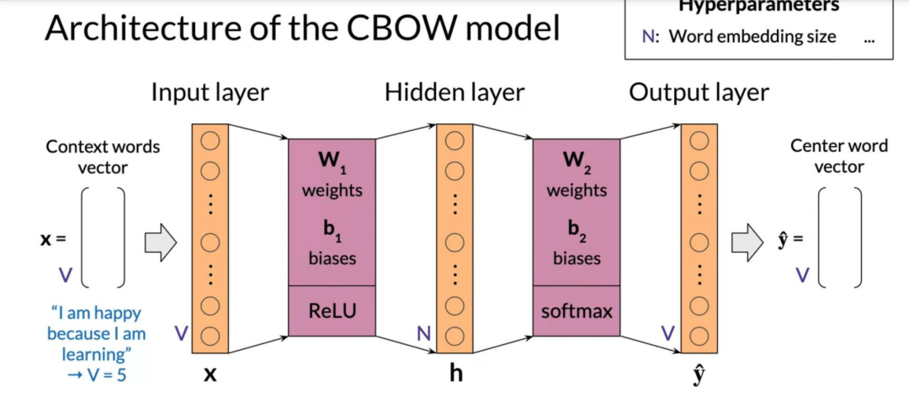

## Word embedding vs one hot 

## Basic word embedding methods
- word2vec (google,2013)
  - Continuous bag-of-words (CBOW)
  - Continuous skip-gram/Skip-gram with negative sampling (SGNS)

- Global Vectors (GloVe) (Stanford,2014)
- fastText(Facebook,2016)
  - Supports out-of-vocabulary(OOV)words
  
## Advanced word embedding methods
Deep learning,contextual embedings
- BERT(Google,2018)
- ELMo(Allen Institue for AI,2018)
- GPT-2(OenAI,2018)
## CBOW (Continous bag-of-words)
- center word prediction 根据两边的词预测中间的词
  
  
  
  - 建立一个vocabulary
  - x : 每条语料的每个单词 用one-hot表示,average one-hot vectors 
  
  - y : centor word 在 vocabulary中的位置，例如在第一个[1,0,0,...]

- extracting word embedding vectors
  
## perplexity
The perplexity is a metric that measures how well a probability model predicts a sample and it is commonly used to evaluate language models. It is defined as: 

$$P(W) = \sqrt[N]{\prod_{i=1}^{N} \frac{1}{P(w_i| w_1,...,w_{n-1})}}$$

As an implementation hack, you would usually take the log of that formula (to enable us to use the log probabilities we get as output of our `RNN`, convert exponents to products, and products into sums which makes computations less complicated and computationally more efficient). You should also take care of the padding, since you do not want to include the padding when calculating the perplexity (because we do not want to have a perplexity measure artificially good). The algebra behind this process is explained next:

$$log P(W) = {log\big(\sqrt[N]{\prod_{i=1}^{N} \frac{1}{P(w_i| w_1,...,w_{n-1})}}\big)}$$

$$ = {log\big({\prod_{i=1}^{N} \frac{1}{P(w_i| w_1,...,w_{n-1})}}\big)^{\frac{1}{N}}}$$ 

$$ = {log\big({\prod_{i=1}^{N}{P(w_i| w_1,...,w_{n-1})}}\big)^{-\frac{1}{N}}} $$
$$ = -\frac{1}{N}{log\big({\prod_{i=1}^{N}{P(w_i| w_1,...,w_{n-1})}}\big)} $$
$$ = -\frac{1}{N}{\big({\sum_{i=1}^{N}{logP(w_i| w_1,...,w_{n-1})}}\big)} $$