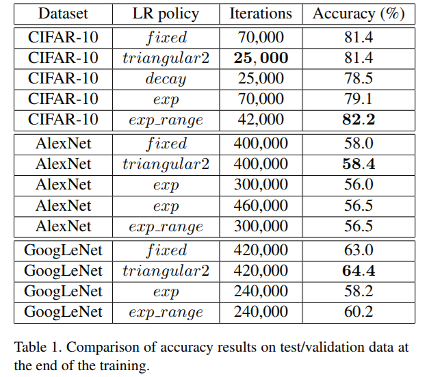

# Cyclical Learning Rates for Training Neural Networks

2018之前训练网络一直都是Adam,在大部分场景中Adam足够好了。然而现在我用Cyclical Learning Rate。


##摘要
训练深模型时学习率是一个很重要的超参数(hper-parameter).本文描述了一个新的设置学习率的方法叫做**周期学习率(cyclical learing rates,CLR)**.该方法不是单调的降低学习率，而是使学习率在合理的边界值内循环变化。使用周期学习率而不是固定值进行训练可以提高分类准确率，而无需进行调整并且通常可以减少迭代次数。本文还描述了一种估算“合理界限”的简单方法 -- 在几个周期内线性的增加学习率。另外，周期学习率也在CIFAR10和CIFAR100对ResNets，Stochastic Depth networks,  DenseNets, 在ImageNet对AlexNet、GoogLeNet进行了验证。

##介绍
深度神经网络通常是随机梯度下降来训练的，太小的学习率使得学习算法收敛很慢，太大的学习率后导致发散。因此，我们必须尝试多种学习率和变化策略。

常规的做法是学习率是一个单一值，在训练中单调下降。本文证明了一个惊人现象，在训练中变化学习率是很有益处的，因此我们提出让全局学习率在一个界限内周期变化,而不是设定一个固定的值。另外周期学习率法(CLR)几乎消除了调整学习率的需要，但是仍达到接近最佳分类的准确率。不像自适应学习率，CLR方法不需要额外的计算量。

贡献点：
1. 一种用于设置全局学习率的方法，无需大量实验即可找到最佳值和变化策略，且基本上无需额外的计算量
2. 证明了一个惊人的现象，学习率反复升降虽然暂时损害了网络性能，但是整体是收益的
3. 在CIFAR10和CIFAR100对ResNets，Stochastic Depth networks,  DenseNets, 在ImageNet对AlexNet、GoogLeNet进行了验证

##Related work
**和自适应学习率比**：
1. 自适应学习率可以看作是CLR的一个竞争对手，因为它可以依靠局部自适应学习率代替全球学习率，但是会产生很大的计算成本。CLR没有这种计算开销可以自由使用。
2. 和自适应学习率不同的是，CLR 可以包含自适应学习率(后面会讨论CLR+自适应学习率)，另外CLR策略在计算上比自适应学习率简单。CLR跟SGDR很像。

##Optimal Learning Rates
### Cyclical Learning Rates
这个学习率策略的本质来自于一个观察，增加学习率会有短暂的负面影响，但是长远来看有好处。这个观察启发了我们的想法，让学习率在一个范围内变化，而不是用阶梯或指数递减（a stepwise fixed or exponentially decreasing value）。也就是说learning rates设置最小最大边界，学习率周期性在边界内变化。大量的实验尝试了各种形式，triangular window (linear线性变化), a Welch window (parabolic 抛物线) and a Hann window (sinusoida l正弦)，他们的结果都差不多。这样的结果导致采用 triangular window，因为它最简单。


一个直观理解为什么CLR work是损失函数的拓扑结构(the loss function topology)
Dauphin et al. 认为最小化损失的困难来自于鞍点而非局部最小值，鞍点有很小的梯度减慢了学习过程而增加学习率可以快速跳过鞍点。一个更实际的原因是最佳学习率可能在一个界限内，接近最优的学习率在整个训练过程中被使用。


上图红线是CLR策略，上下界是[base_lr =0.001, max_lr =0.006]。周期长度是4000即stepsize=2000。CLR达到相同准确度用的interation更少。


如上图三角周期学习率策略，蓝线代表学习率的值，stepsize 是半周期的迭代次数
CLR的实现很简单，伪代码
```python
cycle = math.floor(1 + interations / (2 ∗ stepsize)) 
localx = math.abs(interations / stepsize − 2 ∗ cycle + 1) 
locallr = base_lr + (max_lr − base_lr) ∗ math.max(0, (1 − localx))
```
用一张图来加深理解


除此之外在这篇论文中我们还讨论下面的CLR方法：
1. triangular2：和traiangular策略不同点是每个cycle结束后max_lr减半

1. exp_range: 每个cycle结束后max_lr伽马指数下降。$gamma^{iteration}$


### 如何估计一个好的 cycle length\stepsize
这个参数可以简单的从一个epoch的迭代轮数计算得到，总样本数除以批量大小。例如CIFAR10有50000图片，批量大小100，所以一个epoch的迭代次数是500数,实验结果表明stepsize设置为2~10倍的一个epoch迭代次数比较合适。
使用 CLR 策略还给我们带来的一个好处是我们可以知道什么时候停止训练.实验表明我们用CLR训练3轮就差不多了，训练4或者更多轮能达到更好的结果。还有，停止训练的时候最好在cycle的结尾，即learning rate 在最小处 并且准确度达到了峰值

### 如何估计base_lr 和 max_lr
LR range test:设置一个lr的范围，让lr由小到大线性增长。接下来绘制ACC-LR的曲线，
注意两个时刻(1.base_lr)acc开始上升的时刻 (2.max_lr)acc提升的很慢或者抖动或者开始下降。另外一个经验是最佳学习率通常在可收敛的最大学习率的两倍之内，设置base_lr = 1/3 or 1/4 max_lr.


上图所示是 8个epoch跑出来的 LR range test.
base_lr =0.001 即Acc开始上升的位置
max_lr =0.006 即Acc开始变慢甚至下降的位置

## 实验
### CIFAR 实验

one epoch = 500 iterations.
* base_lr=0.001 max_lr=0.005, stepsize=2000 one cycle =2*stepsize =4000,[0,16000]次迭代即跑了4个cycle
* 接着重新寻找学习率 stepsize =1000 ....

你可能会认为 triangualr 策略的好处来自于降低学习率，因为这个是acc攀升最多的时候。为此我们做一个测试，lr 从 max_lr开始结果step_size次迭代后衰减到base_lr,而后lr固定在base_lr继续训练。Talbe1显示了最终的acc是78.5%，证明对于CLR方法提高和降低学习率都很重要


**CLR的exp_range策略**:Tabel1显示Caffe的exp策略测试最好的结果是70000次迭代acc79.1,exp_range 用42000次迭代达到82.2，42000次足够运行到70000次没有再提升

**和自适应学习率对比**

Table3显示CLR+一些自适应学习方法在25000次迭代就能达到自适应学习方法70000次迭代的acc


图5显示Nesterov+CLR 25000次迭代acc就到81.3%,Adam+CLR 和 Adam 没什么差别。
当CLR+自适应学习率的时候，CLR的效果有时会打折扣，但是CLR仍有价值因为他基本没有计算量的消耗。

#### ResNets, Stochastic Depth, and DenseNets
下面是应用于残差网络的实验

Table4 列出CLR 和 原论文方法的acc比较。括号是lr的范围
实验表明CLR能得到相似或者更好的结果

### Imagenet 实验
略

Refrence：
https://github.com/bckenstler/CLR
https://sgugger.github.io/the-1cycle-policy.html
https://sgugger.github.io/how-do-you-find-a-good-learning-rate.html
https://github.com/adambielski/Learning-Rate


## 补充fast.ai的经验
https://sgugger.github.io/the-1cycle-policy.html
