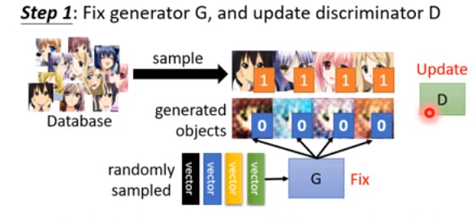
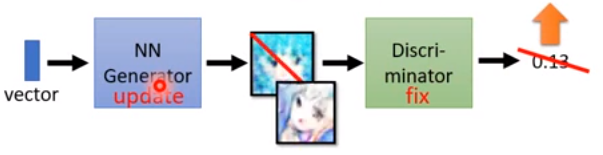
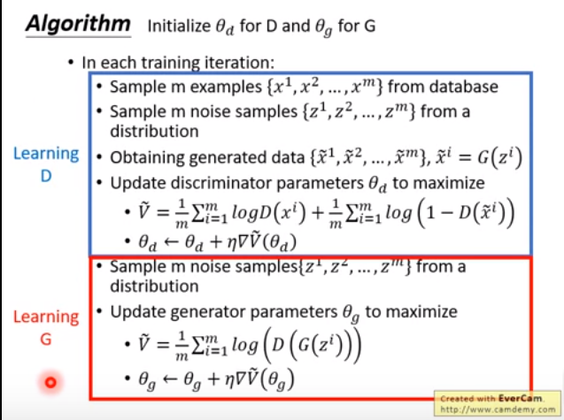
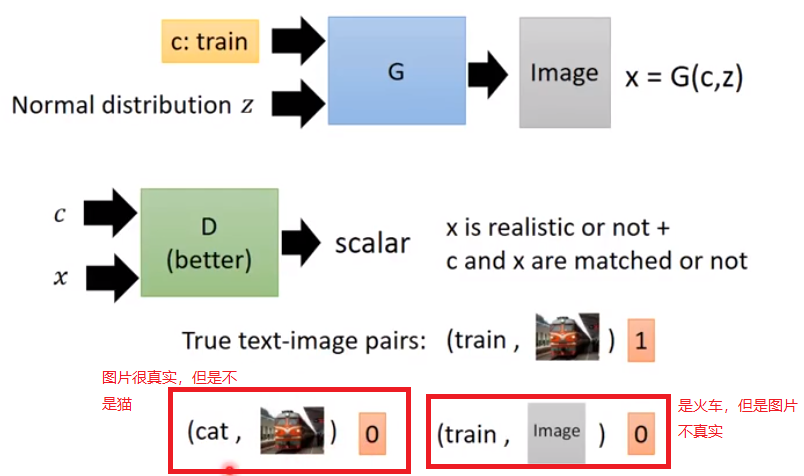
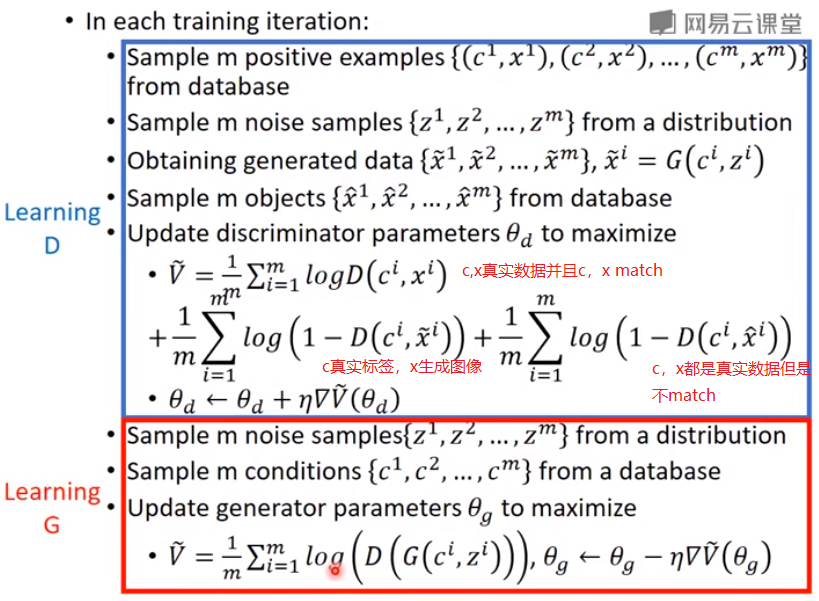
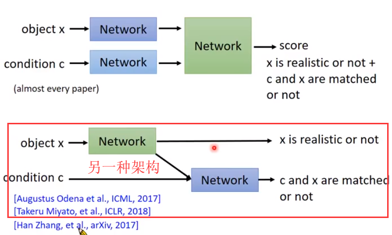
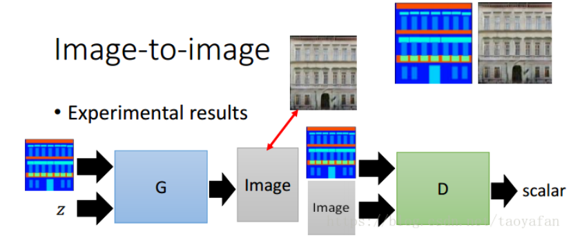
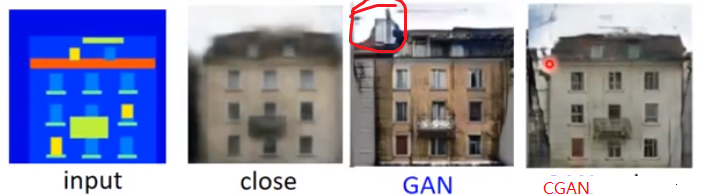
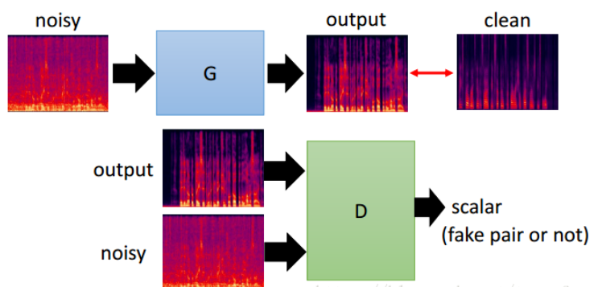

#GAN
笔记参考https://blog.csdn.net/taoyafan/article/category/7691891
## basic idea
* Initialize generator and discriminator (G and D)
* **In each traning iteration:**
    1. Step1: Fix generator G and update discriminator D
    如下图所示，固定生成器，更新判别器，训练的时候从database里随机一些真实数据，生成器则随机生成数据，来更新判别器，这样做是为了训练判别器
    
    2. step2: Fix discriminator D and update generator G
    如下图所示，固定判别器，更新生成器，训练的时候生成器生成数据，判别器打分然后更新生成器，这样做是为了训练生成器
    
* 算法流程
  

## Conditional GAN 条件生成对抗网络
在GAN中输入一个vector随机的向量输出一个图片，只能做到图片很真实，但是不能控制图片里是什么东西，比如说文字生成图片，输入 dog生成一个dog图片，GAN可能会输出一个猫的图片虽然图片很真实但不是猫，CGAN可以。

### CGAN
如下图 同时考虑 1.标签c和图片x必须match 2.图片必须真实

### 算法流程
训练判别网络的时候需要这三种样本，分别是：（1）条件和与条件相符的真实图片，期望输出为1；（2）条件和与条件不符的真实图片，期望输出为0；（3）条件和生成网络生成的输出，期望输出为0。

**另一种架构**
常规形式几乎所有的paper，discriminator 都是一个network输入c,x(条件和图片)输出得分即两种因素综合成为一个分数，而下面这种形式也有一些人在研究，输出两个分数，分别表示真实程度和图片与条件的相符程度。

### 其他应用
1. image-to-image
CGAN 抑制屋顶的突兀的烟囱

2. 语音去噪
去噪的同时保证语音内容不变，不能说 去掉前是i love you  去噪后变成 i hate you   

3. 视频生成

## Unsupervised Conditional Generation (无监督条件生成对抗网络)

