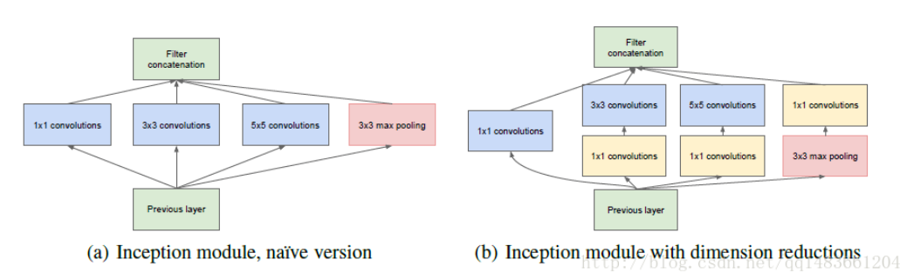
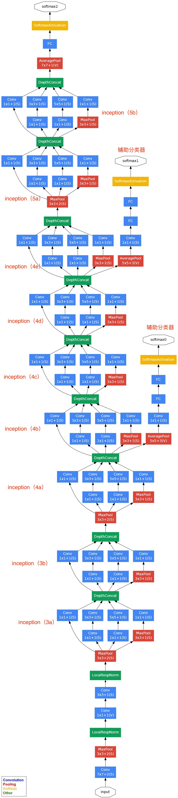
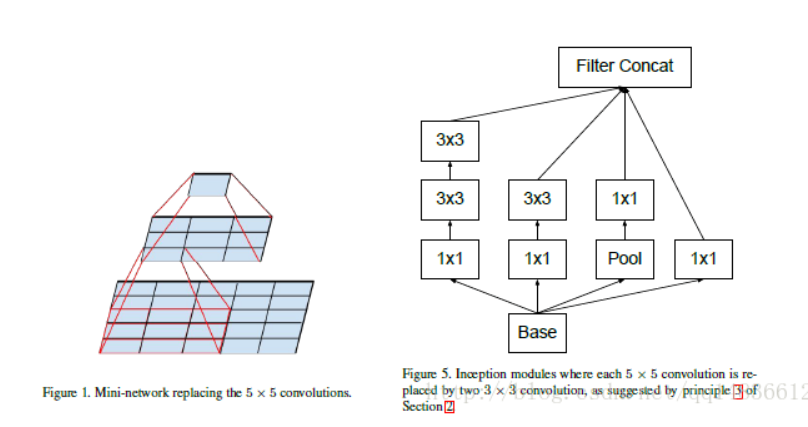
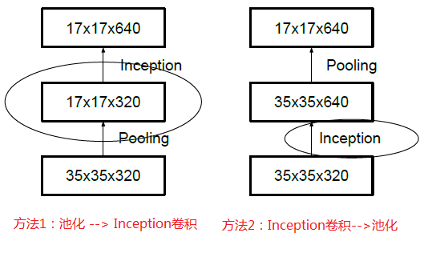
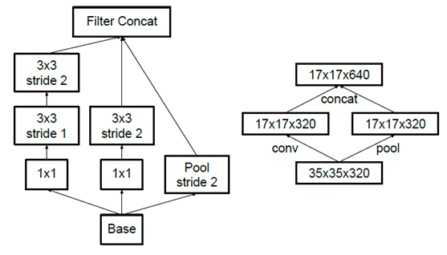
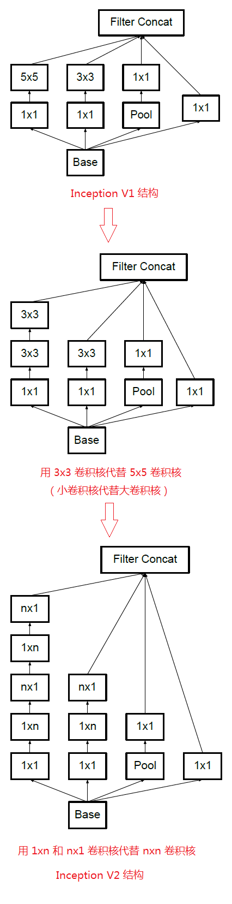

## inception

### inception v1 
从Alexnet到Vgg，网络深度不断增加，却忽视了广度的增加。
Inception 是在广度上增加，同时使用不同的卷积核大小 3*3 5*5 1*1，这些不同的卷积核提取不同的特征，增加了
特征的多样性，但是这样带来一个问题就是参数量增加太大，为了解决这个问题，就引入了1*1的卷积降维，所有右边就是使用了1*1的卷积降维了。这就是右边对左边的改进。

然后我们看GoogleNet，他除了有Inception module外，还有一个特点是他有三个输出，论文中解释这样做的好处是避免梯度的消失，使得方向传播能够进行，但是还有一个作用就是，这样有三个输出的好处是，相当于可以做一个Ensemble，模型的一个集成，我们知道Kaggle中这个技巧是必用的。而且我们知道，越靠前的层卷积提取的特征越低层次的特征，越靠后的卷积层的特征越高层次，如果只有最有一层的输出，也就是相当于只用了最后的高层次的特征分类，但不一定这样就好，所以GoogleNet使用三个输出，也是使用了不同层次的特征的输出作为分类，这样考虑更加周全

GoogleNet还有一个减少参数量的方法是，**他去掉了FC层，用average Pooling来代替**，相比VGG网络和AlexNet网络，几乎所有的参数有耗费在FC层上。

### inception v2
#### 卷积分解
Inception V2做了一个改进就是使用3*3的卷积代替5*5的卷积核，实验证明这样并不影响结果，但是却减少了参数量，假设输入和输出通道数都是C，那么5*5的卷积核参数量为25C^2,但是两个3*3的卷积核参数量为18C^2，同时因为使用两个3*3，使得网络层次加深，增加了非线性，提高了模型的表达能力。结果后如下图

### 降低特征图大小
一般情况下，如果想让图像缩小，可以有如下两种方式：

先池化再作Inception卷积，或者先作Inception卷积再作池化。但是方法一（左图）先作pooling（池化）会导致特征表示遇到瓶颈（特征缺失），方法二（右图）是正常的缩小，但计算量很大。为了同时保持特征表示且降低计算量，将网络结构改为下图，使用两个并行化的模块来降低计算量（卷积、池化并行执行，再进行合并）

还有一个相比Inception V1的改进是，Inception V2 开始引入了**BN层**。BN层的好处再次不叙述，相信大家都知道。

### inception v3
Inception V3就是使用两个1*n和n*1的卷积核取代n*n的卷积核。这样做，相比把5*5用两个3*3代替更加参数量少。同时增加了一些非线性扩展模型表达能力。论文解释说，这种非对称的卷积结构拆分，其结果比对称地拆为几个相同的小卷积核效果更明显，可以处理更多、更丰富的空间特征，增加特征多样性。

### inception v4
结合resnet 引入残差