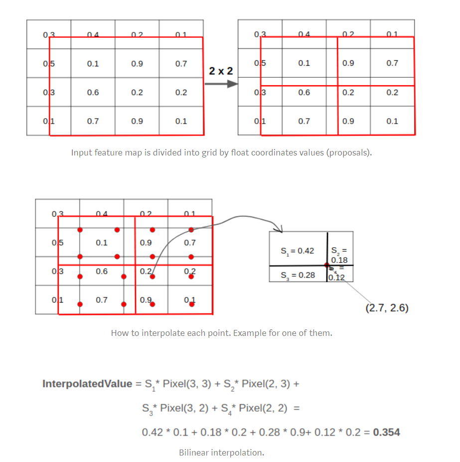

ROI Pooling这一操作存在两次量化的过程。

* 将候选框边界量化为整数点坐标值。
* 将量化后的边界区域平均分割成 k x k 个单元(bin),对每一个单元的边界进行量化。

事实上，经过上述两次量化，此时的候选框已经和最开始回归出来的位置有一定的偏差，这个偏差会影响检测或者分割的准确度。在论文里，作者把它总结为“不匹配问题（misalignment）。

ROI Align的思路很简单：取消量化操作，使用双线性内插的方法获得坐标为浮点数的像素点上的图像数值,从而将整个特征聚集过程转化为一个连续的操作，。值得注意的是，在具体的算法操作上，ROI Align并不是简单地补充出候选区域边界上的坐标点，然后将这些坐标点进行池化，而是重新设计了一套比较优雅的流程

* 遍历每一个候选区域，保持浮点数边界不做量化。
* 将候选区域分割成k x k个单元，每个单元的边界也不做量化。
* 在每个单元中计算固定四个坐标位置，用双线性内插的方法计算出这四个位置的值，然后进行最大池化操作。

