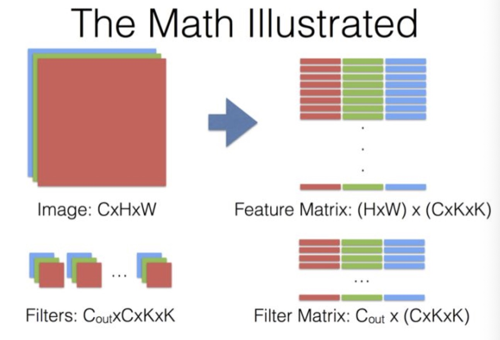
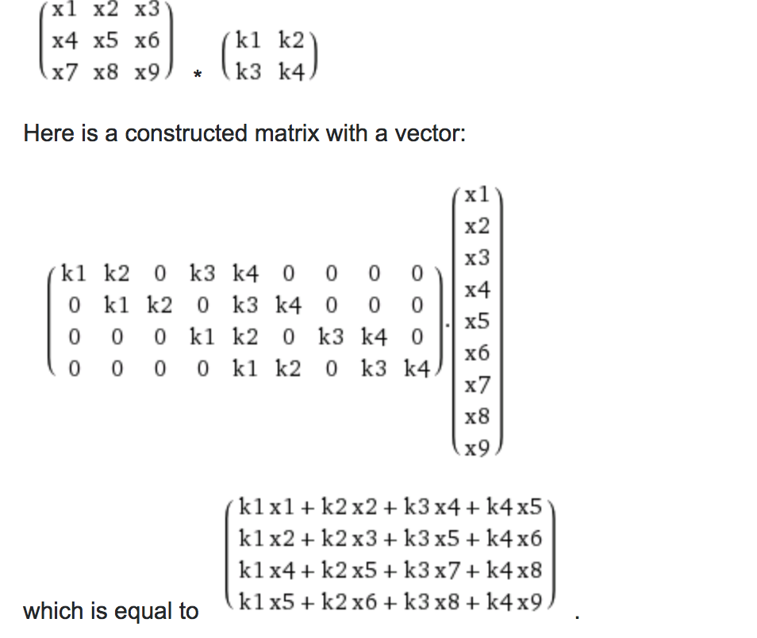

Separable Convolution就是降低卷积运算参数量的一种典型方法。

## 常规卷积
假设输入层为一个大小为64×64像素、三通道彩色图片。经过一个包含4个Filter的卷积层，最终输出4个Feature Map，且尺寸与输入层相同。整个过程可以用下图来概括。

此时，卷积层共4个Filter，每个Filter包含了3个Kernel，每个Kernel的大小为3×3。因此卷积层的参数数量可以用如下公式来计算：**N_std = 4 × 3 × 3 × 3 = 108**

### 再引深一下,convolution 的详细计算过程

* 假设input 为 HxWxC(ip)，经过KxK 卷积 后为HxWxC(op) ，filter矩阵是 KxKxC(ip)xC(op)
* 比如3*3卷积核在图像上移动，如果做for循环那么操作极其的慢，
需要im2col加速卷积,Image的featrue matrix即(HxW)x(KxKxC(ip)). 每个channel 取KxK的小区域平铺。filter matrix 即(KxKxC(ip))xC(op) . 做一个矩阵乘法变成(HxWxC(op))).

### 托普利兹矩阵

## Separable Convolution
Separable Convolution在Google的Xception以及MobileNet论文中均有描述。它的核心思想是将一个完整的卷积运算分解为两步进行，分别为Depthwise Convolution与Pointwise Convolution。

### Depthwise Convolution
同样是上述例子，一个大小为64×64像素、三通道彩色图片首先经过第一次卷积运算，不同之处在于此次的卷积完全是在二维平面内进行，且Filter的数量与上一层的Depth相同。所以一个三通道的图像经过运算后生成了3个Feature map，如下图所示。

其中一个Filter只包含一个大小为3×3的Kernel，卷积部分的参数个数计算如下：
**N_depthwise = 3 × 3 × 3 = 27**

Depthwise Convolution完成后的Feature map数量与输入层的depth相同，但是这种运算对输入层的每个channel独立进行卷积运算后就结束了，没有有效的利用不同map在相同空间位置上的信息。因此需要增加另外一步操作来将这些map进行组合生成新的Feature map，即接下来的Pointwise Convolution。

### Pointwise Convolution
Pointwise Convolution的运算与常规卷积运算非常相似，不同之处在于卷积核的尺寸为 1×1×M，M为上一层的depth。所以这里的卷积运算会将上一步的map在深度方向上进行加权组合，生成新的Feature map。有几个Filter就有几个Feature map。如下图所示。

由于采用的是1×1卷积的方式，此步中卷积涉及到的参数个数可以计算为：
**N_pointwise = 1 × 1 × 3 × 4 = 12**
经过Pointwise Convolution之后，同样输出了4张Feature map，与常规卷积的输出维度相同。

## 参数对比
回顾一下，常规卷积的参数个数为：
**N_std = 4 × 3 × 3 × 3 = 108**
Separable Convolution的参数由两部分相加得到：
**N_depthwise = 3 × 3 × 3 = 27
N_pointwise = 1 × 1 × 3 × 4 = 12
N_separable = N_depthwise + N_pointwise = 39**
相同的输入，同样是得到4张Feature map，Separable Convolution的参数个数是常规卷积的约1/3。因此，在参数量相同的前提下，采用Separable Convolution的神经网络层数可以做的更深。

