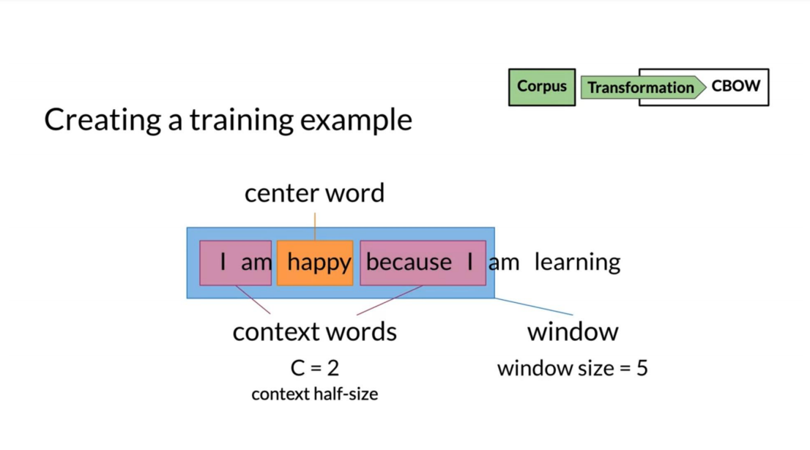
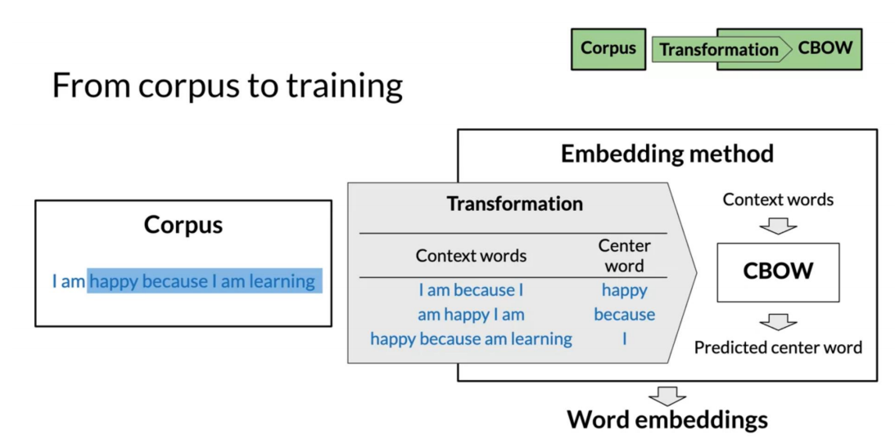
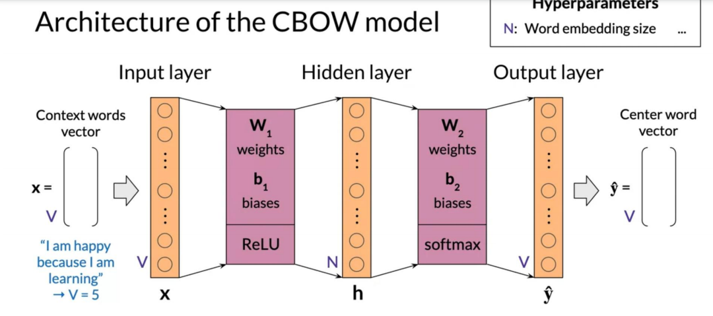
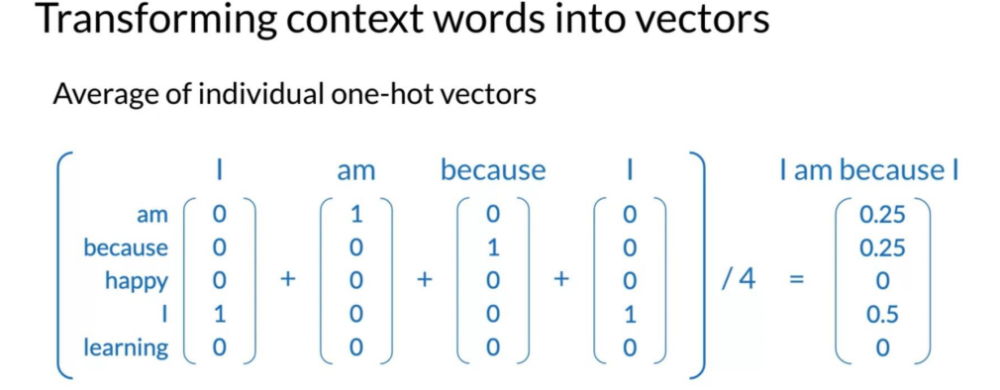

## Word embedding vs one hot 

## Basic word embedding methods
- word2vec (google,2013)
  - Continuous bag-of-words (CBOW)
  - Continuous skip-gram/Skip-gram with negative sampling (SGNS)

- Global Vectors (GloVe) (Stanford,2014)
- fastText(Facebook,2016)
  - Supports out-of-vocabulary(OOV)words
  
## Advanced word embedding methods
Deep learning,contextual embedings
- BERT(Google,2018)
- ELMo(Allen Institue for AI,2018)
- GPT-2(OenAI,2018)
## CBOW (Continous bag-of-words)
- center word prediction 根据两边的词预测中间的词
  
  
  
  - 建立一个vocabulary
  - x : 每条语料的每个单词 用one-hot表示,average one-hot vectors 
  
  - y : centor word 在 vocabulary中的位置，例如在第一个[1,0,0,...]

- extracting word embedding vectors
  
