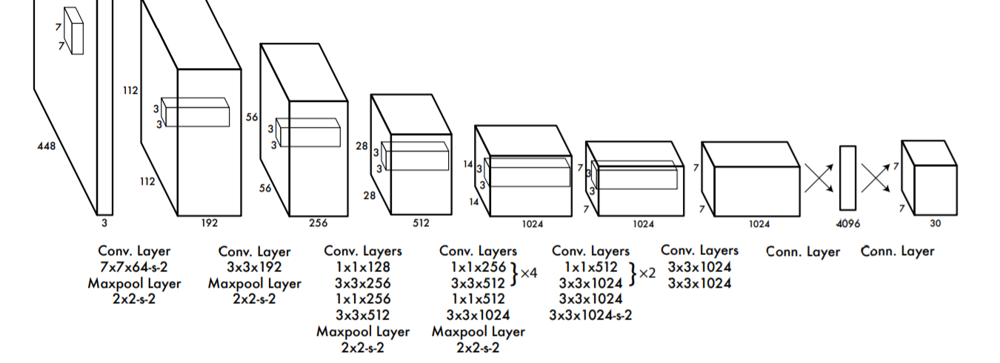
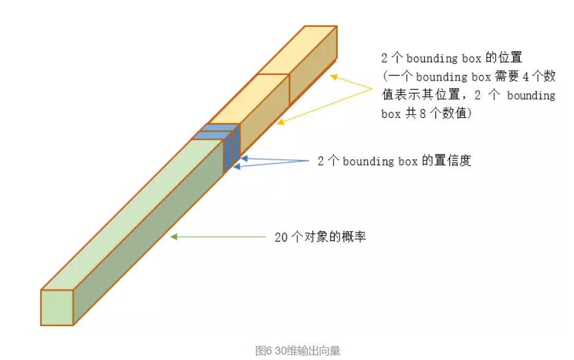
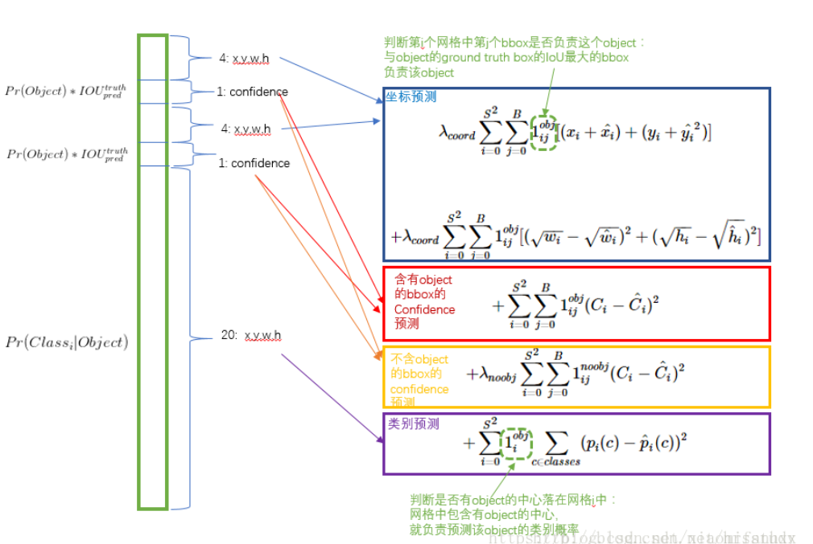
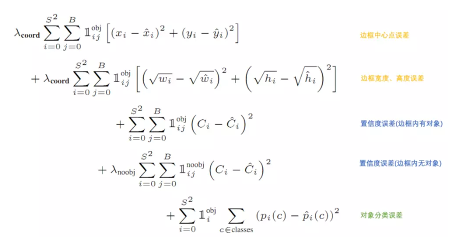
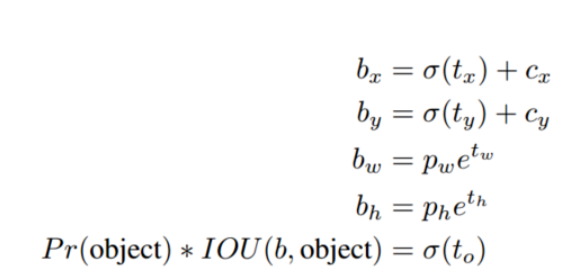
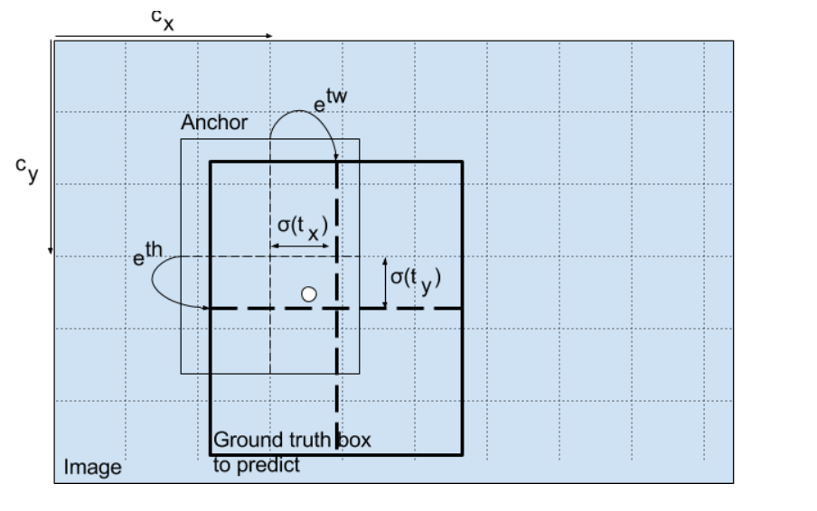

## YOLO V1
**Refrence**

https://zhuanlan.zhihu.com/p/37850811

YOLO意思是You Only Look Once，创造性的将候选区和对象识别这两个阶段合二为一，看一眼图片（不用看两眼哦）就能知道有哪些对象以及它们的位置。

将图片划分为 7*7=49 个网格（grid），每个网格允许预测出2个边框（bounding box，包含某个对象的矩形框），总共 49*2=98 个bounding box。可以理解为98个候选区，它们很粗略的覆盖了图片的整个区域。

RCNN虽然会找到一些候选区，但毕竟只是候选，等真正识别出其中的对象以后，还要对候选区进行微调，使之更接近真实的bounding box。这个过程就是边框回归：将候选区bounding box调整到更接近真实的bounding box。
既然反正最后都是要调整的，干嘛还要先费劲去寻找候选区呢，大致有个区域范围就行了，所以YOLO就这么干了

### 结构
YOLO的结构非常简单，就是单纯的卷积、池化最后加了两层全连接。单看网络结构的话，和普通的CNN对象分类网络几乎没有本质的区别，最大的差异是最后输出层用线性函数做激活函数，因为需要预测bounding box的位置（数值型），而不仅仅是对象的概率。所以粗略来说，YOLO的整个结构就是输入图片经过神经网络的变换得到一个输出的张量

```python
    x = Flatten()(x)
    x = Dense(4096, activation='linear', name='my_connected_0')(x)
    x = LeakyReLU(alpha=0.1)(x)
    x = Dense(1470, activation='linear', name='my_connected_1')(x)
    outputs = Yolo_Reshape([7, 7, 30])(x)
```
### 输入
输入就是原始图像，唯一的要求是缩放到448*448的大小。主要是因为YOLO的网络中，卷积层最后接了两个全连接层，全连接层是要求固定大小的向量作为输入，所以倒推回去也就要求原始图像有固定的尺寸。那么YOLO设计的尺寸就是448*448。

### 输出
输出是一个 7*7*30 的张量（tensor）
根据YOLO的设计，输入图像被划分为 7*7 的网格（grid），输出张量中的 7*7 就对应着输入图像的 7*7 网格。或者我们把 7*7*30 的张量看作 7*7=49个30维的向量，也就是输入图像中的每个网格对应输出一个30维的向量。参考上面图5，比如输入图像左上角的网格对应到输出张量中左上角的向量。
要注意的是，并不是说仅仅网格内的信息被映射到一个30维向量。经过神经网络对输入图像信息的提取和变换，网格周边的信息也会被识别和整理，最后编码到那个30维向量中。


① 20个对象分类的概率
因为YOLO支持识别20种不同的对象（人、鸟、猫、汽车、椅子等），所以这里有20个值表示该网格位置存在任一种对象的概率。
② 2个bounding box的位置
xy表示bounding box的中心相对于cell左上角坐标偏移，宽高则是相对于整张图片的宽高进行归一化的
③ 2个bounding box的置信度
bounding box的置信度 = 该bounding box内存在对象的概率 * 该bounding box与该对象实际bounding box的IOU
用公式来表示就是
$$ Confidence = Pr(Object) * IOU_{pred}^{truth} $$

一个bounding box的置信度Confidence意味着它 是否包含对象且位置准确的程度。置信度高表示这里存在一个对象且位置比较准确，置信度低表示可能没有对象 或者 即便有对象也存在较大的位置偏差。


### 讨论
① 一张图片最多可以检测出49个对象
每个30维向量中只有一组（20个）对象分类的概率，也就只能预测出一个对象。所以输出的 7*7=49个 30维向量，最多表示出49个对象。
② 总共有 49*2=98 个候选区（bounding box）
每个30维向量中有2组bounding box，所以总共是98个候选区。
③ YOLO的bounding box并不是Faster RCNN的Anchor
Faster RCNN等一些算法采用每个grid中手工设置n个Anchor（先验框，预先设置好位置的bounding box）的设计，每个Anchor有不同的大小和宽高比。YOLO的bounding box看起来很像一个grid中2个Anchor，但它们不是。YOLO并没有预先设置2个bounding box的大小和形状，也没有对每个bounding box分别输出一个对象的预测。它的意思仅仅是对一个对象预测出2个bounding box，选择预测得相对比较准的那个。
④ 可以调整网格数量、bounding box数量
7*7网格，每个网格2个bounding box，对448*448输入图像来说覆盖粒度有点粗。我们也可以设置更多的网格以及更多的bounding box。设网格数量为 S*S，每个网格产生B个边框，网络支持识别C个不同的对象

### LOSS

xy表示bounding box的中心相对于cell左上角坐标偏移，宽高则是相对于整张图片的宽高进行归一化的
xywh为什么要这么表示呢？实际上经过这么表示之后，xywh都归一化了，它们的值都是在0-1之间。我们通常做回归问题的时候都会将输出进行归一化，否则可能导致各个输出维度的取值范围差别很大，进而导致训练的时候，网络更关注数值大的维度。因为数值大的维度，算loss相应会比较大，为了让这个loss减小，那么网络就会尽量学习让这个维度loss变小，最终导致区别对待。


A: 小目标检测效果不好的原因是：

1. 目标小，yolov1网络到后面感受野较大，小目标的特征无法再后面7*7的grid中体现，针对这一点，yolov2已作了一定的修改，加入前层（感受野较小）的特征；

1. 目标小，可能会出现在一个grid里有两种物体，但是yolov1的模型决定了一个grid只能预测出一个物体，所以就会丢失目标，针对这一点，yolov2引入了anchor的概念，一个grid有多少个anchor理论上就可以预测多少个目标。

用宽和高的开根号代替原来的宽和高，这样做主要是因为相同的宽和高误差对于小的目标精度影响比大的目标要大。举个例子，原来w=10，h=20，预测出来w=8，h=22，跟原来w=3，h=5，预测出来w1，h=7相比，其实前者的误差要比后者小，但是如果不加开根号，那么损失都是一样：4+4=8，但是加上根号后，变成0.15和0.7。 





## YOLOV3
https://mp.weixin.qq.com/s/4L9E4WGSh0hzlD303036bQ
注意yolov3 anchor中心点 不是网格中心点了， 是网格左上角
同时每一个bounding box预测5个坐值，分别为 tx,ty,tw,th,totx,ty,tw,th,to ，其中前四个是坐标，toto是置信度。如果这个cell距离图像左上角的边距为 (cx,cy)(cx,cy) 以及该cell对应box（bounding box prior）的长和宽分别为 (pw,ph)(pw,ph)，那么预测值可以表示为





YOLOv3 predicts an objectness score for each bounding
box using logistic regression. This should be 1 if the bounding box prior overlaps a ground truth object by more than
any other bounding box prior. **If the bounding box prior is not the best but does overlap a ground truth object by
more than some threshold we ignore the prediction, following [17]. We use the threshold of .5.** Unlike [17] our system
only assigns one bounding box prior for each ground truth
object. If a bounding box prior is not assigned to a ground
truth object it incurs no loss for coordinate or class predictions, only objectness.
