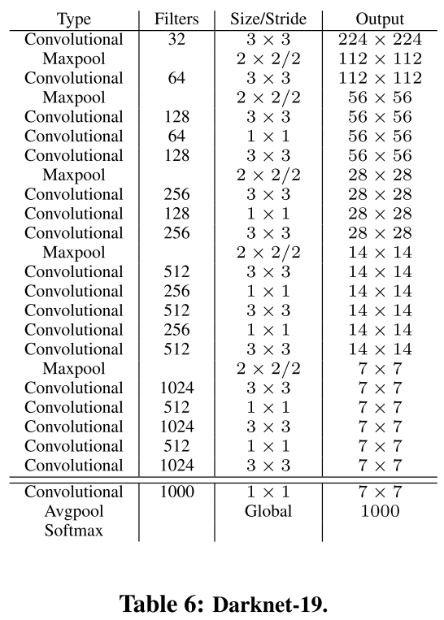

## YOLO V1
**Refrence**

https://zhuanlan.zhihu.com/p/37850811

YOLO意思是You Only Look Once，创造性的将候选区和对象识别这两个阶段合二为一，看一眼图片（不用看两眼哦）就能知道有哪些对象以及它们的位置。

将图片划分为 7*7=49 个网格（grid），每个网格允许预测出2个边框（bounding box，包含某个对象的矩形框），总共 49*2=98 个bounding box。可以理解为98个候选区，它们很粗略的覆盖了图片的整个区域。

RCNN虽然会找到一些候选区，但毕竟只是候选，等真正识别出其中的对象以后，还要对候选区进行微调，使之更接近真实的bounding box。这个过程就是边框回归：将候选区bounding box调整到更接近真实的bounding box。
既然反正最后都是要调整的，干嘛还要先费劲去寻找候选区呢，大致有个区域范围就行了，所以YOLO就这么干了

### 结构
YOLO的结构非常简单，就是单纯的卷积、池化最后加了两层全连接。单看网络结构的话，和普通的CNN对象分类网络几乎没有本质的区别，最大的差异是最后输出层用线性函数做激活函数，因为需要预测bounding box的位置（数值型），而不仅仅是对象的概率。所以粗略来说，YOLO的整个结构就是输入图片经过神经网络的变换得到一个输出的张量

```python
    x = Flatten()(x)
    x = Dense(4096, activation='linear', name='my_connected_0')(x)
    x = LeakyReLU(alpha=0.1)(x)
    x = Dense(1470, activation='linear', name='my_connected_1')(x)
    outputs = Yolo_Reshape([7, 7, 30])(x)
```
### 输入
输入就是原始图像，唯一的要求是缩放到448*448的大小。主要是因为YOLO的网络中，卷积层最后接了两个全连接层，全连接层是要求固定大小的向量作为输入，所以倒推回去也就要求原始图像有固定的尺寸。那么YOLO设计的尺寸就是448*448。

### 输出
输出是一个 7*7*30 的张量（tensor）
根据YOLO的设计，输入图像被划分为 7*7 的网格（grid），输出张量中的 7*7 就对应着输入图像的 7*7 网格。或者我们把 7*7*30 的张量看作 7*7=49个30维的向量，也就是输入图像中的每个网格对应输出一个30维的向量。参考上面图5，比如输入图像左上角的网格对应到输出张量中左上角的向量。
要注意的是，并不是说仅仅网格内的信息被映射到一个30维向量。经过神经网络对输入图像信息的提取和变换，网格周边的信息也会被识别和整理，最后编码到那个30维向量中。


① 20个对象分类的概率
因为YOLO支持识别20种不同的对象（人、鸟、猫、汽车、椅子等），所以这里有20个值表示该网格位置存在任一种对象的概率。
② 2个bounding box的位置
xy表示bounding box的中心相对于cell左上角坐标偏移，宽高则是相对于整张图片的宽高进行归一化的
③ 2个bounding box的置信度
bounding box的置信度 = 该bounding box内存在对象的概率 * 该bounding box与该对象实际bounding box的IOU
用公式来表示就是
$$ Confidence = Pr(Object) * IOU_{pred}^{truth} $$

一个bounding box的置信度Confidence意味着它 是否包含对象且位置准确的程度。置信度高表示这里存在一个对象且位置比较准确，置信度低表示可能没有对象 或者 即便有对象也存在较大的位置偏差。


### 讨论
① 一张图片最多可以检测出49个对象
每个30维向量中只有一组（20个）对象分类的概率，也就只能预测出一个对象。所以输出的 7*7=49个 30维向量，最多表示出49个对象。
② 总共有 49*2=98 个候选区（bounding box）
每个30维向量中有2组bounding box，所以总共是98个候选区。
③ YOLO的bounding box并不是Faster RCNN的Anchor
Faster RCNN等一些算法采用每个grid中手工设置n个Anchor（先验框，预先设置好位置的bounding box）的设计，每个Anchor有不同的大小和宽高比。YOLO的bounding box看起来很像一个grid中2个Anchor，但它们不是。YOLO并没有预先设置2个bounding box的大小和形状，也没有对每个bounding box分别输出一个对象的预测。它的意思仅仅是对一个对象预测出2个bounding box，选择预测得相对比较准的那个。
④ 可以调整网格数量、bounding box数量
7*7网格，每个网格2个bounding box，对448*448输入图像来说覆盖粒度有点粗。我们也可以设置更多的网格以及更多的bounding box。设网格数量为 S*S，每个网格产生B个边框，网络支持识别C个不同的对象

### LOSS

xy表示bounding box的中心相对于cell左上角坐标偏移，宽高则是相对于整张图片的宽高进行归一化的
xywh为什么要这么表示呢？实际上经过这么表示之后，xywh都归一化了，它们的值都是在0-1之间。我们通常做回归问题的时候都会将输出进行归一化，否则可能导致各个输出维度的取值范围差别很大，进而导致训练的时候，网络更关注数值大的维度。因为数值大的维度，算loss相应会比较大，为了让这个loss减小，那么网络就会尽量学习让这个维度loss变小，最终导致区别对待。


A: 小目标检测效果不好的原因是：

1. 目标小，yolov1网络到后面感受野较大，小目标的特征无法再后面7*7的grid中体现，针对这一点，yolov2已作了一定的修改，加入前层（感受野较小）的特征；

1. 目标小，可能会出现在一个grid里有两种物体，但是yolov1的模型决定了一个grid只能预测出一个物体，所以就会丢失目标，针对这一点，yolov2引入了anchor的概念，一个grid有多少个anchor理论上就可以预测多少个目标。

用宽和高的开根号代替原来的宽和高，这样做主要是因为相同的宽和高误差对于小的目标精度影响比大的目标要大。举个例子，原来w=10，h=20，预测出来w=8，h=22，跟原来w=3，h=5，预测出来w1，h=7相比，其实前者的误差要比后者小，但是如果不加开根号，那么损失都是一样：4+4=8，但是加上根号后，变成0.15和0.7。 


## YOLOV2
代码https://github.com/experiencor/keras-yolo2/blob/master/Yolo%20Step-by-Step.ipynb

YOLOv1虽然检测速度快，但在定位方面不够准确，并且召回率较低。为了提升定位准确度，改善召回率，YOLOv2在YOLOv1的基础上提出了几种改进策略，如下图所示，可以看到，一些改进方法能有效提高模型的mAP.
（1）Batch Normalization

YOLOv2中在每个卷积层后加Batch Normalization(BN)层，去掉dropout. BN层可以起到一定的正则化效果，能提升模型收敛速度，防止模型过拟合。YOLOv2通过使用BN层使得mAP提高了2%。
（2）High Resolution Classifier

目前的大部分检测模型都会使用主流分类网络（如vgg、resnet）在ImageNet上的预训练模型作为特征提取器,
而这些分类网络大部分都是以小于256x256的图片作为输入进行训练的，低分辨率会影响模型检测能力。YOLOv2将输入图片的分辨率提升至448x448，为了使网络适应新的分辨率，YOLOv2先在ImageNet上以448x448的分辨率对网络进行10个epoch的微调，让网络适应高分辨率的输入。通过使用高分辨率的输入，YOLOv2的mAP提升了约4%。

（3）Convolutional With Anchor Boxes

YOLOv1利用全连接层直接对边界框进行预测，导致丢失较多空间信息，定位不准。YOLOv2去掉了YOLOv1中的全连接层，使用Anchor Boxes预测边界框，同时为了得到更高分辨率的特征图，YOLOv2还去掉了一个池化层。由于图片中的物体都倾向于出现在图片的中心位置，若特征图恰好有一个中心位置，利用这个中心位置预测中心点落入该位置的物体，对这些物体的检测会更容易。所以总希望得到的特征图的宽高都为奇数。YOLOv2通过缩减网络，使用416x416的输入，模型下采样的总步长为32，最后得到13x13的特征图，然后对13x13的特征图的每个cell预测5个anchor boxes，对每个anchor box预测边界框的位置信息、置信度和一套分类概率值。使用anchor
boxes之后，YOLOv2可以预测13x13x5=845个边界框，模型的召回率由原来的81%提升到88%，mAP由原来的69.5%降低到69.2%.召回率提升了7%，准确率下降了0.3%。

（4）Dimension Clusters

在Faster R-CNN和SSD中，先验框都是手动设定的，带有一定的主观性。YOLOv2采用k-means聚类算法对训练集中的边界框做了聚类分析，选用boxes之间的IOU值作为聚类指标。综合考虑模型复杂度和召回率，最终选择5个聚类中心，得到5个先验框，发现其中中扁长的框较少，而瘦高的框更多，更符合行人特征。通过对比实验，发现用聚类分析得到的先验框比手动选择的先验框有更高的平均IOU值，这使得模型更容易训练学习。

（5）New Network：Darknet-19

YOLOv2采用Darknet-19，其网络结构如下图所示，包括19个卷积层和5个max pooling层，主要采用3x3卷积和1x1卷积，这里1x1卷积可以压缩特征图通道数以降低模型计算量和参数，每个卷积层后使用BN层以加快模型收敛同时防止过拟合。最终采用global avg pool 做预测。采用YOLOv2，模型的mAP值没有显著提升，但计算量减少了。

（6）Direct location prediction

Faster R-CNN使用anchor boxes预测边界框相对先验框的偏移量，由于没有对偏移量进行约束，每个位置预测的边界框可以落在图片任何位置，会导致模型不稳定，加长训练时间。YOLOv2沿用YOLOv1的方法，根据所在网格单元的位置来预测坐标,则Ground Truth的值介于0到1之间。网络中将得到的网络预测结果再输入sigmoid函数中，让输出结果介于0到1之间。设一个网格相对于图片左上角的偏移量是cx，cy。先验框的宽度和高度分别是pw和ph，则预测的边界框相对于特征图的中心坐标(bx，by)和宽高bw、bh的计算

YOLOv2结合Dimention Clusters, 通过对边界框的位置预测进行约束，使模型更容易稳定训练，这种方式使得模型的mAP值提升了约5%。
（7）Fine-Grained Features

YOLOv2借鉴SSD使用多尺度的特征图做检测，提出pass through层将高分辨率的特征图与低分辨率的特征图联系在一起，从而实现多尺度检测。YOLOv2提取Darknet-19最后一个max pool层的输入，得到26x26x512的特征图。经过1x1x64的卷积以降低特征图的维度，得到26x26x64的特征图，然后经过pass through层的处理变成13x13x256的特征图（抽取原特征图每个2x2的局部区域组成新的channel，即原特征图大小降低4倍，channel增加4倍），再与13x13x1024大小的特征图连接，变成13x13x1280的特征图，最后在这些特征图上做预测。使用Fine-Grained Features，YOLOv2的性能提升了1%.

* 注：pass through 是什么，先看下面darket19的模型图，这个input size小，和yolov2的input不一样，凑合着看，一共5个maxpool 在第五个maxpool的前面 ，取了一个pass through,26*26  512 ,采用64个1*1卷积核进行卷积,变成26*26 64，这个时候进行在numpy 叫做reshape+swapaxes，在tf中叫做[tf.space_to_depth](https://github.com/happycube/tensorflow-1/blob/master/tensorflow/g3doc/api_docs/python/functions_and_classes/shard6/tf.space_to_depth.md) 变成13*13 64，再和后面的层concat，具体看代码吧。
```python
import numpy as np 

def space_to_depth(x, block_size): 
    x = np.asarray(x) 
    batch, height, width, depth = x.shape 
    reduced_height = height // block_size 
    reduced_width = width // block_size 
    y = x.reshape(batch, reduced_height, block_size, 
         reduced_width, block_size, depth) 
    z = np.swapaxes(y, 2, 3).reshape(batch, reduced_height, reduced_width, -1) 
    return z 
```



（8）Multi-Scale Training

YOLOv2中使用的Darknet-19网络结构中只有卷积层和池化层，所以其对输入图片的大小没有限制。YOLOv2采用多尺度输入的方式训练，在训练过程中每隔10个batches,重新随机选择输入图片的尺寸，由于Darknet-19下采样总步长为32，输入图片的尺寸一般选择32的倍数{320,352,…,608}。采用Multi-Scale Training, 可以适应不同大小的图片输入，当采用低分辨率的图片输入时，mAP值略有下降，但速度更快，当采用高分辨率的图片输入时，能得到较高mAP值，但速度有所下降。

YOLOv2借鉴了很多其它目标检测方法的一些技巧，如Faster R-CNN的anchor boxes, SSD中的多尺度检测。除此之外，YOLOv2在网络设计上做了很多tricks,使它能在保证速度的同时提高检测准确率，Multi-Scale Training更使得同一个模型适应不同大小的输入，从而可以在速度和精度上进行自由权衡。

YOLOv2的训练

YOLOv2的训练主要包括三个阶段。
第一阶段：先在ImageNet分类数据集上预训练Darknet-19，此时模型输入为224224,共训练160个epochs。
第二阶段：将网络的输入调整为448448,继续在ImageNet数据集上finetune分类模型，训练10个epochs，此时分类模型的top-1准确度为76.5%，而top-5准确度为93.3%。
第三个阶段：修改Darknet-19分类模型为检测模型，并在检测数据集上继续finetune网络。
网络修改包括（网路结构可视化）：移除最后一个卷积层、global avgpooling层以及softmax层，并且新增了三个332014卷积层，同时增加了一个passthrough层，最后使用1*1卷积层输出预测结果。


## YOLOV3
https://mp.weixin.qq.com/s/4L9E4WGSh0hzlD303036bQ
注意yolov3 anchor中心点 不是网格中心点了， 是网格左上角
同时每一个bounding box预测5个坐值，分别为 tx,ty,tw,th,to ，其中前四个是坐标，to是置信度。如果这个cell距离图像左上角的边距为 (cx,cy)(cx,cy) 以及该cell对应box（bounding box prior）的长和宽分别为 (pw,ph)(pw,ph)，那么预测值可以表示为


### yolov3 的数据集怎么准备
https://github.com/xiaomaxiao/yolov3/blob/master/model/generator.py
说下答题的思路：
为每一个gt box计算与anchor的iou,选择iou最大的那个anchor。
### 训练的时候
对于confidence的计算，因为背景区域过多，需要计算一个ignore mask，就是对于背景区域预测出来的anchor和gtbox的iou如果大于0.5 则，不参与loss的计算。


YOLOv3 predicts an objectness score for each bounding
box using logistic regression. This should be 1 if the bounding box prior overlaps a ground truth object by more than
any other bounding box prior. **If the bounding box prior is not the best but does overlap a ground truth object by
more than some threshold we ignore the prediction, following [17]. We use the threshold of .5.** Unlike [17] our system
only assigns one bounding box prior for each ground truth
object. If a bounding box prior is not assigned to a ground
truth object it incurs no loss for coordinate or class predictions, only objectness.
