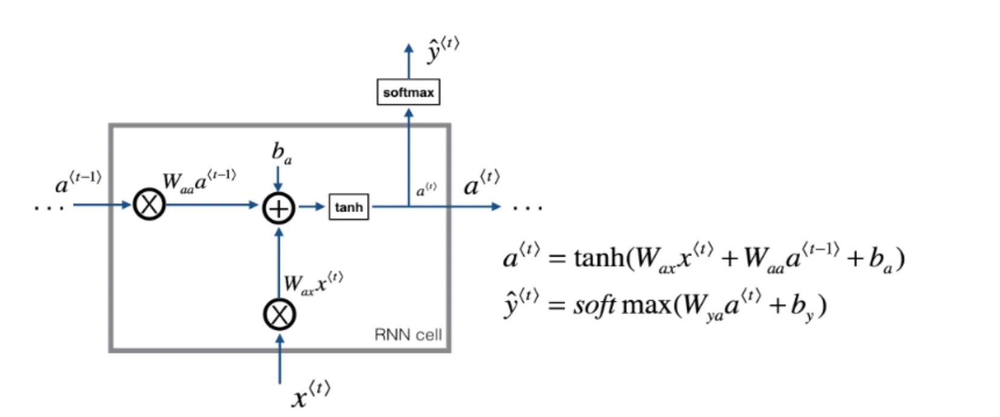
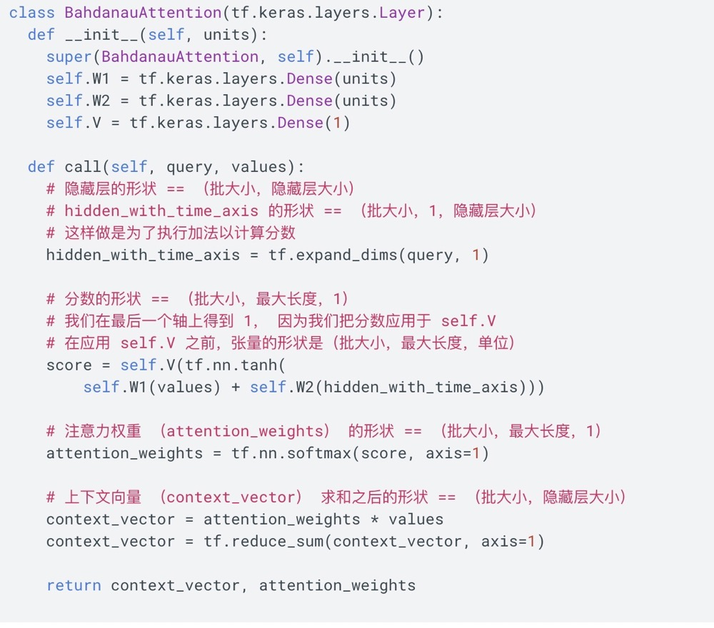
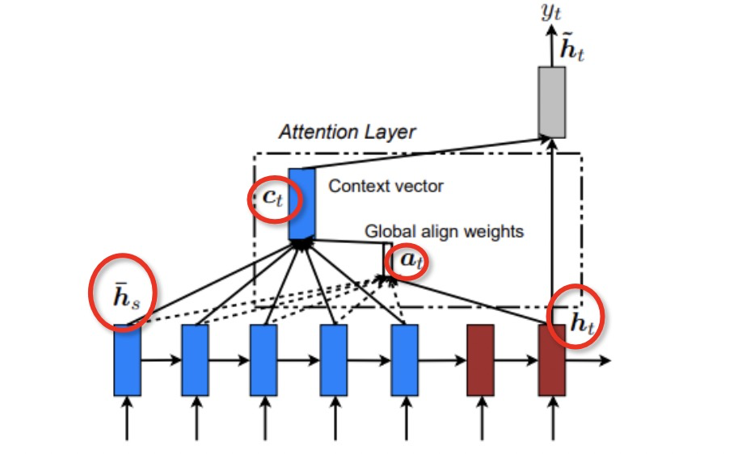
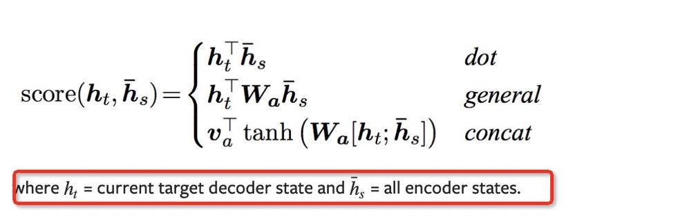
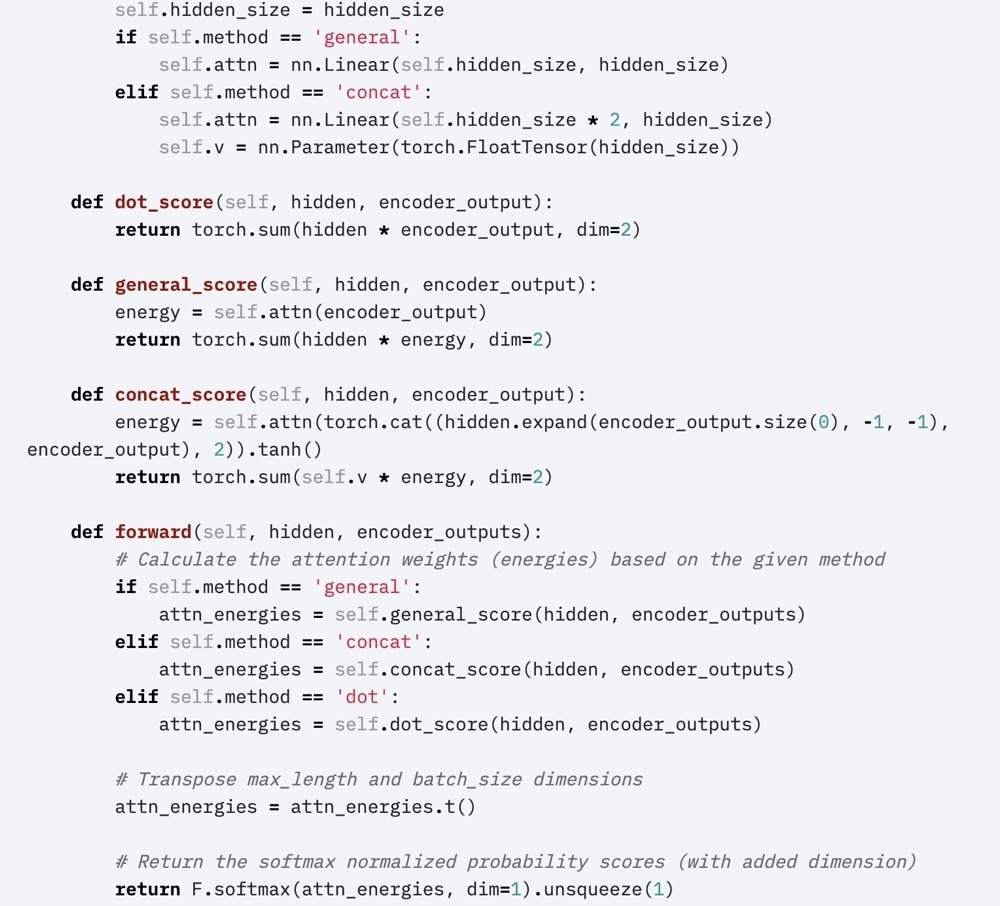

## RNN


这个图中用a表示了隐含状态，我在公式里用h写了。
$$ h_{t} = tanh(x_{t}W_{xh} + h_{t-1} W_{hh} + b_{h})$$

$$ \hat{y}_{t} = softmax(h_{t}W_{hy + b_{y}}) $$

* 形状表示
 $h_{t}$ = batchsize(n表示) * hidden_size(h表示)
 $x_{t}$ = n * x
 $W_{xh}$ = x * h
 $h_{t-1}$ = n * h
 $W_{hh}$ = h * h 
 $b_{n}$ = 1 * h
 $h_{t} = tanh(x_{t}W_{xh} + h_{t-1} W_{hh} + b_{h})$ = n * h 
 $\hat{y}_{t}$ = n * y
 $W_{hy}$ = h * y 
 $b_{y}$ = 1 * y 
 $\hat{y}_{t} = softmax(h_{t}W_{hy} + b_{y}) $ = n * y
 
* 在rnn函数中只有$h_{t}$部分没有$\hat{y}$.
$\hat{y}$是rnn后的操作，比如你要做分类等等。
* rnn的输出，在pytorch中输出h_n 和ouput
h_n指rnn的最后一个输出，output指所有timestep的输出，tensorflow也类似。注意output并不是$\hat{y}$


https://www.yiyibooks.cn/yiyibooks/Effective_Approaches_to_Attention_Based_Neural_Machine_Translation/index.html

## attention要解决的问题
https://www.jianshu.com/p/c94909b835d6


## bahdanua
https://www.tensorflow.org/tutorials/text/nmt_with_attention

$$ score_{alignment} = W_{combined} \cdot tanh(W_{decoder} \cdot H_{decoder} + W_{encoder} \cdot H_{encoder}) $$

* $H_{decoder}$的第一次是取$H_{encoder}的最后一个隐含状态$
* query 是 decoder
* valude 是 encode 的输出

## luong
与[Bahdanau et al. 2015]的比较 — 尽管我们的全局 attention 方式在本质上类似于Bahdanau et al. 2015提出的模型，有几个关键差异反映了我们如何从原始模型中进行简化和泛化。 **首先，我们只需在编码器和解码器的顶层LSTM层使用隐藏状态**  而Bahdanau et al. 2015 将双向编码器中将前向和后向源隐藏状态和非堆叠的单向解码器中的目标隐藏状态连接起来。 **其次，我们的计算路径更简单：我们从ht →at →ct →˜ht，然后进行预测，等式(5)、等式(6)和图2有详细解释。 然而，在任何时刻t，Bahdanau et al. 2015 从前一个隐藏状态构建 ht-1 →at →ct →ht，然后再预测之前再添加一个deep-output 和一个 maxout 层**。 **最后，Bahdanau et al. 2015 只使用一个对齐函数concat 积进行了实验；而我们显示其他方法更好。**




## attention的可视化
socre 就是
## mask loss 
## tick
* teacher_forcing 可以快速收敛，副作用是解码器没有足够的机会遇到真实的编码输出，导致模型不稳定，
因此需要设置概率teacher_forcing_ratio
* gradient clip 防止梯度爆炸

## 贪婪搜索
## 穷举搜索
## beam search(束搜索)
转seq2seq.md 看
## 评价指标
### blue
评价机器翻译结果通常使用BLEU（Bilingual Evaluation Understudy）[1]。对于模型预测序列中任意的子序列，BLEU考察这个子序列是否出现在标签序列中。

具体来说，设词数为$n$的子序列的精度为$p_n$。它是预测序列与标签序列匹配词数为$n$的子序列的数量与预测序列中词数为$n$的子序列的数量之比。举个例子，假设标签序列为$A$、$B$、$C$、$D$、$E$、$F$，预测序列为$A$、$B$、$B$、$C$、$D$，那么$p_1 = 4/5,(预测序列共5个字符，预测对4个)\ p_2 = 3/4(预测序列相邻两两组合共预测对3个),\ p_3 = 1/3,\ p_4 = 0$。设$len_{\text{label}}$和$len_{\text{pred}}$分别为标签序列和预测序列的词数，那么，BLEU的定义为

$$ \exp\left(\min\left(0, 1 - \frac{len_{\text{label}}}{len_{\text{pred}}}\right)\right) \prod_{n=1}^k p_n^{1/2^n},$$

其中$k$是我们希望匹配的子序列的最大词数。可以看到当预测序列和标签序列完全一致时，BLEU为1。

因为匹配较长子序列比匹配较短子序列更难，BLEU对匹配较长子序列的精度赋予了更大权重。例如，当$p_n$固定在0.5时，随着$n$的增大，$0.5^{1/2} \approx 0.7, 0.5^{1/4} \approx 0.84, 0.5^{1/8} \approx 0.92, 0.5^{1/16} \approx 0.96$。另外，模型预测较短序列往往会得到较高$p_n$值。因此，上式中连乘项前面的系数是为了惩罚较短的输出而设的。举个例子，当$k=2$时，假设标签序列为$A$、$B$、$C$、$D$、$E$、$F$，而预测序列为$A$、$B$。虽然$p_1 = p_2 = 1$，但惩罚系数$\exp(1-6/2) \approx 0.14$，因此BLEU也接近0.14。

下面来实现BLEU的计算。
```python
def bleu(pred_tokens, label_tokens, k):
    len_pred, len_label = len(pred_tokens), len(label_tokens)
    score = math.exp(min(0, 1 - len_label / len_pred))
    for n in range(1, k + 1):
        num_matches, label_subs = 0, collections.defaultdict(int)
        for i in range(len_label - n + 1):
            label_subs[''.join(label_tokens[i: i + n])] += 1
        for i in range(len_pred - n + 1):
            if label_subs[''.join(pred_tokens[i: i + n])] > 0:
                num_matches += 1
                label_subs[''.join(pred_tokens[i: i + n])] -= 1      
        score *= math.pow(num_matches / (len_pred - n + 1), math.pow(0.5, n))
    return score
```

### 困惑度(Perplexity)