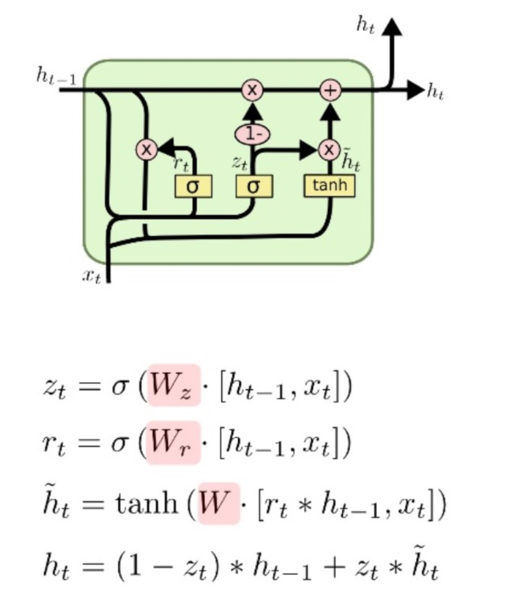
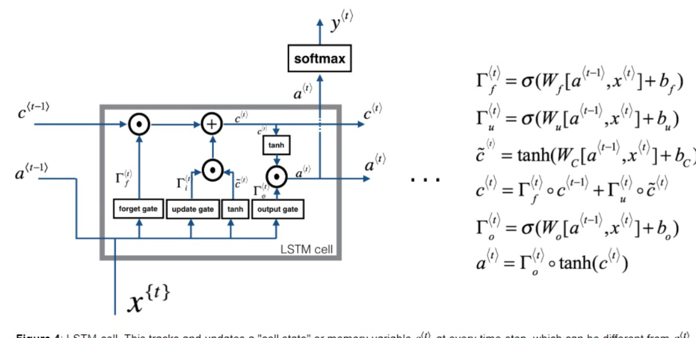

## RNN


这个图中用a表示了隐含状态，我在公式里用h写了。
$$ h_{t} = tanh(x_{t}W_{xh} + h_{t-1} W_{hh} + b_{h})$$

$$ \hat{y}_{t} = softmax(h_{t}W_{hy + b_{y}}) $$

* 形状表示
 $h_{t}$ = batchsize(n表示) * hidden_size(h表示)
 $x_{t}$ = n * x
 $W_{xh}$ = x * h
 $h_{t-1}$ = n * h
 $W_{hh}$ = h * h 
 $b_{n}$ = 1 * h
 $h_{t} = tanh(x_{t}W_{xh} + h_{t-1} W_{hh} + b_{h})$ = n * h 
 $\hat{y}_{t}$ = n * y
 $W_{hy}$ = h * y 
 $b_{y}$ = 1 * y 
 $\hat{y}_{t} = softmax(h_{t}W_{hy} + b_{y}) $ = n * y
 
* 在rnn函数中只有$h_{t}$部分没有$\hat{y}$.
$\hat{y}$是rnn后的操作，比如你要做分类等等。
* rnn的输出，在pytorch中输出h_n 和ouput
h_n指rnn的最后一个输出，output指所有timestep的输出，tensorflow也类似。注意output并不是$\hat{y}$

https://www.bilibili.com/video/av18262110?from=search&seid=16930771410284656948
这个视频讲lstm和gru不错,先讲gru再讲lstm更容易理解
## gru

$$
\begin{aligned}
\boldsymbol{R}_t = \sigma(\boldsymbol{X}_t \boldsymbol{W}_{xr} + \boldsymbol{H}_{t-1} \boldsymbol{W}_{hr} + \boldsymbol{b}_r),\\
\boldsymbol{Z}_t = \sigma(\boldsymbol{X}_t \boldsymbol{W}_{xz} + \boldsymbol{H}_{t-1} \boldsymbol{W}_{hz} + \boldsymbol{b}_z),\\
\tilde{\boldsymbol{H}}_t = \text{tanh}(\boldsymbol{X}_t \boldsymbol{W}_{xh} + \left(\boldsymbol{R}_t \odot \boldsymbol{H}_{t-1}\right) \boldsymbol{W}_{hh} + \boldsymbol{b}_h),\\
\boldsymbol{H}_t = \boldsymbol{Z}_t \odot \boldsymbol{H}_{t-1}  + (1 - \boldsymbol{Z}_t) \odot \tilde{\boldsymbol{H}}_t.
\end{aligned}
$$

* $z_{t} 重置门$
* $r_{t} 更新门$
* 这两个门没什么花里胡哨的，都是用$\boldsymbol{X}_t\boldsymbol{H}_{t-1}$参与计算

* $\hat{h}_{t} 候选隐藏状态$ 它通过更新门来决定上一个时刻的隐藏状态哪些需要更新
* $\hat{h}_{t} 最终参与计算的隐藏状态$ 前半部分$z_{t}$决定来哪些需要丢弃，后半部分决定哪些需要更新
* 重置门有助于捕捉时间序列里短期的依赖关系；因为它是丢弃
* 更新门有助于捕捉时间序列里长期的依赖关系。因为它是保留
## lstm 
长短期记忆（Long short-term memory, LSTM）是一种特殊的RNN，主要是为了解决长序列训练过程中的梯度消失和梯度爆炸问题。简单来说，就是相比普通的RNN，LSTM能够在更长的序列中有更好的表现。

$$
\begin{aligned}
输入门-\boldsymbol{I}_t &= \sigma(\boldsymbol{X}_t \boldsymbol{W}_{xi} + \boldsymbol{H}_{t-1} \boldsymbol{W}_{hi} + \boldsymbol{b}_i),\\
遗忘门-\boldsymbol{F}_t &= \sigma(\boldsymbol{X}_t \boldsymbol{W}_{xf} + \boldsymbol{H}_{t-1} \boldsymbol{W}_{hf} + \boldsymbol{b}_f),\\
输出门-\boldsymbol{O}_t &= \sigma(\boldsymbol{X}_t \boldsymbol{W}_{xo} + \boldsymbol{H}_{t-1} \boldsymbol{W}_{ho} + \boldsymbol{b}_o),
\end{aligned}
$$

$$
\begin{aligned}
候选记忆细胞 - \tilde{\boldsymbol{C}}_t = \text{tanh}(\boldsymbol{X}_t \boldsymbol{W}_{xc} + \boldsymbol{H}_{t-1} \boldsymbol{W}_{hc} + \boldsymbol{b}_c),\\
记忆细胞-\boldsymbol{C}_t = \boldsymbol{F}_t \odot \boldsymbol{C}_{t-1} + \boldsymbol{I}_t \odot \tilde{\boldsymbol{C}}_t.\\
隐藏状态 - \boldsymbol{H}_t = \boldsymbol{O}_t \odot \text{tanh}(\boldsymbol{C}_t).
\end{aligned}
$$
* 和gru 差不多，只是多了一个输出门 ， 如果我们把输出门和隐藏状态这两个去掉和gru是一样多。但是这两个有什么用呢，隐藏状态有一个输出门来控制，这个决定多记忆细胞是不是要用或者不用，但是记忆细胞是保留多，它可能在当前没用，在以后会有用


https://www.yiyibooks.cn/yiyibooks/Effective_Approaches_to_Attention_Based_Neural_Machine_Translation/index.html

## attention要解决的问题
https://www.jianshu.com/p/c94909b835d6
encoder-decoder最大的缺点是，encoder接收了不管多长的语句，最后输出的只是最后一个vector，当语句很长时，这个vector能否有效地表示该语句是很值得怀疑的。
如何解决这个问题呢？我们很自然会想到，第一个RNN其实在中间会产生很多输出，这些输出都被我们抛弃了，我们只用了最后的一个。如果能利用上中间的输出，兴许可以解决问题。Attention正是利用上了这些中间的输出。


https://github.com/spro/practical-pytorch/blob/master/seq2seq-translation/seq2seq-translation-batched.ipynb
## bahdanua
https://www.tensorflow.org/tutorials/text/nmt_with_attention

$$ score_{alignment} = W_{combined} \cdot tanh(W_{decoder} \cdot H_{decoder} + W_{encoder} \cdot H_{encoder}) $$

* $H_{decoder}$的第一次是取$H_{encoder}的最后一个隐含状态$
* query 是 decoder
* valude 是 encode 的输出

## luong
与[Bahdanau et al. 2015]的比较 — 尽管我们的全局 attention 方式在本质上类似于Bahdanau et al. 2015提出的模型，有几个关键差异反映了我们如何从原始模型中进行简化和泛化。 **首先，我们只需在编码器和解码器的顶层LSTM层使用隐藏状态**  而Bahdanau et al. 2015 将双向编码器中将前向和后向源隐藏状态和非堆叠的单向解码器中的目标隐藏状态连接起来。 **其次，我们的计算路径更简单：我们从ht →at →ct →˜ht，然后进行预测，等式(5)、等式(6)和图2有详细解释。 然而，在任何时刻t，Bahdanau et al. 2015 从前一个隐藏状态构建 ht-1 →at →ct →ht，然后再预测之前再添加一个deep-output 和一个 maxout 层**。 **最后，Bahdanau et al. 2015 只使用一个对齐函数concat 积进行了实验；而我们显示其他方法更好。**


## attention的可视化
socre 就是
## mask loss 
## tick
* teacher_forcing 可以快速收敛，副作用是解码器没有足够的机会遇到真实的编码输出，导致模型不稳定，
因此需要设置概率teacher_forcing_ratio
https://zhuanlan.zhihu.com/p/93030328
* gradient clip 防止梯度爆炸

## 贪婪搜索
## 穷举搜索
## beam search(束搜索)
转seq2seq.md 看

https://blog.csdn.net/u014514939/article/details/95667422
https://github.com/budzianowski/PyTorch-Beam-Search-Decoding/blob/master/decode_beam.py
https://github.com/ottokart/beam_search/blob/master/beam_search.py
https://github.com/vahidk/EffectiveTensorflow#beam_search
https://github.com/allenai/allennlp/blob/master/allennlp/nn/beam_search.py
```python
class Node(object):
    def __init__(self, hidden, previous_node, decoder_input, attn, log_prob, length):
        self.hidden = hidden
        self.previous_node = previous_node
        self.decoder_input = decoder_input
        self.attn = attn
        self.log_prob = log_prob
        self.length = length        


def beam_search(beam_width):
    ...
    root = Node(hidden, None, decoder_input, None, 0, 1)
    q = Queue()
    q.put(root)
    
    end_nodes = [] #最终节点的位置，用于回溯
    while not q.empty():
        candidates = []  #每一层的可能被拓展的节点，只需选取每个父节点的儿子节点中概率最大的k个即可
    
        for _ in range(q.qsize()):
            node = q.get()
            decoder_input = node.decoder_input
            hidden = node.hidden
            
            # 搜索终止条件
            if decoder_input.item() == EOS or node.length >= 50:
                end_nodes.append(node)
                continue
              
            log_prob, hidden, attn = decoder(
                 decoder_input, hidden, encoder_input
             )
             
             log_prob, indices = log_prob.topk(beam_width) #选取某个父节点的儿子节点概率最大的k个
             
             for k in range(beam_width):
                  index = indices[k].unsqueeze(0)
                  log_p = log_prob[k].item()
                  child = Node(hidden, node, index, attn, node.log_prob + log_p, node.length + 1)
                  candidates.append((node.log_prob + log_p, child))  #建立候选儿子节点，注意这里概率需要累计
           
         candidates = sorted(candidates, key=lambda x:x[0], reverse=True) #候选节点排序
         length = min(len(candidates), beam_width)  #取前k个，如果不足k个，则全部入选
         for i in range(length):
             q.put(candidates[i][1])  

    # 后面是回溯, 省略
    ...

```
## 评价指标
### blue
评价机器翻译结果通常使用BLEU（Bilingual Evaluation Understudy）[1]。对于模型预测序列中任意的子序列，BLEU考察这个子序列是否出现在标签序列中。

具体来说，设词数为$n$的子序列的精度为$p_n$。它是预测序列与标签序列匹配词数为$n$的子序列的数量与预测序列中词数为$n$的子序列的数量之比。举个例子，假设标签序列为$A$、$B$、$C$、$D$、$E$、$F$，预测序列为$A$、$B$、$B$、$C$、$D$，那么$p_1 = 4/5,(预测序列共5个字符，预测对4个)\ p_2 = 3/4(预测序列相邻两两组合共预测对3个),\ p_3 = 1/3,\ p_4 = 0$。设$len_{\text{label}}$和$len_{\text{pred}}$分别为标签序列和预测序列的词数，那么，BLEU的定义为

$$ \exp\left(\min\left(0, 1 - \frac{len_{\text{label}}}{len_{\text{pred}}}\right)\right) \prod_{n=1}^k p_n^{1/2^n},$$

其中$k$是我们希望匹配的子序列的最大词数。可以看到当预测序列和标签序列完全一致时，BLEU为1。

因为匹配较长子序列比匹配较短子序列更难，BLEU对匹配较长子序列的精度赋予了更大权重。例如，当$p_n$固定在0.5时，随着$n$的增大，$0.5^{1/2} \approx 0.7, 0.5^{1/4} \approx 0.84, 0.5^{1/8} \approx 0.92, 0.5^{1/16} \approx 0.96$。另外，模型预测较短序列往往会得到较高$p_n$值。因此，上式中连乘项前面的系数是为了惩罚较短的输出而设的。举个例子，当$k=2$时，假设标签序列为$A$、$B$、$C$、$D$、$E$、$F$，而预测序列为$A$、$B$。虽然$p_1 = p_2 = 1$，但惩罚系数$\exp(1-6/2) \approx 0.14$，因此BLEU也接近0.14。

下面来实现BLEU的计算。
```python
def bleu(pred_tokens, label_tokens, k):
    len_pred, len_label = len(pred_tokens), len(label_tokens)
    score = math.exp(min(0, 1 - len_label / len_pred))
    for n in range(1, k + 1):
        num_matches, label_subs = 0, collections.defaultdict(int)
        for i in range(len_label - n + 1):
            label_subs[''.join(label_tokens[i: i + n])] += 1
        for i in range(len_pred - n + 1):
            if label_subs[''.join(pred_tokens[i: i + n])] > 0:
                num_matches += 1
                label_subs[''.join(pred_tokens[i: i + n])] -= 1      
        score *= math.pow(num_matches / (len_pred - n + 1), math.pow(0.5, n))
    return score
```

### 困惑度(Perplexity)

https://pytorch.org/tutorials/beginner/chatbot_tutorial.html


https://blog.keras.io/a-ten-minute-introduction-to-sequence-to-sequence-learning-in-keras.html
https://www.bilibili.com/video/BV1qx41197mh?from=search&seid=10980733662144393179