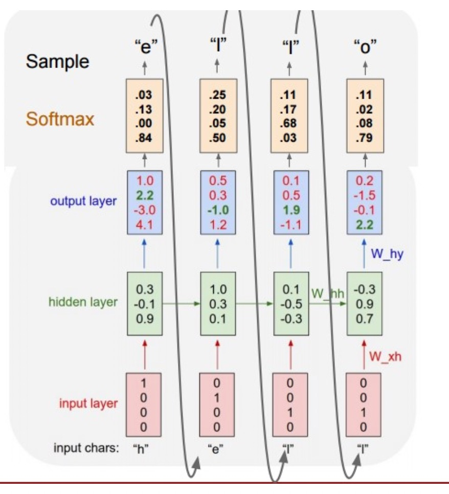

## RNN

这个图中用a表示了隐含状态，我在公式里用h写了。
$$ h_{t} = tanh(x_{t}W_{xh} + h_{t-1} W_{hh} + b_{h})$$

$$ \hat{y}_{t} = softmax(h_{t}W_{hy + b_{y}}) $$

* 形状表示
 $h_{t}$ = batchsize(n表示) * hidden_size(h表示)
 $x_{t}$ = n * x
 $W_{xh}$ = x * h
 $h_{t-1}$ = n * h
 $W_{hh}$ = h * h 
 $b_{n}$ = 1 * h
 $h_{t} = tanh(x_{t}W_{xh} + h_{t-1} W_{hh} + b_{h})$ = n * h 
 $\hat{y}_{t}$ = n * y
 $W_{hy}$ = h * y 
 $b_{y}$ = 1 * y 
 $\hat{y}_{t} = softmax(h_{t}W_{hy + b_{y}}) $ = n * y
 
* 在rnn函数中只有$h_{t}$部分没有$\hat{y}$.
$\hat{y}$是rnn后的操作，比如你要做分类等等。
* rnn的输出，在pytorch中输出h_n 和ouput
h_n指rnn的最后一个输出，output指所有timestep的输出，tensorflow也类似。注意output并不是$\hat{y}$

https://www.yiyibooks.cn/yiyibooks/Effective_Approaches_to_Attention_Based_Neural_Machine_Translation/index.html
## bahdanua
$$ score_{alignment} = W_{combined} \cdot tanh(W_{decoder} \cdot H_{decoder} + W_{encoder} \cdot H_{encoder}) $$
## luong
与[Bahdanau et al. 2015]的比较 — 尽管我们的全局 attention 方式在本质上类似于Bahdanau et al. 2015提出的模型，有几个关键差异反映了我们如何从原始模型中进行简化和泛化。 **首先，我们只需在编码器和解码器的顶层LSTM层使用隐藏状态**  而Bahdanau et al. 2015 将双向编码器中将前向和后向源隐藏状态和非堆叠的单向解码器中的目标隐藏状态连接起来。 **其次，我们的计算路径更简单：我们从ht →at →ct →˜ht，然后进行预测，等式(5)、等式(6)和图2有详细解释。 然而，在任何时刻t，Bahdanau et al. 2015 从前一个隐藏状态构建 ht-1 →at →ct →ht，然后再预测之前再添加一个deep-output 和一个 maxout 层**。 **最后，Bahdanau et al. 2015 只使用一个对齐函数concat 积进行了实验；而我们显示其他方法更好。**

