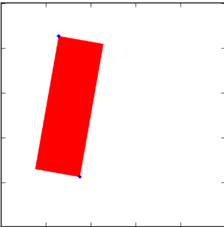
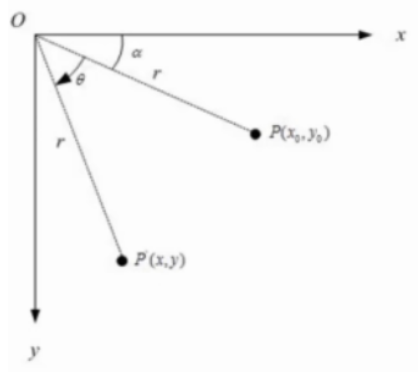
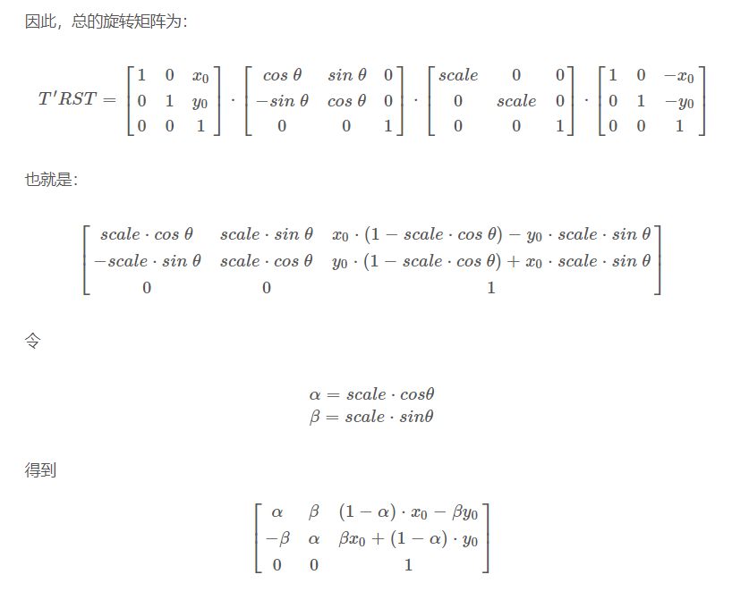
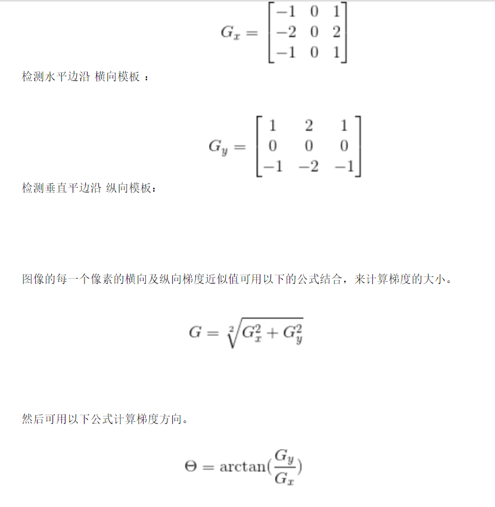
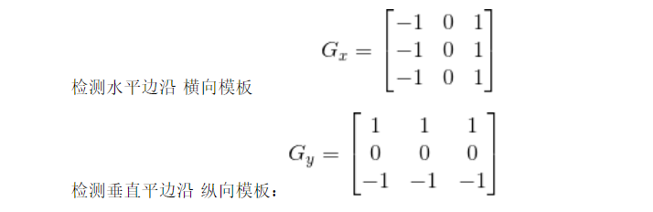
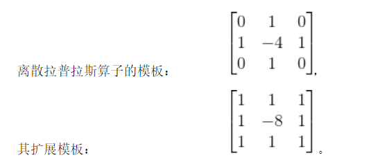
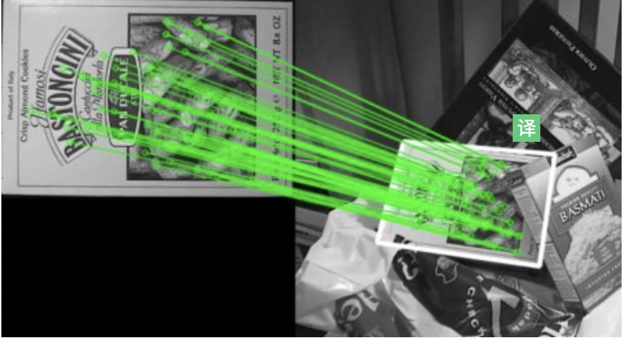

# 图像旋转
```python
"""
在图像中画一个矩形，旋转图像的同时，点跟着旋转
"""
import cv2
import numpy as np 
import matplotlib.pyplot as plt 

(h,w) = 500,500

img = np.ones((h,w,3),np.uint8) * 255

# (pt1,pt2)
rect = [(100,100),(200,400)]
img = cv2.rectangle(img,rect[0],rect[1],color=(255,0,0),thickness=-1)
img_1 = np.copy(img)
for r in rect:
    cv2.circle(img_1,r,2,(0,0,255),thickness=3)
plt.imshow(img_1)

img_2 = np.copy(img)
M  = cv2.getRotationMatrix2D((w/2,h/2),-10,1.0)
img_2 = cv2.warpAffine(img_2,M,(w,h),borderValue=(255,255,255))
#注意这里
#https://stackoverflow.com/questions/44378098/trouble-getting-cv-transform-to-work
r_rect = cv2.transform(np.array([rect]),M)[0]
for r in r_rect:
    print(r)
    cv2.circle(img_2,tuple(r),2,(0,0,255),thickness=3)
plt.imshow(img_2)
```


## 像素坐标矩阵变换
### 平移
$$
x = x_{0} + ax \\
y = y_{0} + ay
$$
$$
\begin{bmatrix}
    x\\
    y\\
    z
\end{bmatrix} =
\begin{bmatrix}
    1&0&ax\\
    0&1&ay\\
    0&0&1
\end{bmatrix}
\begin{bmatrix}
    x_{0}\\
    y_{0}\\
    1
\end{bmatrix}
$$

### 旋转

$$
x_{0} = r\cos\alpha\\
y_{0} = r\sin\alpha\\
x = r\cos(\alpha+\theta) = r\cos\alpha \cos\theta - r\sin\alpha sin\theta = x_{0}\cos\theta - y_{0}\sin\theta\\
y = r\sin(\alpha + \theta) = r\sin\alpha \cos\theta + r\cos\alpha\sin\theta = y_{0}\cos\theta + x_{0}\sin\theta
$$
$$
\begin{bmatrix}
    x\\
    y\\
    1
\end{bmatrix} =
\begin{bmatrix}
    \cos\theta&-\sin\theta&0\\
    \sin\theta&\cos\theta&0\\
    0&0&1
\end{bmatrix}
\begin{bmatrix}
    x_{0}\\
    y_{0}\\
    1
\end{bmatrix}
$$

### 缩放
$$
x = k1 * x_{0}\\
y = k2 * y_{0}
$$
$$
\begin{bmatrix}
    x\\y\\1
\end{bmatrix} = 
\begin{bmatrix}
   k1&0&0\\
   0&k2&0\\
   0&0&1 
\end{bmatrix}
\begin{bmatrix}
    x_{0}\\y_{0}\\1
\end{bmatrix}
$$

## 原理推导 
getRotationMatrix2D
https://charlesnord.github.io/2017/04/01/rotation/


## 旋转矩阵 防止cut off
```python
def warpAffine_Padded(src_h,src_w,M,mode='matrix'):
    '''
    重新计算旋转矩阵，防止cut off image
    args：
        src_h,src_w 原图的高、宽
        mode: mode is matrix 时 M 是旋转矩阵
              mode is angle 时  M 是角度
    returns:
        offset_M : 新的旋转矩阵
        padded_w,padded_h : 图像的新宽、高
    
    ------------------------------------
    用法：
        h,w = imagetest.shape[0:2]
        M = cv2.getRotationMatrix2D((w/2,h/2),angle,1.0)
        offset_M , padded_w , padded_h = warpAffinePadded(h,w,M)
        rects = cv2.transform(rects,offset_M)
        imagetest = cv2.warpAffine(imagetest,offset_M,(padded_w,padded_h))
    '''
    if(mode == 'angle'):
        M = cv2.getRotationMatrix2D((src_w/2,src_h/2),M,1.0)
    
    # 图像四个顶点
    lin_pts = np.array([
        [0,0],
        [src_w,0],
        [src_w,src_h],
        [0,src_h]
    ])
    trans_lin_pts = cv2.transform(np.array([lin_pts]),M)[0]
    
    #最大最小点
    min_x = np.floor(np.min(trans_lin_pts[:,0])).astype(int)
    min_y = np.floor(np.min(trans_lin_pts[:,1])).astype(int)
    max_x = np.ceil(np.max(trans_lin_pts[:,0])).astype(int)
    max_y = np.ceil(np.max(trans_lin_pts[:,1])).astype(int)

    offset_x = -min_x if min_x < 0 else 0
    offset_y = -min_y if min_y < 0 else 0
    #print('offsetx:{},offsety:{}'.format(offset_x,offset_y))
    offset_M = M + [[0,0,offset_x],[0,0,offset_y]]

    padded_w = src_w + (max_x - src_w)  + offset_x 
    padded_h = src_h + (max_y - src_h)  + offset_y 
    return offset_M,padded_w,padded_h

```


# 边缘检测算子
## sobel 


## prewitt


## laplacian



# 平滑
## 均值
### 代码实现
https://medium.com/@akumar5/computer-vision-gaussian-filter-from-scratch-b485837b6e09
## 中值
## 高斯

# 图像颜色空间
https://zhuanlan.zhihu.com/p/32269942

## RGB
```python
'''
各通道取不同的阈值二值化
'''
strawberry = cv2.imread('s.jpg')
lower = np.array([0,0,100])
upper = np.array([40,40,255])
bin = cv2.inRange(strawberry,lower,upper)
```

因为在比较暗的地方，整张图的 RGB 的数值都很低，在比较亮的地方，数值又比较高。 RGB 三个通道的数值都很容易随着光照的改变而改变，无法在复杂的环境中得到自己需要的特定区域

## HSV
色相（Hue) 饱和度(Saturation) 亮度(Value)
H 代表色彩，S 代表颜色的深浅，V 代表着颜色的明暗程度。
在 OpenCV 视觉库中，HSV 的数值被做了一些小的修改， H 的范围调整为 0~180，S 和 V 的范围为 0~255。
当我们采用 HSV 的图像阈值得到某一种颜色时，可以参考颜色分布表，先将 H 通道对应的颜色找到。表格中，每种颜色都对应了一个区间。
即使明度取值 255 也不会变为全白，因为这时，这个取值是指蓝色的亮度，而不是像 RGB 一样表示颜色。饱和度同理。

```python
HSV = cv2.cvtColor(img, cv2.COLOR_BGR2HSV)  #RGB 转为 HSV
H, S, V = cv2.split(HSV)    #分离 HSV 三通道
Lowerred0 = np.array([155,43,35])
Upperred0 = np.array([180,255,255])
mask1 = cv2.inRange(HSV, Lowerred0, Upperred0) 
Lowerred1 = np.array([0,43,35])
Upperred1 = np.array([11,255,255])
mask2 = cv2.inRange(HSV, Lowerred1, Upperred1)    #将红色区域部分归为全白，其他区域归为全黑
Apple = mask1 +mask2
```


## YUV
YUV 色彩空间实际上是把一幅彩色的图片分成了一个表示暗亮程度的亮度信号(Luminance)Y，和两个表示颜色的色度信号(Chrominance)U 和 V。U，V通道分别是蓝色通道和红色通道，Y 通道表示亮度信息。

U 通道数值越高，颜色就越接近蓝色，V 通道数值越高，颜色就越接近红色,Y 通道数值越高，图片则越亮。

为什么会有这种颜色通道呢？其实这是被欧洲的电视系统采用的一种颜色编码方式，主要是为了让信号支持新的彩色电视，但也继续支持黑白电视。如果是黑白电视，只使用 Y 通道信号就足够了

即使是光线发生了很大的改变，V 通道还是能很好的体现出红色来。所以当我们要识别红蓝色物体时，使用 YUV 通道就会有较好的效果。
```python
fruit = cv2.imread("fruits.jpg")
fruit = cv2.cvtColor(fruit,cv2.COLOR_BGR2YUV)
Y,U,V = cv2.split(fruit)
Blueberry = cv2.inRange(U,130,255)
Strawberry = cv2.inRange(V,170,255)
cv2.imshow("blueberry",Blueberry)
cv2.imshow("strawberry",Strawberry)
cv2.waitKey(0)
```

## CMYK
CMYK 色彩空间中，C（cyan）代表青色，M（magenta）代表洋红色，Y（yellow）代表黄色，K（black）代表黑色。

CMYK 主要使用在印刷方面，比如喷墨打印机一般都是使用这四种颜色的墨盒。在 RGB 色彩空间里红色，绿色和蓝色叠加起来的时候是白色，但在 CMYK 色彩空间中，青色，洋红色，黄色叠加起来是黑色。

但是实际情况中，颜色叠加起来会是褐色，所以还是会加上单独的黑色。相比于 RGB，CMYK 更加实用于在白色的介质上打印图像。

# 特征点匹配
https://docs.opencv.org/3.0-beta/doc/py_tutorials/py_feature2d/py_feature_homography/py_feature_homography.html#py-feature-homography

```python
import numpy as np
import cv2
from matplotlib import pyplot as plt

MIN_MATCH_COUNT = 10

img1 = cv2.imread('box.png',0)          # queryImage
img2 = cv2.imread('box_in_scene.png',0) # trainImage

# Initiate SIFT detector
#cv2.SIFT(100) 保留100个特征点
sift = cv2.SIFT()

# find the keypoints and descriptors with SIFT
kp1, des1 = sift.detectAndCompute(img1,None)
kp2, des2 = sift.detectAndCompute(img2,None)

FLANN_INDEX_KDTREE = 0
index_params = dict(algorithm = FLANN_INDEX_KDTREE, trees = 5)
search_params = dict(checks = 50)

flann = cv2.FlannBasedMatcher(index_params, search_params)

matches = flann.knnMatch(des1,des2,k=2)

# store all the good matches as per Lowe's ratio test.
good = []
for m,n in matches:
    if m.distance < 0.7*n.distance:
        good.append(m)
```

接下来透视变换

```python
if len(good)>MIN_MATCH_COUNT:
    src_pts = np.float32([ kp1[m.queryIdx].pt for m in good ]).reshape(-1,1,2)
    dst_pts = np.float32([ kp2[m.trainIdx].pt for m in good ]).reshape(-1,1,2)

    M, mask = cv2.findHomography(src_pts, dst_pts, cv2.RANSAC,5.0)
    matchesMask = mask.ravel().tolist()

    h,w = img1.shape
    pts = np.float32([ [0,0],[0,h-1],[w-1,h-1],[w-1,0] ]).reshape(-1,1,2)
    dst = cv2.perspectiveTransform(pts,M)

    img2 = cv2.polylines(img2,[np.int32(dst)],True,255,3, cv2.LINE_AA)

else:
    print "Not enough matches are found - %d/%d" % (len(good),MIN_MATCH_COUNT)
    matchesMask = None
```
接下来透视变换把图抠出来
```python
pts = pts.reshape(4,2)
w = pts[1][0] - pts[0][0]
h = pts[2][1] - pts[1][1]
pt2 = np.array([[0,0],[w,0],[w,h],[0,h]],dtype='float32')
pt1 = pt1.astype('float32')
M = cv2.getPerspectiveTransform(pt1,pt2)
perspective = cv2.warpPerspective(dst,M,(w,h),cv2.INTER_LINEAR) 
```

## 特征点保存与加载
https://isotope11.com/blog/storing-surf-sift-orb-keypoints-using-opencv-in-python

```python
def pickle_keypoints(keypoints, descriptors):
    i = 0
    temp_array = []
    for point in keypoints:
        temp = (point.pt, point.size, point.angle, point.response, point.octave,
        point.class_id, descriptors[i])     
        ++i
        temp_array.append(temp)
    return temp_array

def unpickle_keypoints(array):
    keypoints = []
    descriptors = []
    for point in array:
        temp_feature = cv2.KeyPoint(x=point[0][0],y=point[0][1],_size=point[1], _angle=point[2], _response=point[3], _octave=point[4], _class_id=point[5])
        temp_descriptor = point[6]
        keypoints.append(temp_feature)
        descriptors.append(temp_descriptor)
    return keypoints, np.array(descriptors)
```

## io 
```
import numpy as np 
import cv2 
import io 
#将图片写入io
img = np.ones((100,100),np.uint8)
is_sucess,buffer = cv2.imencode('.jpg',img)
io_buf = io.BytesIO(buffer)

#从io获取图片
decode_img = cv2.imdecode(np.frombuffer(io_buf.getbuffer(),np.uint8),-1)

```