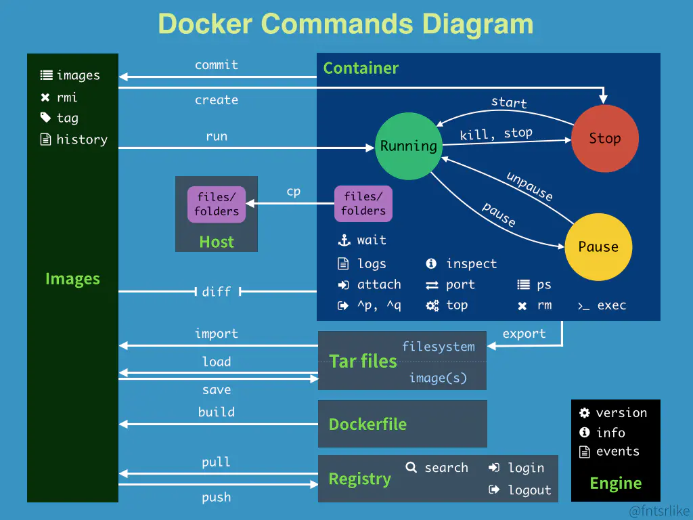

### docker

* docker run = docker create + docker start 
* 启动容器 docker container start 
* 终止容器 docker container stop 
* 查看容器 docker container -ls -all
* 查看镜像 docker images ls 


### docker + tensorflow serving 
```
docker run --gpus '"device=1"' -p 8501:8501 --mount type=bind,source=/data/mahuichao/math_equation_fit_input_feed/tmp/signature/,target=/models/math -e MODEL_NAME=math -t tensorflow/serving:latest-gpu &
```

