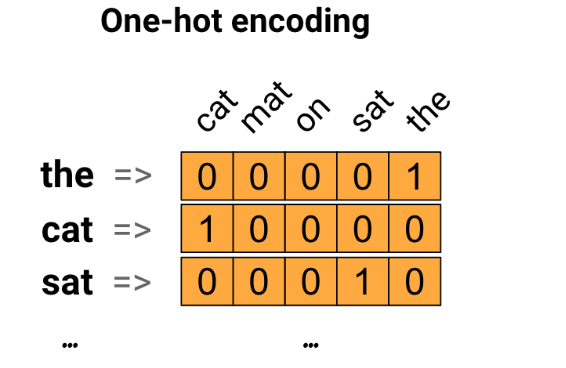

# embedding 

 *  https://www.tensorflow.org/guide/embedding
 *  https://www.tensorflow.org/tutorials/representation/word2vec
 *  https://kexue.fm/archives/4122
## one hot 与 embedding
### One-hot encodings

Key point: This approach is inefficient. A one-hot encoded vector is sparse (meaning, most indices are zero). Imagine we have 10,000 words in the vocabulary. To one-hot encode each word, we would create a vector where 99.99% of the elements are zero.
### Encode each word with a unique number
A second approach we might try is to encode each word using a unique number. Continuing the example above, we could assign 1 to "cat", 2 to "mat", and so on. We could then encode the sentence "The cat sat on the mat" as a dense vector like [5, 1, 4, 3, 5, 2]. This appoach is efficient. Instead of a sparse vector, we now have a dense one (where all elements are full).

There are two downsides to this approach, however:

The integer-encoding is arbitrary (it does not capture any relationship between words).

An integer-encoding can be challenging for a model to interpret. A linear classifier, for example, learns a single weight for each feature. Because there is no relationship between the similarity of any two words and the similarity of their encodings, this feature-weight combination is not meaningful.
### Word embeddings