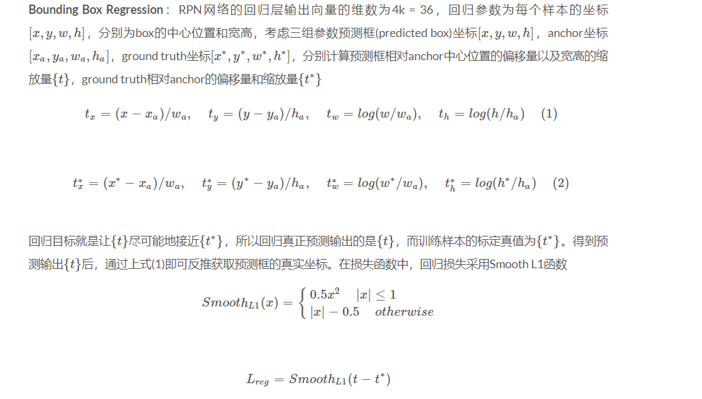

* rcnn 到 faster rcnn https://zhuanlan.zhihu.com/p/60033491

http://www.voidcn.com/article/p-wefishkl-brm.html

https://www.bilibili.com/video/av91598533?p=6

https://towardsdatascience.com/faster-r-cnn-object-detection-implemented-by-keras-for-custom-data-from-googles-open-images-125f62b9141a

https://github.com/bubbliiiing/faster-rcnn-keras
https://github.com/jinfagang/keras_frcnn
https://blog.csdn.net/v_JULY_v/article/details/80170182

## 从rcnn 到 fasterrcnn
RCNN
1.在图像中确定约1000-2000个候选框 (使用选择性搜索Selective Search)
2.每个候选框内图像块缩放至相同大小，并输入到CNN内进行特征提取 
3.对候选框中提取出的特征，使用分类器判别是否属于一个特定类 多个svm二分类器，判断是否属于这个类别
4.对于属于某一类别的候选框，用回归器进一步调整其位置
目标检测问题的衡量标准是重叠面积：许多看似准确的检测结果，往往因为候选框不够准确，重叠面积很小。故需要一个位置精修步骤。 
回归器 
对每一类目标，使用一个线性回归器进行精修。正则项λ=10000
输入为深度网络pool5层的4096维特征，输出为（包括对x，y的平移以及对w，h的缩放）


Fast R-CNN
1.在图像中确定约1000-2000个候选框 (使用选择性搜索Selective Search)
2.对整张图片输进CNN，得到feature map
3.找到每个候选框在feature map上的映射patch，将此patch作为每个候选框的卷积特征输入进行金字塔池化
分别是4*4，2*2，1*1，将这三张网格放到下面这张特征图上，就可以得到16+4+1=21种不同的块(Spatial bins)，我们从这21个块中，每个块提取出一个特征，这样刚好就是我们要提取的21维特征向量。这种以不同的大小格子的组合方式来池化的过程就是空间金字塔池化（SPP）。比如，要进行空间金字塔最大池化，其实就是从这21个图片块中，分别计算每个块的最大值，从而得到一个输出单元，最终得到一个21维特征的输出。

4.对候选框中提取出的特征，使用分类器判别是否属于一个特定类 
5.对于属于某一类别的候选框，用回归器进一步调整其位置

Faster R-CNN
1.对整张图片输进CNN，得到feature map
2.卷积特征输入到RPN，得到候选框的特征信息
3.对候选框中提取出的特征，使用分类器判别是否属于一个特定类 
4.对于属于某一类别的候选框，用回归器进一步调整其位置

原文链接：https://blog.csdn.net/v_JULY_v/java/article/details/80170182

-------------------------

## faster rcnn 详解
同时以每个锚点为中心生成9个anchor boxes（3个不同大小尺寸 128，256，512 ，3个不同比列 1：1，1：2，2：1）
https://blog.csdn.net/weixin_44791964/article/details/104451667
```python
def get_rpn(base_layers, num_anchors):
    x = Conv2D(512, (3, 3), padding='same', activation='relu', kernel_initializer='normal', name='rpn_conv1')(base_layers)

    x_class = Conv2D(num_anchors, (1, 1), activation='sigmoid', kernel_initializer='uniform', name='rpn_out_class')(x)
    x_regr = Conv2D(num_anchors * 4, (1, 1), activation='linear', kernel_initializer='zero', name='rpn_out_regress')(x)
    
    x_class = Reshape((-1,1),name="classification")(x_class)
    x_regr = Reshape((-1,4),name="regression")(x_regr)
    return [x_class, x_regr, base_layers]
```


* w , h 为什么取对数：因为缩放尺度必须是正数，线性回归的值是正负都有的，我们可以加exp 指数，变换到正值，反函数即为log。
* 线性函数拟合非线性函数：对数运算是非线性运算，但是，在IOU较大的时候对数运算可以近似为线性运算。

## 样本生成阶段
* 正负样本的问题：
1. anchor 与 gtbox的 iou 大于0.7 保留 ，0.3 - 0.7 忽略。 0.3 是副样本。这样会得到大量的候选框，选取256个（128正 + 128 负）

## 训练阶段
rpn 后 用nms 选300个。 算iou 0.1 到 0.5 的算负的 大于0.5 算正的 。 随机选出32个组成一个batch。给classfier。
测试的阶段 这300个要 切成n个32的片 依次classfier