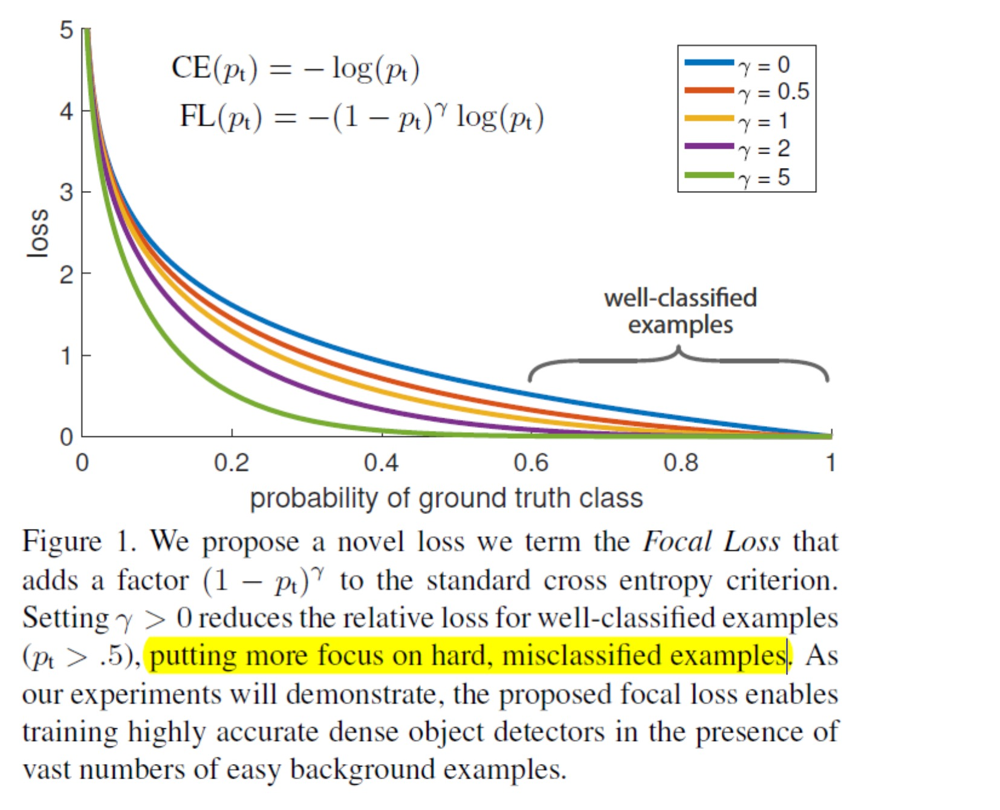
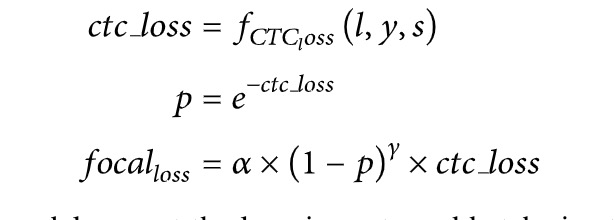

## focal loss

### $\alpha$系数怎么影响多分类多呢
### 要解决什么问题

目的是通过减少易分类样本的权重，从而使得模型在训练时更专注于难分类的样本。

https://zhuanlan.zhihu.com/p/49981234
https://skyhigh233.com/blog/2018/04/04/focalloss/
## focal_ctc_loss



参考论文 Focal CTC Loss for Chinese Optical Character Recognition on Unbalanced Datasets
```python
def ctc_lambda_func(args):
    y_pred, labels, input_length, label_length = args
    # the 2 is critical here since the first couple outputs of the RNN
    # tend to be garbage:
    a = 0.25
    r = 0.5
    y_pred = y_pred[:, 2:, :]
    #ctc是交叉上损失，概率p要反算回去
    loss =  K.ctc_batch_cost(labels, y_pred, input_length, label_length)
    p = K.exp(-1 * loss)
    focalLoss = a * K.pow(1 - p, r) * loss
    return focalLoss
```