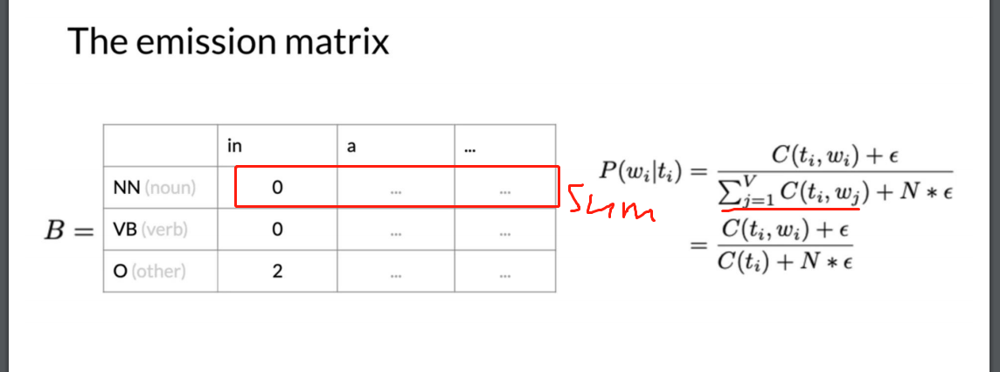

## markov chains 马尔可夫链
马尔可夫链（英语：Markov chain），又称离散时间马可夫链（discrete-time Markov chain，缩写为DTMC）。为状态空间中经过从一个状态到另一个状态的转换的随机过程。该过程要求具备“无记忆”的性质：**下一状态的概率分布只能由当前状态决定，在时间序列中它前面的事件均与之无关。** 这种特定类型的“无记忆性”称作马可夫性质。
$$ P(x_{t+1}|...,x_{t-2},x_{t-1},x_t) = P(x_{t+1}|x_t) $$ 
### 转移矩阵
* 由一个状态转换到另一个状态的概率组成的矩阵

### 初始状态
转移矩阵定义了由一个状态转移到另一个状态，那么最开始的状态由初始状态定义

## HMM 隐马尔可夫
https://medium.com/@a5560648/hmm%E7%B0%A1%E4%BB%8B-1acfe20e6c80
HMM是利用觀測值來推斷狀態的一個算法，而狀態被稱為隱藏狀態(hidden state)是因為我們看不到狀態，只能看到觀測值，所以實際上我們對狀態是不了解的，例如：我們可以觀察到身體狀態是正常、咳嗽、暈眩，從而透過HMM推斷背後的狀態為健康還是生病。
我們雖然對隱藏狀態(hidden state)不了解，但我們知道狀態之間的轉移機率(transition probability)還有狀態對應到觀測值的發射機率(emission probability)，從這兩者搭配觀測序列
### 发射矩阵

### 计算转移概率

$$ P(t_i | t_{i-1}) = \frac{C(t_{i-1}, t_{i}) + \alpha }{\sum_{j=1}^{N}C(t_{i-1},t_i) +\alpha * N}等价\frac{C(t_{i-1}, t_{i}) + \alpha }{C(t_{i-1}) +\alpha * N} $$

- $N$ is the total number of tags (NN,VB,O.....)
- $C(t_{i-1}, t_{i})$ is the count of the tuple (previous POS, current POS) in `transition_counts` dictionary.
- $C(t_{i-1})$ is the count of the previous POS in the `tag_counts` dictionary.
- $\alpha$ is a smoothing parameter.

* 计算$C(t_{i-1},t_i)$

* 初始状态词性为NN(名词)的数量为1

* NN(名词)转移到O(其他)的数量为6

* 计算$E_{j=1}^{N}C(O,t_j)$

* 计算概率并smooth
  如此例VB(动词)到任何词性的计数都为0,这就意味着VB不可能转移到其他词性，为了提高泛化性需要加一个$\epsilon$平滑
  

  ### 计算发射概率

$$P(w_i | t_i) = \frac{C(t_i, word_i)+ \alpha}{\sum_{j=1}^{V}C(t_{i},word_{j}) +\alpha * N}等价\frac{C(t_i, word_i)+ \alpha}{C(t_{i}) +\alpha * N}$$

- $C(t_i, word_i)$ is the number of times $word_i$ was associated with $tag_i$ in the training data (stored in `emission_counts` dictionary).
- $C(t_i)$ is the number of times $tag_i$ was in the training data (stored in `tag_counts` dictionary).
- $N$ is the number of words in the vocabulary
- $\alpha$ is a smoothing parameter. 

  * 计算单词IN为NN、VB、OO的数量

  
### Viterbi Algorithm and Dynamic Progaramming 维特比算法

#### Initialization Step

* 初始化$C_{i,1} ,\pi_i 可以从转移矩阵A中得到，b_{i,cindex(w1)} 可以从发射矩阵B中得到$ 

* 初始化$d_{i,1}$

* 举例

#### Forward pass

#### Backward pass 
* 通过矩阵C先计算最后一列$C_(i,k)$的argmax假设是第一个，通过矩阵D找到$D_{1,k}$的值对应的索引为3,再找到$D_{3,k-1}$对应的索引1，依次类推。

