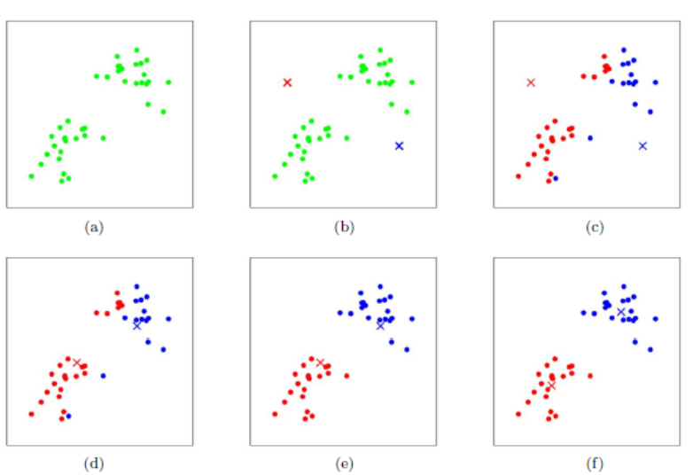

```python
    def kmeans(self, boxes, k, dist=np.median):
        box_number = boxes.shape[0]
        distances = np.empty((box_number, k))
        last_nearest = np.zeros((box_number,))

        ## 设点数为N
        ## 1.随机选取K个种子点
        np.random.seed()
        clusters = boxes[np.random.choice(
            box_number, k, replace=False)]  
        while True:
            ## 2.各个点到种子点的距离算出[N,K]
            distances = 1 - self.iou(boxes, clusters)
            ## 3.各个点属于距离最近的种子点
            current_nearest = np.argmin(distances, axis=1)
            ## 4.如果各个点所属种子点没有改变则中止
            if (last_nearest == current_nearest).all():
                break  
            ## 5.否则更新种子点，这里dist取np.median 取各个聚类簇的质心
            for cluster in range(k):
                clusters[cluster] = dist(  # update clusters
                    boxes[current_nearest == cluster], axis=0)

            last_nearest = current_nearest

        return clusters
```

