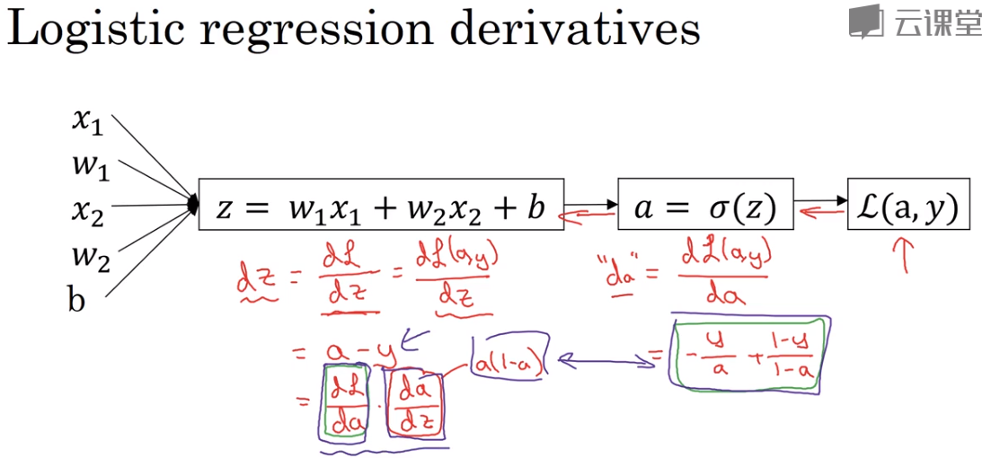

## logistic regression
$ z = w^T x + b $
$ \hat{y} = a = \sigma(z) $
**交叉熵损失函数**
$ costJ = -\frac{1}{m}\sum_{i=1}^{m}y^{(i)}\log(a^{(i)})+(1-y^{(i)})\log(1-a^{(i)}) $

### 这个损失函数是怎么来的？
deeplearning.ai 2.18 有讲看,过程如下
$\hat{y} = \sigma(w^T x + b) \quad when \quad \sigma(z) = \frac{1}{1+e^{-z}}$
$Interput \quad \hat{y} = p(y=1|x) $
$if \quad y=1: \quad p(y|x) = \hat{y} $
$if \quad y=0: \quad p(y|x) = 1-\hat{y} $
$so \quad p(y|x) = \hat{y}^y(1-\hat{y})^{1-y} $
$if \quad y=0 \quad p(y|x) = \hat{y}^0(1-\hat{y})^{1-0} = 1 -\hat{y}$
$if \quad y=1 \quad p(y|x) = \hat{y}^1(1-\hat{y})^{1-1} =\hat{y}$
$因为log是单调递增函数,最大化p(y|x)等价于 \log(p(y|x))$
$\log(p(y|x))
  =\log(\hat{y}^y(1-\hat{y})^{1-y}) 
  = y\log(\hat{y}) + (1-y)\log(1-\hat{y})
$

### 为什么不用平方损失？

### 梯度下降求导

$ da = \frac{\partial J}{\partial a}= -\frac{y}{a} + \frac{1-y}{1-a}$
$ dz = \frac{\partial J}{\partial a} \frac{\partial a}{\partial z}
     =(-\frac{y}{a} + \frac{1-y}{1-a}) (a(1-a)) = a -y $
$ dw =  \frac{\partial J}{\partial a} \frac{\partial a}{\partial z} \frac{\partial z}{\partial w} = (a-y)x $
$ db =  \frac{\partial J}{\partial a} \frac{\partial a}{\partial z} \frac{\partial z}{\partial b}= (a-y) $
