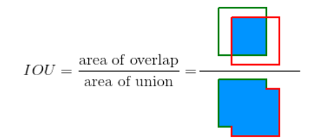
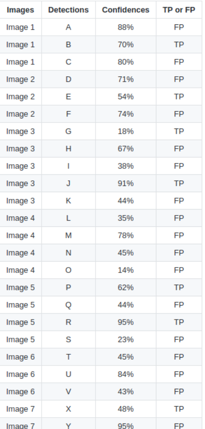
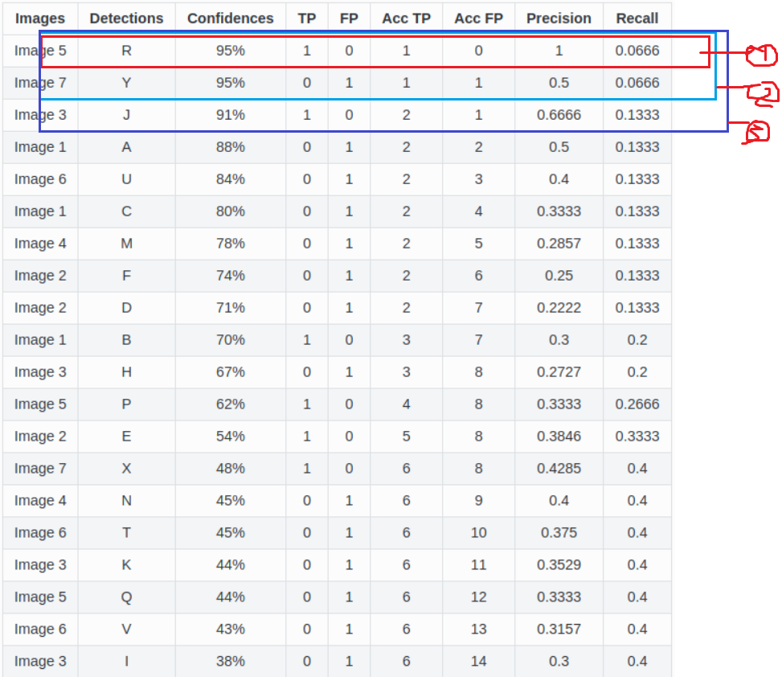
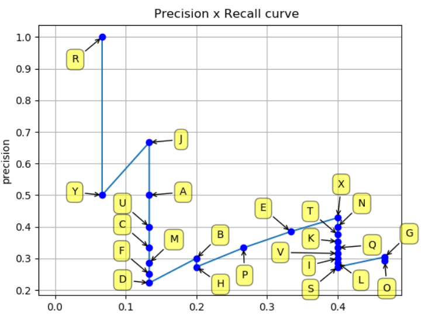
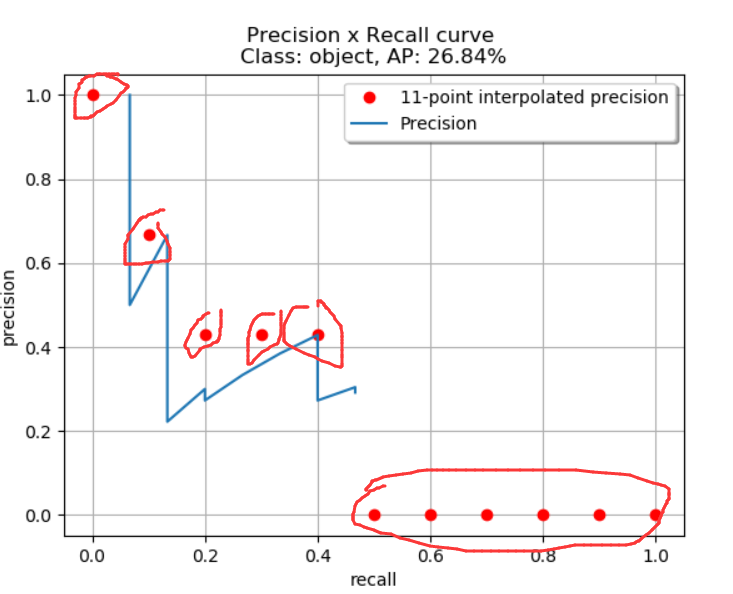
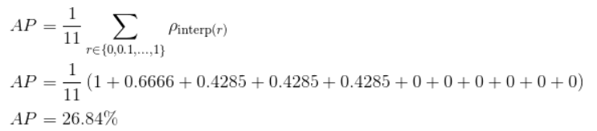
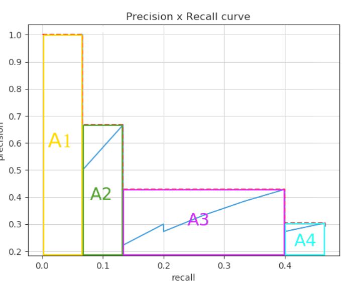
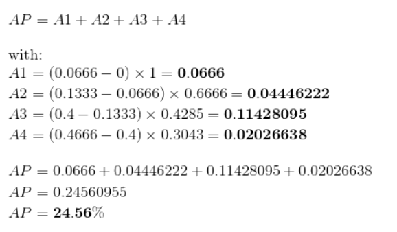

参考:https://github.com/rafaelpadilla/Object-Detection-Metrics
代码：https://github.com/facebookresearch/Detectron/blob/05d04d3a024f0991339de45872d02f2f50669b3d/lib/datasets/voc_eval.py
##voc-mAP
### Intersection Over Union(IOU)

Iou is given by overlapping area between the predicted bounding box and the groud truth bounding box divided by the area of union between them:
$$
IOU = \frac{area(B_p\cap B_{gt})}{area(B_p\cup B_{gt})}
$$

### True Positive, False Positive, False Negative and True Negative
Some basic concepts used by the metrics:

* True Positive (TP): A correct detection. Detection with IOU ≥       threshold . 
* False Positive (FP): A wrong detection. Detection with IOU <        threshold . 
* False Negative (FN): A ground truth not detected . 
* True Negative (TN): **Does not apply.** It would represent a corrected misdetection. In the object detection task there are many possible bounding boxes that should not be detected within an image. Thus, TN would be all possible bounding boxes that were corrrectly not detected (so many possible boxes within an image). That's why it is not used by the metrics. **自己的解释： 负例的正确数，这个在目标检测中负例就是背景，无穷无尽，没法评估**
  
threshold: depending on the metric, it is usually set to 50%, 75% or 95%.

### Precision
$$
Precision = \frac{TP}{TP+FP} = \frac{TP}{all\quad detections}
$$
* all detections(TP+FP) : 模型预测出来的检测框的总数

### Recall
$$
Recall = \frac{TP}{TP+FN} = \frac{TP}{all\quad ground \quad truths}
$$
* all ground truths(TP+FN) = 标记框的总数

### Metrics
#### Precision - Recall curve
P-R曲线：改变confidence threshold 置信度阈值得到Precision 和 Recall 画出曲线。
* 一个好的目标检测器即使改变confidence threshold依然有高的Precision和Recall
* 一个不好的目标检测，增加Recall但随之Precision会降低。这就是为什么P-R曲线总是随着Recall的增加Precsion会越来越低。

#### Average Precision
目标检测中衡量识别精度的指标是mAP（mean average precision）。多个类别物体检测中，每一个类别都可以根据recall和precision绘制一条曲线，AP就是该曲线下的面积，mAP是多个类别AP的平均值

**问题引出**
在一个bounding box里， 我识别出来鸭子的score最高但是只有0.1， 那么他真的是鸭子吗？ 很可能他还是负样本。 所以我们需要一个阈值， 如果识别出了鸭子而且分数大于这个阈值才真的说他是正样本， 否则他是负样本。
* 如果threshold太高， prediction非常严格， 所以我们认为是鸭子的基本都是鸭子，precision就高了；但也因为筛选太严格， 我们也放过了一些score比较低的鸭子， 所以recall就低了。
* 如果threshold太低， 什么都会被当成鸭子， precision就会很低， recall就会很高

如何表述precison和recall的关系呢？这就用到了P-R曲线，因为我们根据不同的threshold， 可以取到不同（也可能相同）的precision recall值。 这样想的话对于每个threshold，我们都有（precision， recall）的pair， 也就有了precision和recall之间的curve关系

有了这么一条precision-recall curve， 他衡量着两个有价值的判断标准， precision和recall的关系， 那么不如两个一起动态考虑， 就有了鸭子这个class的Average Precision， 即curve下的面积， 他可以充分的表示在这个model中， precision和recall的总体优劣。

**如何采样P-R曲线计算面积**

举例：
有7张图片Image(1-7),里面共有24个检测到的框(A-Y),每个框对应的confidence 和计算出来是TP还是FP ，ground truth boxes是15个

以confidence从高到低排序，计算PR，采用累计和的方式（the cumulative sum of the elements ）
1. 假设只有 R 一个框，其他的框都被滤掉，此时
   sum(TP)=1 sum(FP)=0.
   P=(TP)/(TP+FP) = 1/1 = 1. 
   R = (TP)/all ground truth = 1/15 =0.0666
2. 假设有 R Y两个框，其他框都被滤掉了，此时
   sum(TP) = 1 ,sum(FP)=1.
   P=(TP)/(TP+FP) = 1/2 = 0.5
   R = (TP)/all ground truth = 1/15 =0.0666
3. 假设有 R Y J三个框，其他框都被滤掉了，此时
   sum(TP) = 2 ,sum(FP)=1.
   P=(TP)/(TP+FP) = 2/3 = 0.6666
   R = (TP)/all ground truth = 2/15 =0.13333
4. 依次类推

画出P-R曲线,计算AP面积有两种方法
* 在VOC2010以前，只需要选取当Recall >= 0, 0.1, 0.2, ..., 1共11个点时的Precision最大值，然后AP就是这11个Precision的平均值。
* 在VOC2010及以后，需要针对每一个不同的Recall值（包括0和1），选取其大于等于这些Recall值时的Precision最大值，然后计算PR曲线下面积作为AP值。

#### Calculating the 11-point interpolation 11个点插值
$$
AP= \frac{1}{11} \sum_{r \epsilon\{0,0.1,0.2..,1\}}P_{interp}(r)
$$
$$
P_{interp}(r) = \max_{\tilde{r}:\tilde{r}\geq r}p(\tilde{r})
$$
$P_{interp}(r)代表插值操作r代表Recall$ 意思是
r = 0 取Recall>=0范围内Precision的最大值
r = 0.1 取Recall>=0.1范围内Precision的最大值
....
r =1.0 取Recall>=1.0范围内Precision的最大值
AP = 11个结果相加取均值
MAP = 每类的AP相加/类别数

#### Interpolating all points
$$
AP = \sum_{n=0}^{m} (r_{n+1} - r_n) P_{interp}(r_{n+1})
$$
$$
P_{interp}(r) = \max_{\tilde{r}:\tilde{r}\geq r_{n+1}}p(\tilde{r})
$$

<table>
<td> 
  
</td> 
<td> 
  
</td> 
</table>

