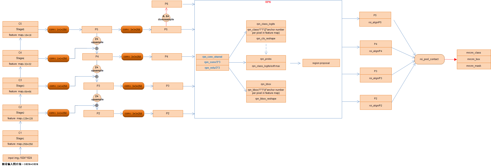
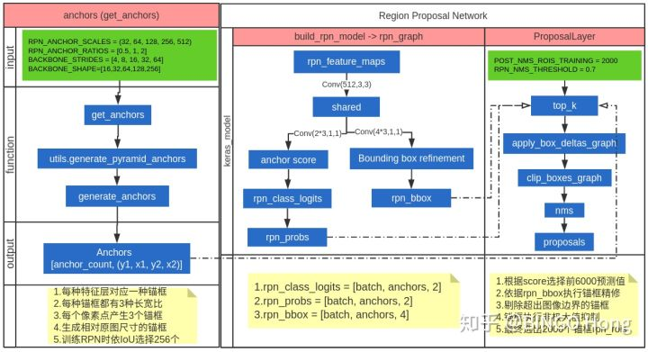
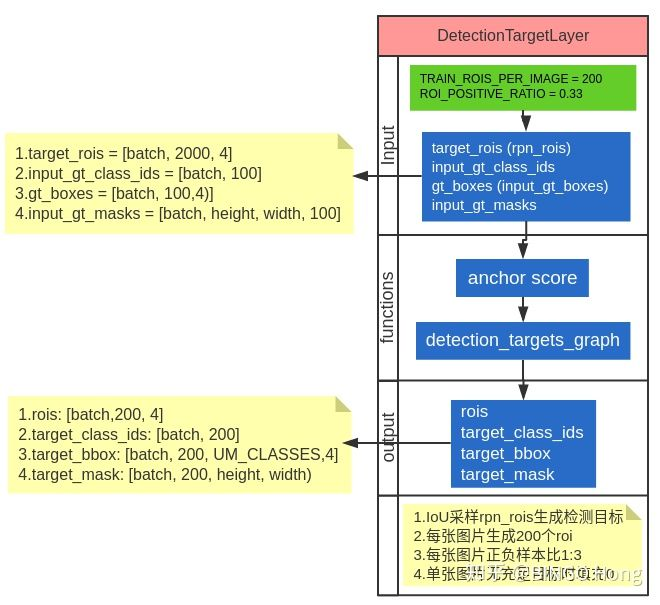
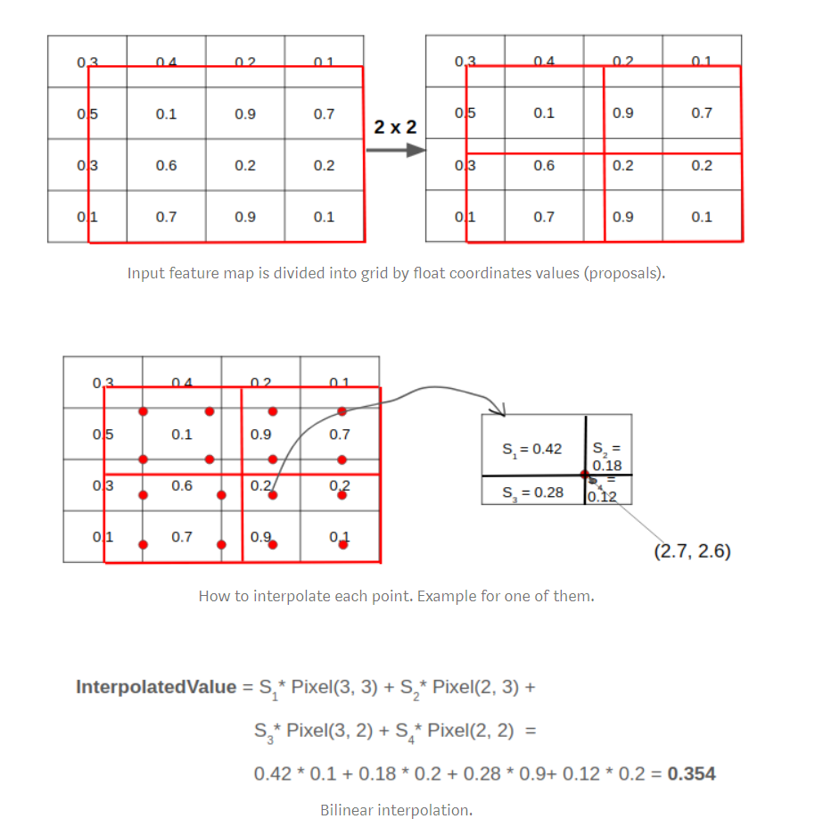
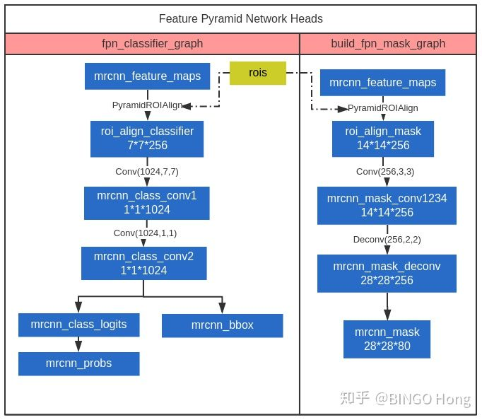
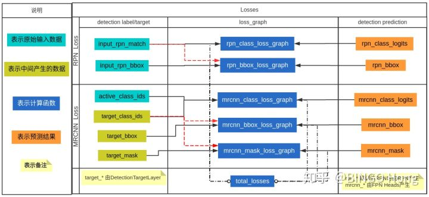

https://github.com/akTwelve/Mask_RCNN


## anchor 

- 假设图片1024x2014,FPN五层
- 每层对应的Scales:  (32, 64, 128, 256, 512)
- 生成anchor的ratio :  [0.5, 1, 2]
- anchor per cell ： 3 
- 第一层anchors数: 256x256x3 = 196608 
- Match anchors to GT Boxes
  - If an anchor overlaps a GT box with IoU >= 0.7 then it's positive.
  - If an anchor overlaps a GT box with IoU < 0.3 then it's negative.
  - Neutral anchors are those that don't match the conditions above,
 and they don't influence the loss function.
  - However, don't keep any GT box unmatched (rare, but happens). Instead,
 match it to the closest anchor (even if its max IoU is < 0.3).
  - 随机选取256个anchor(128正+128负，其余为0)
- Bounding Box Regression
  - ```python
    (gt_center_y - anchor_center_y) / a_h,
    (gt_center_x - anchor_center_x) / a_w,
    np.log(gt_h / anchor_h),
    np.log(gt_w / anchor_w),
    ```
  -  w , h 为什么取对数：因为缩放尺度必须是正数，线性回归的值是正负都有的，我们可以加exp 指数，变换到正值，反函数即为log。

## FPN
参见总图
## RPN

- (P2,P3,P4,P5,P6) 分别 做分类和回归，结果concat
- 根据得分取 前6000个
- 用nms 取2000 个

- 在训练时，2000个显得太多，所以会进一步筛选为200个做为target。
  - 正负比例1:3
  - 正样本:IOU>=0.5 否则为负样本
  - 如果不足200,用0补齐
## RoIAlign
ROI Pooling这一操作存在两次量化的过程。

* 将候选框边界量化为整数点坐标值。
* 将量化后的边界区域平均分割成 k x k 个单元(bin),对每一个单元的边界进行量化。

事实上，经过上述两次量化，此时的候选框已经和最开始回归出来的位置有一定的偏差，这个偏差会影响检测或者分割的准确度。在论文里，作者把它总结为“不匹配问题（misalignment）。

ROI Align的思路很简单：取消量化操作，使用双线性内插的方法获得坐标为浮点数的像素点上的图像数值,从而将整个特征聚集过程转化为一个连续的操作，。值得注意的是，在具体的算法操作上，ROI Align并不是简单地补充出候选区域边界上的坐标点，然后将这些坐标点进行池化，而是重新设计了一套比较优雅的流程


* 遍历每一个候选区域，保持浮点数边界不做量化。
* 将候选区域分割成k x k个单元，每个单元的边界也不做量化。
* 在每个单元中计算固定四个坐标位置，用双线性内插的方法计算出这四个位置的值，然后进行最大池化操作。



https://zhuanlan.zhihu.com/p/65467789

## FPN Head (mask box class)
https://zhuanlan.zhihu.com/p/40404949


## LOSS

https://zhuanlan.zhihu.com/p/40405927

