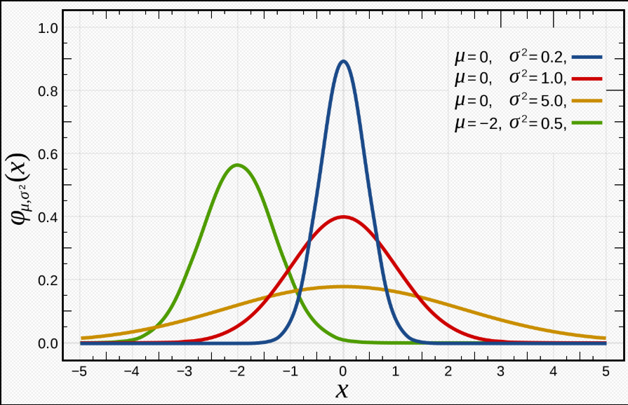
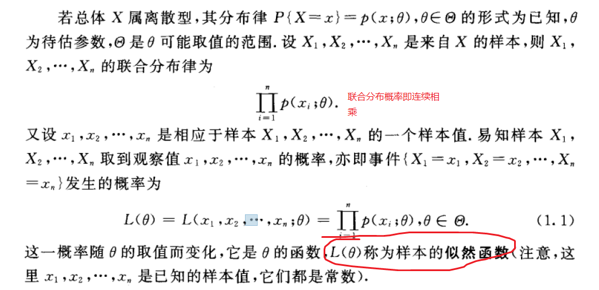
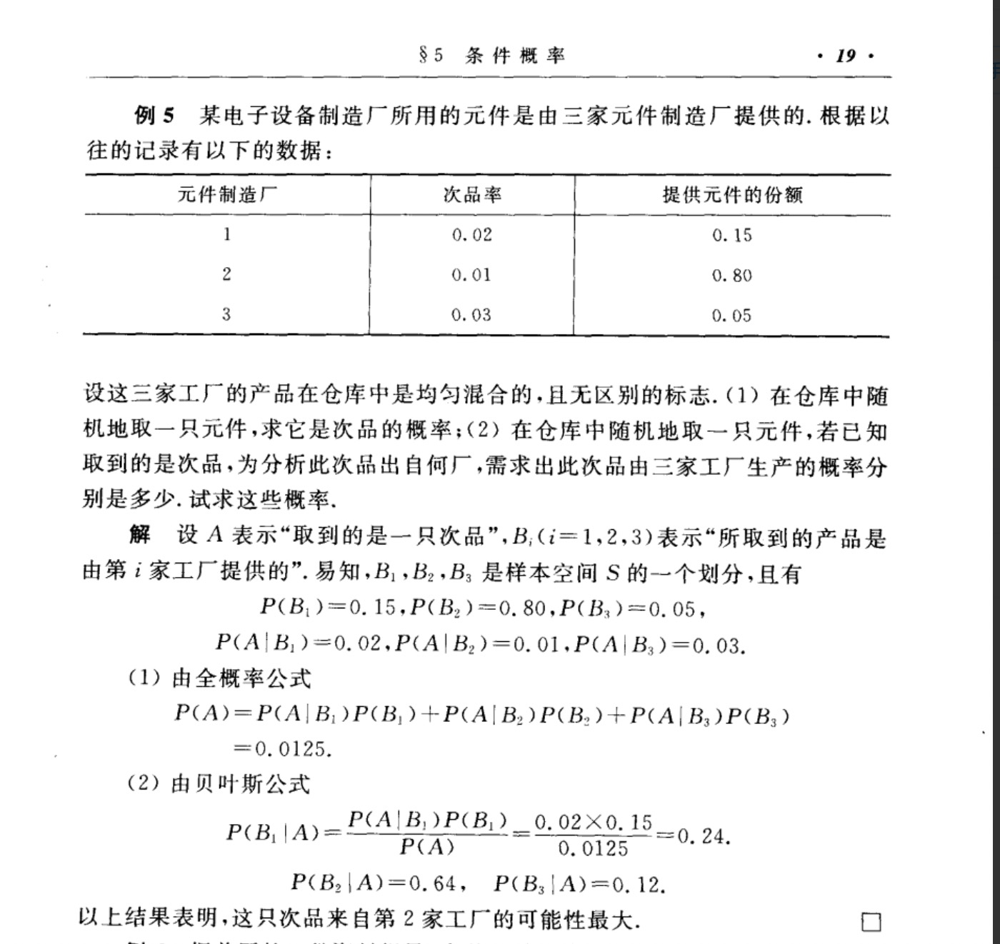

# 数学

## 概率论数理统计

### 正态分布
正态分布也称高斯分布
$$
f(x)=\frac{1}{\sqrt{2\pi}\sigma} \exp-\frac{(x-\mu)^2}{2\sigma^2};其中\mu是
均值（数据点的均值），\sigma^2是方差（数据点的方差）
$$

**性质**
1. 曲线关于$x=\mu$对称
2. 当$x=\mu$时取到最大值即$f(x)=\frac{1}{\sqrt{2\pi}\sigma}$

**标准正态分布**
如果一个随机变量X服从这个分布，我们写作$  N(\mu,\sigma^2)$ 如果$\mu =0且\sigma =1$，这个分布被称为标准正态分布，这个分布能够简化为
$$
f(x)=\frac{1}{\sqrt{2\pi}} \exp \left(-\frac{x^2}{2} \right)
$$

### 极大似然估计（Maximum Likelihood Estimate，MLE）
参考浙江大学概率论与数理统计第四版 152页，整理笔记

极大似然估计中采样需满足一个重要的假设，就是所有的采样都是独立同分布的。
**似然函数**$L(\theta) = L(x_{1},x_{2},....,x_{n};\theta) = \prod_{i=1}^{n}f(x_{i}；\theta) $ 其中$\prod$是连乘的意思
**最大似然估计值**即最大化似然函数 $ L(x_{1},x_{2},....,x_{n};\hat{\theta}) = \max_{\theta\epsilon\Theta}L(x_{1},x_{2},....,x_{n};\theta) 则\hat{\theta}是最大似然估计值 $

求极大似然函数估计值的一般步骤：
1. 写出似然函数；
2. 对似然函数取对数(乘法变加法) ，并整理；
3. 求导数，
4. 解似然方程 。

### 条件概率
$P(B|A)$ 在事件A发生的条件下，B发生的概率。
* 条件概率公式：将一枚硬币抛掷两次，观察其出现正反面的情况。设事件A为至少有一次为H.事件B为两次抛掷为同一面。
设样本空间S = {HH,HT,TH,TT},A = {HH,HT,TH},B={HH,TT}. 求 P(B|A)
解：已知A已经发生,则 TT 不可能发生。 只有HH属于B则P(B|A) = 1/3。
P(A) = 3/4 ; P(AB)=1/4 ; $$P(B|A) = \frac{P(AB)}{P(A)}$$

* 乘法定理
$$P(AB) = P(B|A)P(A) $$
### 全概率
* 设试验E的样本空间为S,A为E的事件，B1,B2,....,Bn为S的一个划分，且$P(B_{i}) > 0 $ 则 $$P(A) = P(A|B_{1})P(B_{1}) +...... +P(A|B_{n})P(B_{n}) = \sum_{j=1}^{n}P(A|B_{j})P(B_{j})$$

### 先验分布 后验分布
https://blog.csdn.net/qq_23947237/article/details/78265026
> 隔壁小哥要去15公里外的一个公园，他可以选择步行走路，骑自行车或者开辆车，然后通过其中一种方式花了一段时间到达公园。
> 首先在这个事里边，大家不要关注隔壁小哥去干嘛，也许去送外卖吧：) 。言归正传，**这件事中采用哪种交通方式是因，花了多长时间是果**。俗话说瓜熟蒂落，皆是因果；因果循环，报应不爽。要理解即将提到的概念，何为因何为果先要搞清楚
#### 后验概率 （知果求因）
预先已知结果（路上花的时间），然后根据结果估计（猜）原因（交通方式）的概率分布.
例子问题公式化：$P(交通方式∣花费的时间)$
修改成一般的公式：$P(因∣果)$
公式正规化：$P(θ∣x)$
>（公式中的 “∣”读作 given，即给定的意思。如P(A∣B) 即A given B 的概率）
> [解释]：看到这里估计大家很奇怪为什么要用 x、 θ 这样的字母表示，而不是熟悉的 x 、 y 。这样表示自然是有原因的。在这里大家只需要先暂时记住 θ 代表因、 x 代表果，后面的贝叶斯我们将会具体介绍这些字母的含义。
#### 先验概率 （由历史求因）
换个情景，我们不再考虑隔壁小哥去公园的结果了。假设隔壁小哥还没去，大早上刚起床，打算吃完早饭再去,因为我们是在结果发生前就开始猜的，根据历史规律确定原因 （交通方式）的概率分布即 先验概率。
例子问题公式化：$P(交通方式)$
一般化：$P(因)$
正规化：$P(θ)$
#### 似然估计 （由因求果）
似然函数问题公式化：$P(时间∣交通方式)$
一般化：$P(果∣因)$
正规化：$P(x∣θ)$

* 我们熟知的贝叶斯公式是这样的：
$$P(A|B) = \frac{P(B|A)*P(A)}{P(B)}$$
* 但是这里我们采用如下形式：
$$P(θ|x) = \frac{P(x|θ)*P(θ)}{P(x)}$$
$$后验概率 = \frac{似然估计 * 先验概率}{evidence}$$
> [注]：P(x) 即 evidence。隔壁小哥去公园很多次，忽略交通方式是什么，只统计每次到达公园的时间 x，于是得到了一组时间的概率分布。这种不考虑原因，只看结果的概率分布即 evidence，它也称为样本发生的概率分布的证据。
### 贝叶斯 Bayes
$$P(B_{i}|A) = \frac{P(B_{i}A)}{P(A)} = \frac{P(A|B_{i})P(B_{i})}{\sum_{j=1}^{n}P(A|B_{j})P(B_{j})}$$

### KL散度(KLD)

KL散度是两个概率分布P和Q差别的非对称性的度量。 KL散度是用来度量使用基于Q的分布来编码服从P的分布的样本所需的额外的平均比特数。典型情况下，P表示数据的真实分布，Q表示数据的理论分布、估计的模型分布、或P的近似分布

### PCA

### SVD

#### SVD 奇异值分解 --- 线性变换几何意义
https://zhuanlan.zhihu.com/p/36546367
http://blog.sciencenet.cn/home.php?mod=space&uid=696950&do=blog&quickforward=1&id=699380
http://blog.sciencenet.cn/blog-696950-699432.html

#### 公式

### EM (Expectation-Maximization Algorithm)期望最大
https://www.bilibili.com/video/BV1a54y1X7wM?from=search&seid=13941329756666396082
http://sofasofa.io/tutorials/gmm_em/
 > 我们知道极大似然估计是求解实现结果的最佳参数θ，但极大似然估计需要面临的概率分布只有一个或者知道结果是通过哪个概率分布实现的，只不过你不知道这个概率分布的参数。而**如果概率分布有多个呢或者你不知道结果是通过哪个概率分布实现的？** 于是别说去确定“这些概率分布”的最佳参数了，我们连最终结果是根据哪个概率分布得出来的都不知道，这就是EM算法要解决的

* 在说明EM算法的求解思想前，我们先总结下上面的内容。
一般的用Y表示观测到的随机变量的数据，Z表示隐随机变量的数据(因为我们观测不到结果是从哪个概率分布中得出的，所以将这个叫做隐变量)。于是Y和Z连在一起被称为完全数据，仅Y一个被称为不完全数据。这时有没有发现EM算法面临的问题主要就是：有个隐变量数据Z。而如果Z已知的话，那问题就可用极大似然估计求解了。
## 微积分
## 拉格朗日乘子法
https://www.youtube.com/watch?v=aep6lwPqm6I&list=PLSQl0a2vh4HC5feHa6Rc5c0wbRTx56nF7&index=94
http://littleshi.cn/online/LagMul.html

