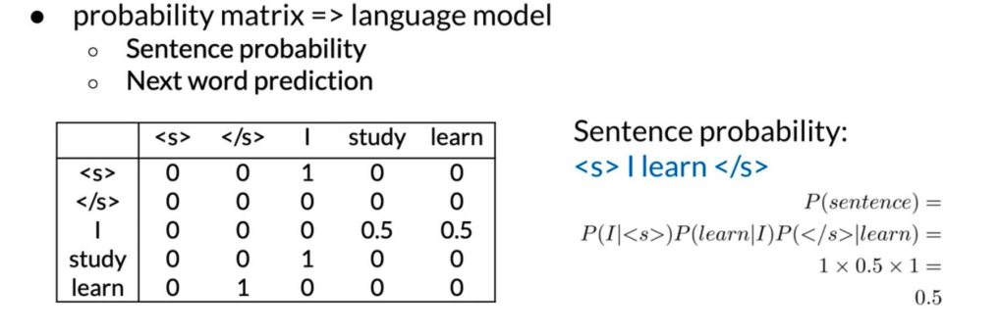

* n = 1 叫 unigram
* n = 2 叫 bigram
* n = 3 叫 trigram

https://houbb.github.io/2020/01/20/nlp-chinese-spelling-correct-02
http://52opencourse.com/138/%E6%96%AF%E5%9D%A6%E7%A6%8F%E5%A4%A7%E5%AD%A6%E8%87%AA%E7%84%B6%E8%AF%AD%E8%A8%80%E5%A4%84%E7%90%86%E7%AC%AC%E4%BA%94%E8%AF%BE-%E6%8B%BC%E5%86%99%E7%BA%A0%E9%94%99%EF%BC%88spelling-correction%EF%BC%89

* 序列符号约定
  $$ w_{1}^{m} = w_1 w_2 ...w_m $$
  $$ w_{1}^{3} = w_1 w_2 w_3 $$

## Language Model
**以Bigram 距离**
- Count matrix
  
- Probability matrix
  
- Language model
  
- Log probability to avoid underflow
  

## Perplexity

## Out of vocabulary words 

## Smoothing

## Backoff

## Interpolation

## Summary
