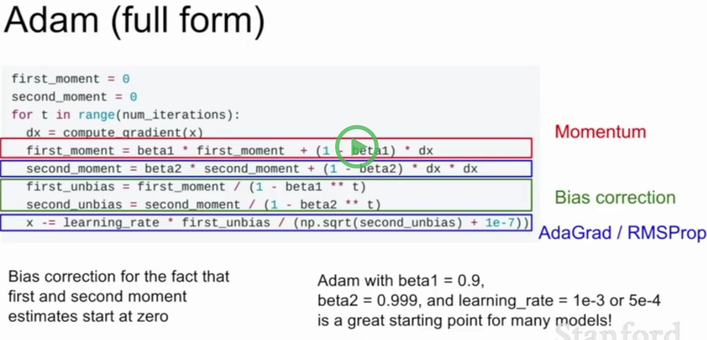

## SGD 

```
SGD方法的一个缺点是，其更新方向完全依赖于当前的batch，因而其更新十分不稳定。解决这一问题的一个简单的做法便是引入momentum。
x += - learning_rate * dx
```
## Momentum
```
v = mu * v - learning_rate * dx # 与速度融合
x += v # 与位置融合

* 下降初期时，使用上一次参数更新，下降方向一致，乘上较大的)能够进行很好的加速
* 下降中后期时，在局部最小值来回震荡的时候使得更新幅度增大，跳出陷阱
* 在梯度改变方向的时候，能够减少更新，抑制振荡，从而加快收敛
```
前面都是以相同的学习率更新，而深度学习模型中往往涉及大量的参数，不同参数的更新频率往往有所区别。对于更新不频繁的参数（典型例子：更新 word embedding 中的低频词），我们希望单次步长更大，多学习一些知识；对于更新频繁的参数，我们则希望步长较小，使得学习到的参数更稳定，不至于被单个样本影响太多。而深度学习模型中往往涉及大量的参数，不同参数的更新频率往往有所区别。对于更新不频繁的参数（典型例子：更新 word embedding 中的低频词），我们希望单次步长更大，多学习一些知识；对于更新频繁的参数，我们则希望步长较小，使得学习到的参数更稳定，不至于被单个样本影响太多。

## AdaGrad
```python
while True:
    dx = computer_gradient(x)
    grad_squared += dx * dx
    x -=learning_rate * dx /(np.sqrt(grad_squared) + 1e-7)
```
在 Adagrad 中， v_t 是单调递增的，使得学习率逐渐递减至 0，可能导致训练过程提前结束。为了改进这一缺点，可以考虑在计算二阶动量时不累积全部历史梯度，而只关注最近某一时间窗口内的下降梯度。根据此思想有了 RMSprop[5]在 Adagrad 中， v_t 是单调递增的，使得学习率逐渐递减至 0，可能导致训练过程提前结束。为了改进这一缺点，可以考虑在计算二阶动量时不累积全部历史梯度，而只关注最近某一时间窗口内的下降梯度。根据此思想有了 RMSprop[5]

## RMSProp
```python
while True:
    dx = computer_gradient(x)
    grad_squared = decay_rate * grad_squared + (1 - decay_rate) * dx * dx
    x -= learning_rate * dx /(np.sqrt(grad_squared) + 1e-7)
```

## Adam

Adam[6] 可以认为是 RMSprop 和 Momentum 的结合。和 RMSprop 对二阶动量使用指数移动平均类似，Adam 中对一阶动量也是用指数移动平均计算。Adam[6] 可以认为是 RMSprop 和 Momentum 的结合。和 RMSprop 对二阶动量使用指数移动平均类似，Adam 中对一阶动量也是用指数移动平均计算。



## AdamW
https://www.zybuluo.com/sambodhi/note/1201597
https://www.jiqizhixin.com/articles/2018-07-03-14