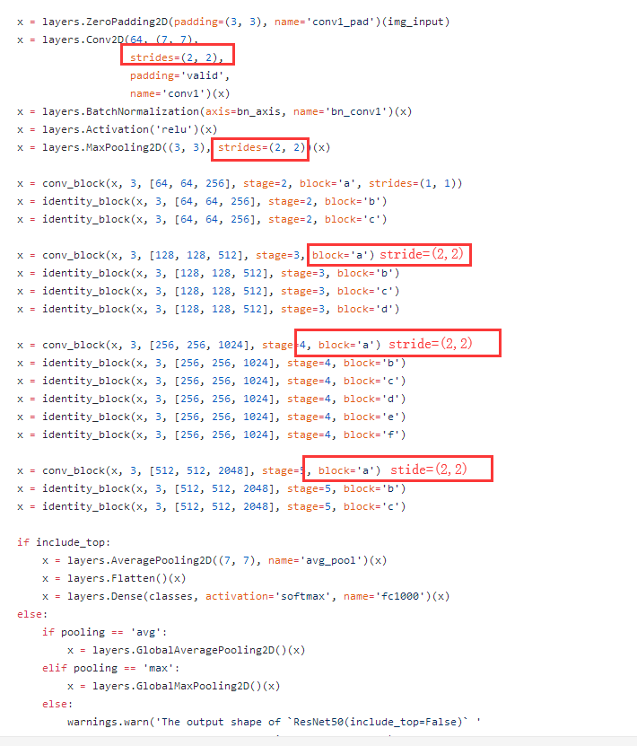

https://github.com/titu1994/keras-squeeze-excite-network/blob/master/se_resnet.py 
## 要解决的问题


## 如何解决


What you should remember:
* Very deep "plain" networks don't work in practice because they are hard to train due to vanishing gradients.
* The skip-connections help to address the Vanishing Gradient problem. They also make it easy for a ResNet block to learn an identity function.
* There are two main type of blocks: The identity block and the convolutional block.
* Very deep Residual Networks are built by stacking these blocks together.

## 网络结构



## resnet block 模块
```
def _resnet_block(input, filters, k=1, strides=(1, 1)):
    ''' Adds a pre-activation resnet block without bottleneck layers
    Args:
        input: input tensor
        filters: number of output filters
        k: width factor
        strides: strides of the convolution layer
    Returns: a keras tensor
    '''
    init = input
    channel_axis = 1 if K.image_data_format() == "channels_first" else -1

    x = BatchNormalization(axis=channel_axis)(input)
    x = Activation('relu')(x)

    if strides != (1, 1) or init._keras_shape[channel_axis] != filters * k:
        init = Conv2D(filters * k, (1, 1), padding='same', kernel_initializer='he_normal',
                      use_bias=False, strides=strides)(x)

    x = Conv2D(filters * k, (3, 3), padding='same', kernel_initializer='he_normal',
               use_bias=False, strides=strides)(x)
    x = BatchNormalization(axis=channel_axis)(x)
    x = Activation('relu')(x)

    x = Conv2D(filters * k, (3, 3), padding='same', kernel_initializer='he_normal',
               use_bias=False)(x)

    # squeeze and excite block
    x = squeeze_excite_block(x)

    m = add([x, init])
    return m
```

## SE 模块

```
def squeeze_excite_block(input, ratio=16):
    ''' Create a channel-wise squeeze-excite block
    Args:
        input: input tensor
        filters: number of output filters
    Returns: a keras tensor
    References
    -   [Squeeze and Excitation Networks](https://arxiv.org/abs/1709.01507)
    '''
    init = input
    channel_axis = 1 if K.image_data_format() == "channels_first" else -1
    filters = init._keras_shape[channel_axis]
    se_shape = (1, 1, filters)

    se = GlobalAveragePooling2D()(init)
    se = Reshape(se_shape)(se)
    se = Dense(filters // ratio, activation='relu', kernel_initializer='he_normal', use_bias=False)(se)
    se = Dense(filters, activation='sigmoid', kernel_initializer='he_normal', use_bias=False)(se)

    if K.image_data_format() == 'channels_first':
        se = Permute((3, 1, 2))(se)

    x = multiply([init, se])
    return x


def spatial_squeeze_excite_block(input):
    ''' Create a spatial squeeze-excite block
    Args:
        input: input tensor
    Returns: a keras tensor
    References
    -   [Concurrent Spatial and Channel Squeeze & Excitation in Fully Convolutional Networks](https://arxiv.org/abs/1803.02579)
    '''

    se = Conv2D(1, (1, 1), activation='sigmoid', use_bias=False,
                kernel_initializer='he_normal')(input)

    x = multiply([input, se])
    return x


def channel_spatial_squeeze_excite(input, ratio=16):
    ''' Create a spatial squeeze-excite block
    Args:
        input: input tensor
        filters: number of output filters
    Returns: a keras tensor
    References
    -   [Squeeze and Excitation Networks](https://arxiv.org/abs/1709.01507)
    -   [Concurrent Spatial and Channel Squeeze & Excitation in Fully Convolutional Networks](https://arxiv.org/abs/1803.02579)
    '''

    cse = squeeze_excite_block(input, ratio)
    sse = spatial_squeeze_excite_block(input)

    x = add([cse, sse])
    return x
```

