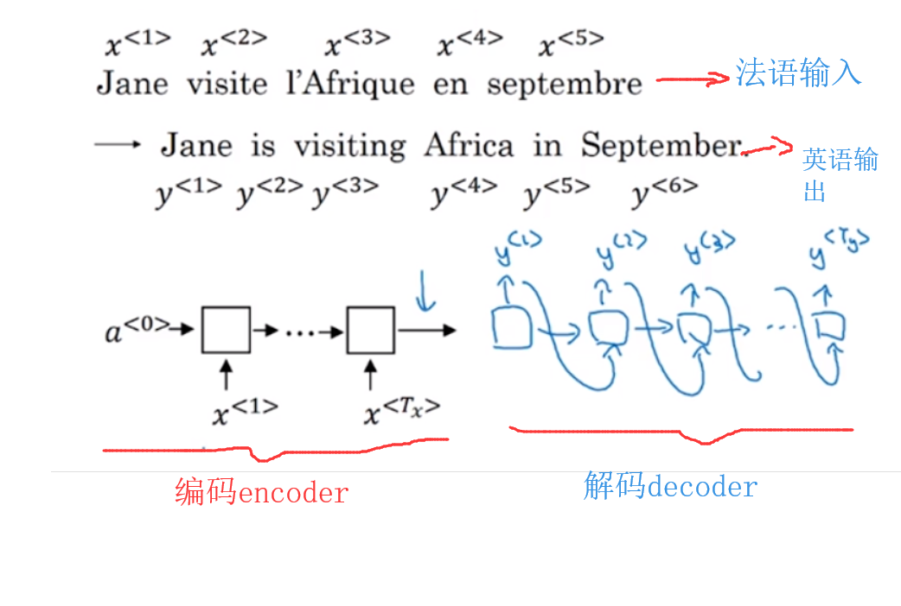
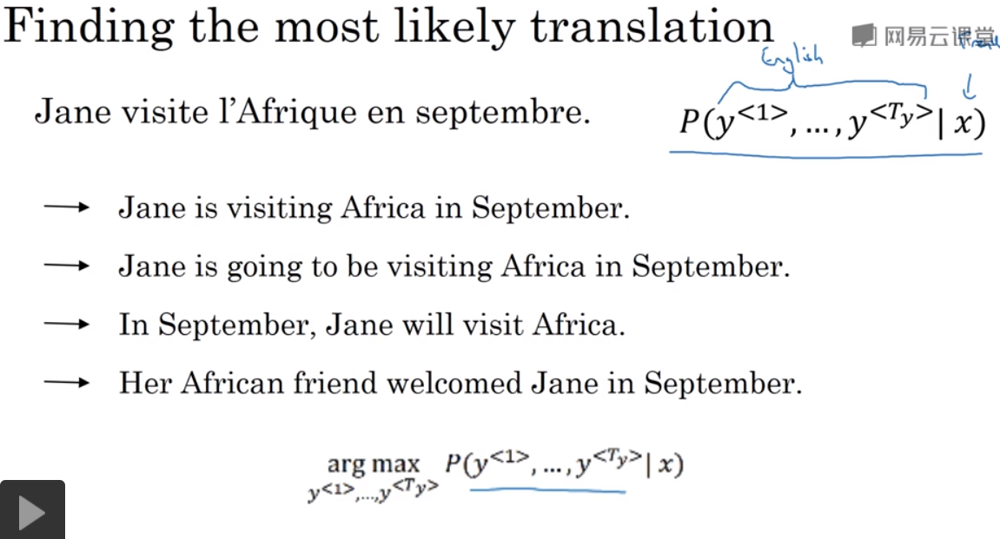
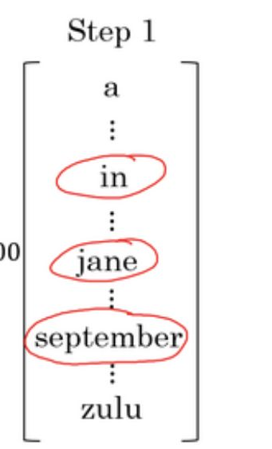
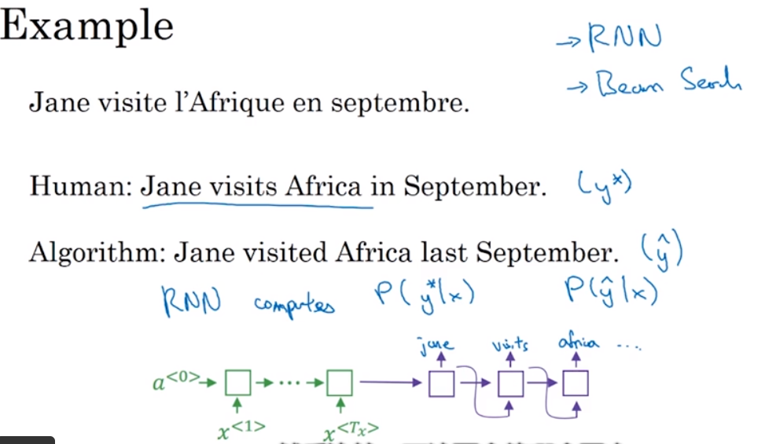
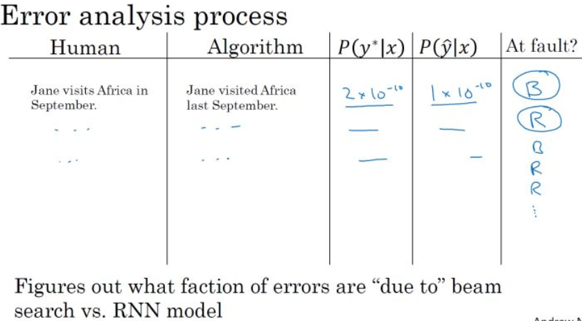
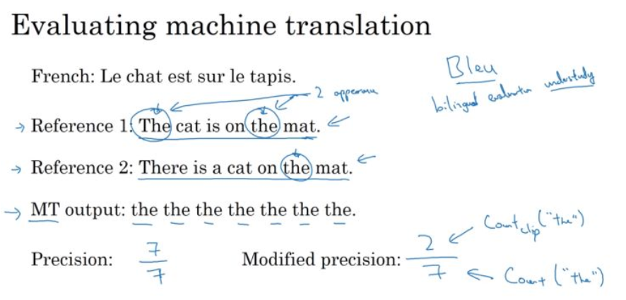
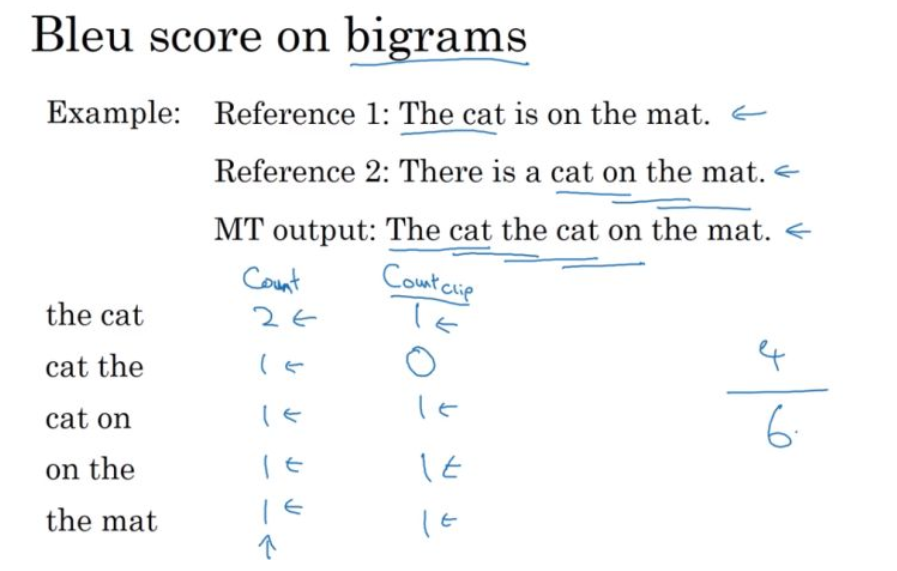
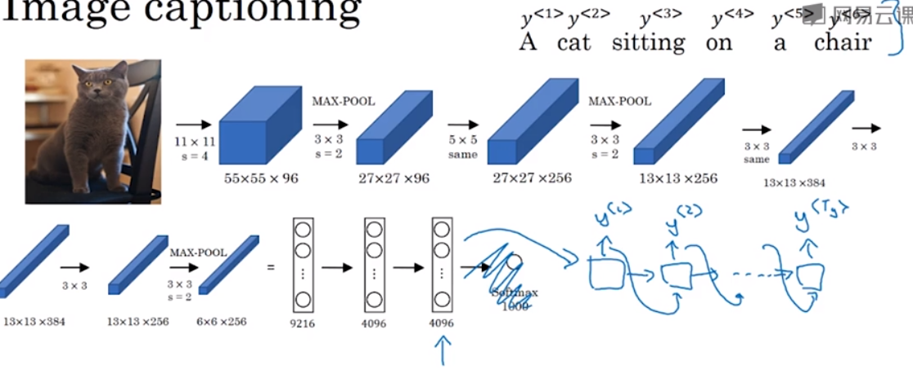
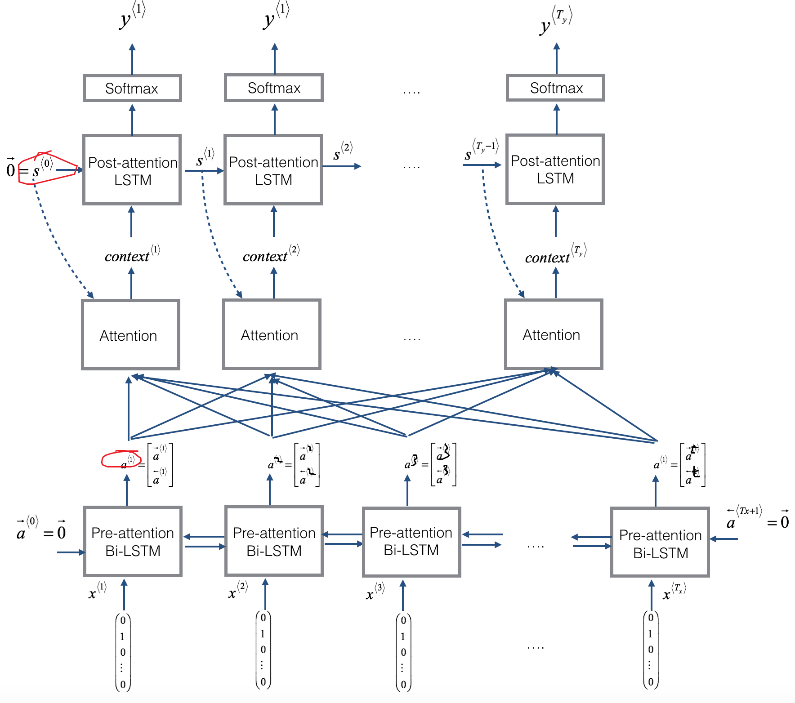
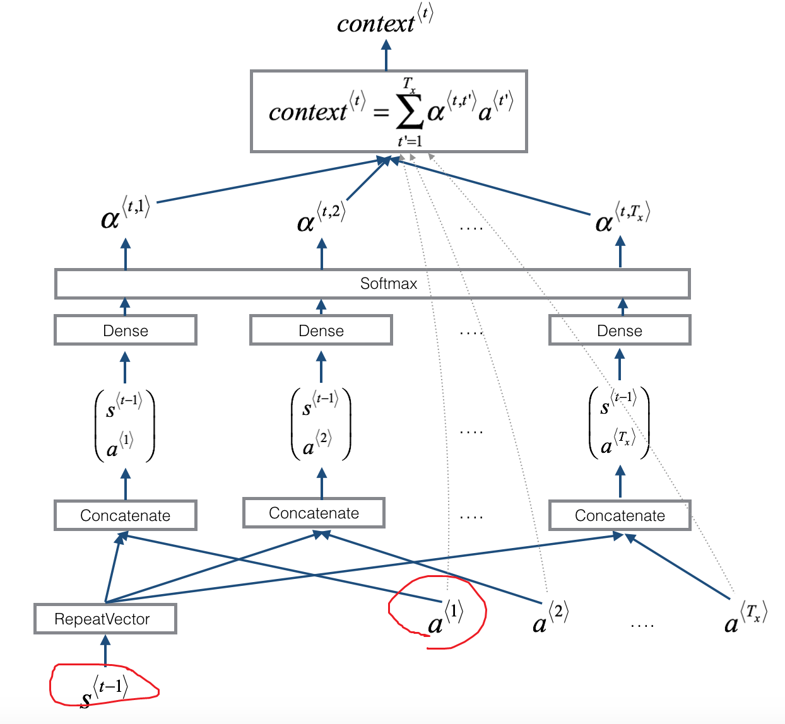

# sequence to sequence 

## 机器翻译

### 疑问：a<0>是什么
### 疑问：decoder的结束标记在哪里？
在编码阶段法语单词按照时序每个单词依次输入(x1,x2...xT)，最后得到一个输出。
将输出输入解码生成y1,y1作为输入生成y2,.....,那么就这样一直循环下去吗?应该有个END OF的符号吧

## beam search 集束搜索
解码出的(y1,y2,y3....)是一系列的概率,需要找出条件概率最高的的组合,而不是贪心算法求出最大概率y1,根据y1生成y2,求最大概率y2....

### 具体算法
1. 第一步的时候，我们通过模型计算得到 $ y^{<1>} $的分布概率，选择前B个作为候选结果，设beam width =3 则如下图所示的"in", "jane", "september"

2. 第二步的时候，我们已经选择出了in、jane、September作为第一个单词的三个最可能选择，beam search针对每个第一个单词考虑第二个单词的概率，例如针对单词“in”，我们将 $ y^{<1>} $ ='in'，然后将它喂给  解码输入2，输出结果$ y^{<2>} $  作为第二个单词的概率输出。我们的选择方法为：$ P(y^{<2>},"in"|x)=P(y^{<2>}|"in",x) P("in"|x) $,这样得到10000个候选，同样"jane","Septeber"也各自得到10000个候选总共30000个候选，选择概率最高的前3个，比如得到的结果是：
* in september
* jane is
* jane visits
3. 第三步的时候，同样我们将我们将$ y^{<1>} ='in'， y^{<2>} ='september'，$然后将它喂给$ x^{<3>} $，输出结果$ y^{<3>} $作为第三个单词的概率输出10000个选择，其他两组也一样，共30000个选择，选前3个，依次类推....,直到中止在句尾符号
**notice:** 如果beam width =1,则和贪心算法是一样的

### beam search 改进 length normalization 
在Seq2Seq中的beam search算法中采用beam search来搜索得到使得条件语言模型概率最大的序列，并介绍了搜索方法。
$$\arg\max_{y} P( y^{<1>},y^{<2>},y^{<3>},...y^{<T_y>}|x^{<1>},x^{<2>},...x^{<T_x>})  $$
其中 $ P(y^{<1>},y^{<2>},y^{<3>},...y^{<T_y>}|x)=P(y^{<1>}|x)P(y^{<2>}|y^{<1>},x)...P(y^{<T_y>}|y^{<1>},...,y^{<T_y-1>},x)$

因此我们的条件概率模型可以看作是求解下式：
$\arg\max_{y}\prod_{t=1}^{T_y} P(y^{<t>}|x,y^{<1>},...,y^{<t-1>}) $

**这里存在两个问题**
1. 数值溢出
上式是条件概率的乘积,因每一项都<1,很多项<1的数乘,可能造成数值下溢(numerical underflow),解决办法是加一个log变成各项相加
$$\arg\max_{y} \sum_{t=1}^{T_y}{\log P(y^{<t>}|x,y^{<1>},...,y^{<t-1>})}$$

2. 倾向于更短的翻译
各项相乘次数越多则结果越小，即使加log，因为log(<1)是负数，各项相加也会造成结果越小，所以会更倾向于更短的翻译。
为了解决这个问题，我们对目标函数进行归一化，得到归一化的对数似然目标函数，如下式子:
$$\arg\max_{y} \frac{1}{T_y^{a}}\sum_{t=1}^{T_y}{\log P(y^{<t>}|x,y^{<1>},...,y^{<t-1>})} $$
T_y是句子长度，我们通常采用更加柔和的方法，例如 a=0.7 。如果 a=1 ，就相当于完全用长度来归一化，如果 a=0 ，就相当于完全没有归一化。
a是一个超参需要根据实际情况调整

### beam search 中的宽度B如果选择
超参数B的调节在实践中非常重要，一般存在以下规律

B越大
* 优点是：可考虑的选择越多，能找到的句子越好
* 缺点是：计算代价更大，速度越慢，内存消耗越大
B越小
* 优点是：计算代价小，速度快，内存占用越小
* 缺点是：可考虑的选择变少，结果没那么好
在Seq2Seq中的beam search算法中我们选择 B=3 ，在实践中这个值有点偏小。在产品中，经常可以看到把束宽设到10，束宽为100对于产品系统来说有点大了，这也取决于不同应用。

但是对科研而言，人们想压榨出全部性能，这样有个最好的结果用来发论文，也经常看到大家用束宽为1000或者3000，这也是取决于特定的应用和特定的领域。

在你实现你的应用时，尝试不同的束宽的值，当B很大的时候，性能提高会越来越少。对于很多应用来说，从束宽1，也就是贪心算法，到束宽为3、到10，你会看到一个很大的改善。但是当束宽从1000增加到3000时，效果就没那么明显了。 

### 定项搜索的误差分析
集束搜索算法是一种近似搜索算法，也被称为启发式搜索算法。它的输出不能保证总是可能性最大的句子，因为其每一步中仅记录着Beam width为3或者10或者100种的可能的句子。

所以，如果我们的集束搜素算法出现错误了要怎么办呢？我们如何确定是集束搜索算法出现了错误还是模型出现了错误呢？此时集束搜索算法的误差分析就显示出了作用。

**例子** 
同样以法语句子的英文翻译为例子，我们人类对法语句子的翻译如中间的句子，而我们的模型输出的翻译如下面的句子。通过我们的模型，我们分别计算人类翻译的概率 $P(y^{*}|x)$ 以及模型翻译的概率 $P(\hat y|x)$ ，比较两个概率的大小，通过比较我们就能知道是因为Beam Search 算法的问题还是RNN模型的问题。

- 疑问？人类的结果是怎么算的？应该是decode的时候y<1>=jane的概率，把jane输入后，y<2>输出visits的概率依次累计
- $P(y^{*}|x) > P(\hat y|x)$ 的情况：人类翻译概率要比beam search好 **所以Beam search 算法出错了**
- $P(y^{*}|x) <= P(\hat y|x)$ 的情况：beam search 翻译结果比人类的好，**所以这里是RNN模型出错了**
  
对各个句子进行检测，得到每个句子对应的出错情况，那么根据整个开发集的上算法错误和模型错误的比例，就可以针对性地对二者之一进行改进和修正了。

## BLEU Score
对于机器翻译系统来说，一种语言对于另外一种语言的翻译常常有多种正确且合适的翻译，我们无法做到像图像识别一样有固定准确度答案，所以针对不同的翻译结果，往往很难评估那一个结果是更好的，哪一个翻译系统是更加有效的。这里引入Bleu score 用来评估翻译系统的准确性。（Bleu, bilingual evaluation understudy）

**评估机器翻译**：
如下面的法语翻译的例子，我们有两种不同的翻译，但是两种翻译都是正确且较好的翻译结果。
Bleu score 的评估理念是观察机器生成的翻译结果中的每一个词是否出现在至少一个人工翻译结果的参考之中。
如下图Reference1、2是人工翻译的参考

- Precision: 观察输出结果的每一个词是否出现在参考中,但是有缺点比如MT(machine translation) Output的翻译结果很糟糕全部都是the,但是他却是7/7 精度很高
- Modified Precision：改进后的算法，将每个单词设置一个得分上限（单个参考句子中出现的最大的次数，如图中
  the单词的上限为2）。

### Bleu score on bigrams 
与单个词的评估相似，这里我们以两个相邻的单词作为一个二元词组来进行Bleu得分评估，得到机器翻译的二元词组的得分和其相应的得分上限，进而得到改进的精确度。
如下图，MT output：The cat the cat on the mat
二元组为(The cat)(cat the)(the cat)(cat on)(on the)(the mat),precision = 4/6

对于不同的n-gram，我们计算改良的精确度得分的公式如下：
$$
{P_1}{\rm{ = }}\frac{{\sum\limits_{unigram \in \widehat y} {Coun{t_{clip}}(unigram)} }}{{\sum\limits_{unigram \in \widehat y} {Count(unigram)} }}
$$
$$
{P_n}{\rm{ = }}\frac{{\sum\limits_{n - gram \in \widehat y} {Coun{t_{clip}}(n - gram)} }}{{\sum\limits_{n - gram \in \widehat y} {Count(n - gram)} }}
$$

**score细节**

得到每种n-gram的Bleu score： $P_{n} $，如$ P_{1}，P_{2}，P_{3}，P_{4}$ ；
组合Bleu scores：
$BP \exp(\dfrac{1}{4}\sum_{n=1}^{4}P_{n})\\$

其中，BP(brevity penalty)简短惩罚，作为一个调节因子，来对太短的翻译结果的翻译系统进行惩罚。

$BP = \left\{ \begin{array}{l} 1, if{\kern 1pt} {\kern 1pt} MT\_length > reference\_length{\kern 1pt} {\kern 1pt} \\ \exp (1 - MT\_length/reference\_length), otherwise \end{array} \right. $

Bleu score 作为机器翻译系统的一种单一评估指标，它有一个虽然不是非常完美，但是却也非常好的效果，其加快了整个机器翻译领域的进程，对机器翻译具有革命性的影响。同时，Bleu score对大多数的文本生成的模型均是有效的评估手段。

## image captioning
**本质:** encoder编码阶段用CNN对图像就行编码

## Attention Model

<table>
<td> 
  
</td> 
<td> 
  
</td> 
</table>

