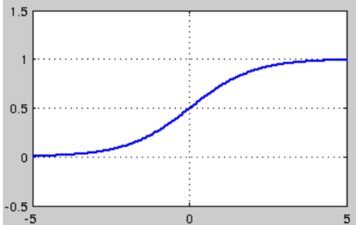
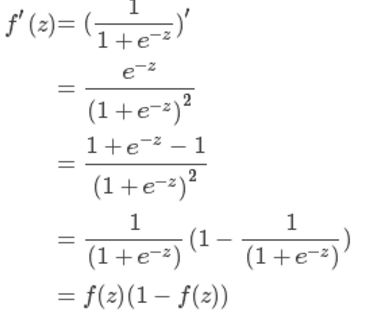

## sigmoid 求导

$ a = \sigma(z) = \frac{1}{1 + e^{-z}} $

$ dz = a(1-a) $

sigmoid 是使用范围最广的一类激活函数，具有指数函数形状，它在物理意义上最为接近生物神经元。此外，(0, 1) 的输出还可以被表示作概率，或用于输入的归一化，代表性的如Sigmoid交叉熵损失函数。
然而，sigmoid也有其自身的缺陷，最明显的就是饱和性。从上图可以看到，其两侧导数逐渐趋近于0
limx−>∞f′(x)=0
limx−>∞f′(x)=0

具有这种性质的称为软饱和激活函数。具体的，饱和又可分为左饱和与右饱和。与软饱和对应的是硬饱和, 即
f′(x)=0，当|x|>c，其中c为常数。
f′(x)=0，当|x|>c，其中c为常数。

sigmoid 的软饱和性，使得深度神经网络在二三十年里一直难以有效的训练，是阻碍神经网络发展的重要原因。具体来说，由于在后向传递过程中，sigmoid向下传导的梯度包含了一个 f′(x)f′(x) 因子（sigmoid关于输入的导数），因此一旦输入落入饱和区，f′(x)f′(x) 就会变得接近于0，导致了向底层传递的梯度也变得非常小。此时，网络参数很难得到有效训练。这种现象被称为梯度消失。一般来说， sigmoid 网络在 5 层之内就会产生梯度消失现象
此外，sigmoid函数的输出均大于0，使得输出不是0均值，这称为偏移现象，这会导致后一层的神经元将得到上一层输出的非0均值的信号作为输入

### 求导

补充知识：
$ d \frac{1}{x} = -\frac{1}{x^{2}} $
$ d e^{x} = e^{x} $