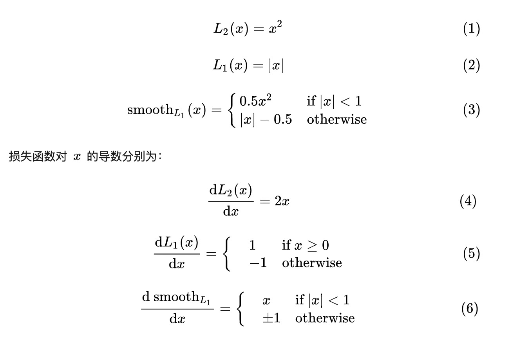
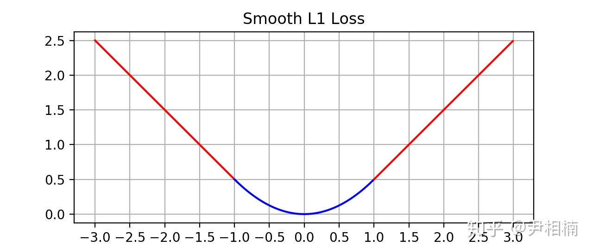

https://www.zhihu.com/question/58200555

l2:当x大的时候梯度也大，这就导致训练初期，预测值与 groud truth 差异过于大时，损失函数对预测值的梯度十分大，训练不稳定。

l1:导数是常数,这就导致训练后期，预测值与 ground truth 差异很小时，损失对预测值的导数的绝对值仍然为 1，而 learning rate 如果不变，损失函数将在稳定值附近波动，难以继续收敛以达到更高精度。

smoothl1:在在 x 较小时，对x的梯度也会变小，而在 x 很大时，对 x 的梯度的绝对值达到上限 1，也不会太大以至于破坏网络参数。 smoothl1 完美地避开了 l1 和 l2 损失的缺陷。