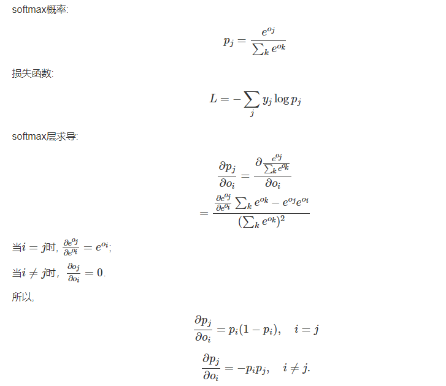
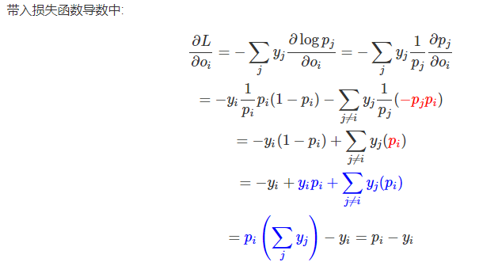

https://blog.csdn.net/legalhighhigh/article/details/81409551
https://robertlexis.github.io/2018/07/02/Softmax-cross-entropy-%E6%8E%A8%E5%AF%BC%E5%8F%8A%E6%B1%82%E5%AF%BC/

之前一直因为softmax的损失函数 当作逻辑回归的交叉熵损失函数,看了这个才明白啊

