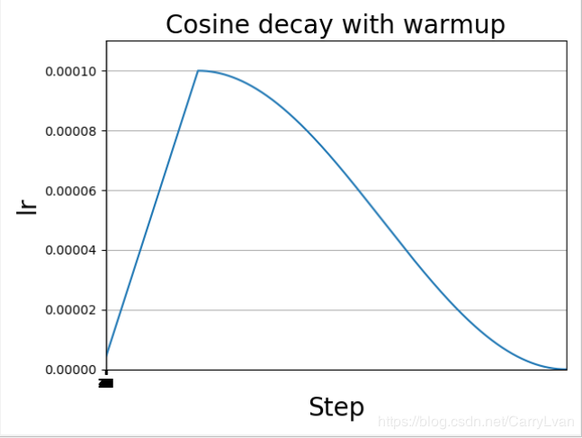

https://www.codeleading.com/article/4655816717/
https://blog.csdn.net/qq_38290475/article/details/103548680
https://blog.csdn.net/CarryLvan/article/details/104394960
warm up：训练初期由于离目标较远，一般需要选择大的学习率，但是使用过大的学习率容易导致不稳定性。所以可以做一个学习率热身阶段，在开始的时候先使用一个较小的学习率，然后当训练过程稳定的时候再把学习率调回去。比如说在热身阶段，将学习率从0调到初始学习率。

warm up + 指数衰减

## warm up + 余弦退火

https://blog.csdn.net/CarryLvan/article/details/104394960

