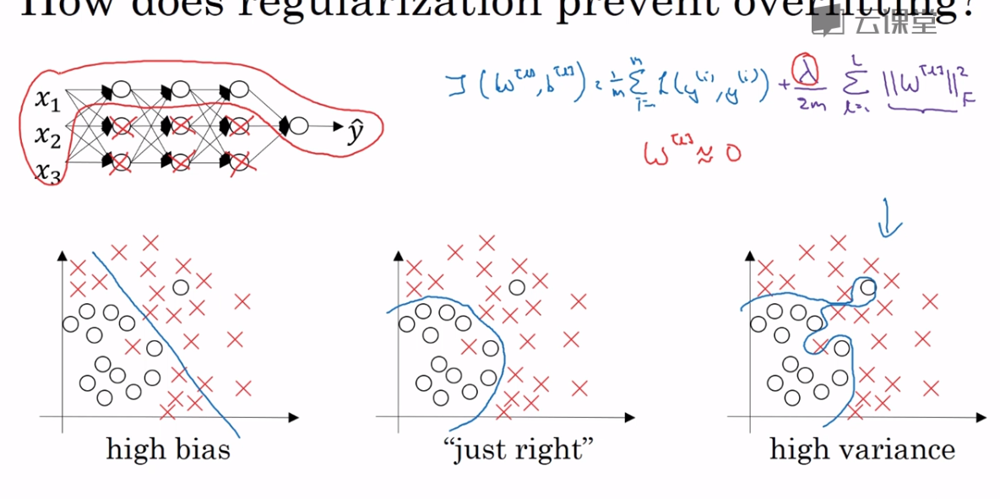
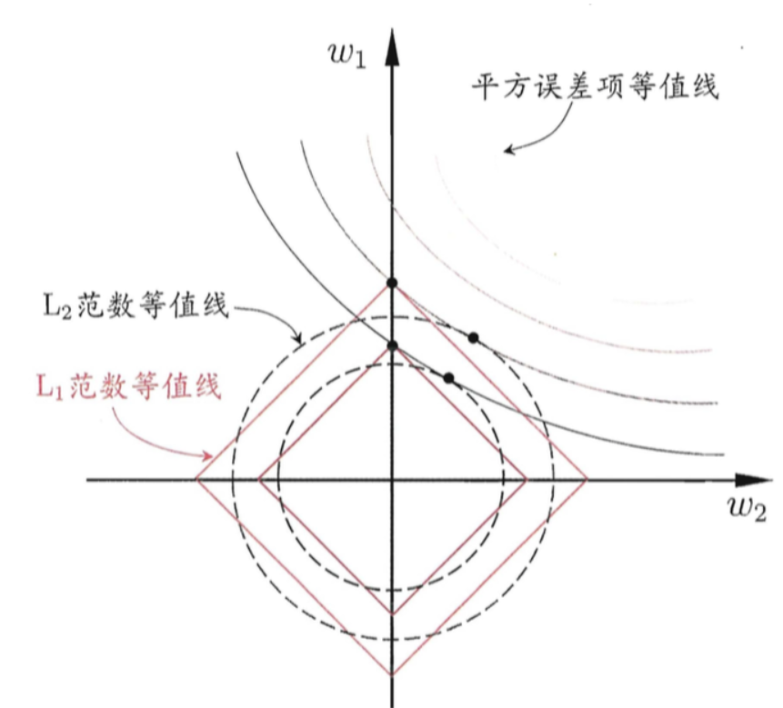

## 权重正则化

* 吴恩达课上的解释: 要损失函数J最小化，则$\frac{\lambda}{2m}\sum{\left|W\right\|_2}$ 需要最小化，其实就是w-weight最小化，权重小则意味着影响小，我们把$\lambda$设置的足够大的话极端的情况就是w约等于0，网络退化到线性模型。
  

## L1 和 L2 的区别
https://liam.page/2017/03/30/L1-and-L2-regularizer/
https://www.zhihu.com/question/26485586

L1正则会把不重要的特征直接置零变得稀疏， 而L2正则会让系数变小


为了简便起见，我们只考虑模型有两个参数 w1 与 w2 的情形。

在图中，我们有三组「等值线」。位于同一条等值线上的 w1 与 w2，具有相同的值（平方误差、L1-范数或L2-范数）。并且，对于三组等值线来说，当 (w1,w2) 沿着等值线法线方向，像外扩张，则对应的值增大；反之，若沿着法线方向向内收缩，则对应的值减小。

因此，对于目标函数 Obj(F) 来说，实际上是要在正则项的等值线与损失函数的等值线中寻找一个交点，使得二者的和最小。

对于 L1-正则项来说，因为 L1-正则项的等值线是一组菱形，这些交点容易落在坐标轴上。因此，另一个参数的值在这个交点上就是零，从而实现了稀疏化。

对于 L2-正则项来说，因为 L2-正则项的等值线是一组圆形。所以，这些交点可能落在整个平面的任意位置。所以它不能实现「稀疏化」。但是，另一方面，由于 (w1,w2) 落在圆上，所以它们的值会比较接近。这就是为什么 L2-正则项可以使得参数在零附近稠密而平滑
## drop out 正则化

### 训练和测试
```python
d3 = np.random.rand(a3.shape[0],a3.shape[1]) < keep_prob
a3 = np.multiply(a3,d3)
a3/ = keep_prob  #训练阶段 除以keep_prob

#测试阶段无dropout，也不除以keep_prob
```

## 数据增广 
## early stopping
