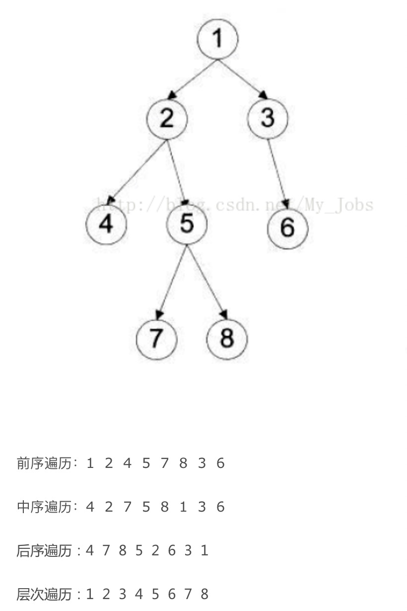
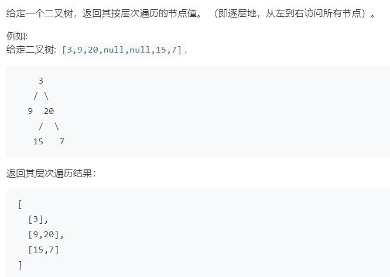

* 前序遍历：根结点->左子树->右子树
* 中序遍历：左子树->根结点->右子树
* 后序遍历：左子树->右子树->根结点

* 这里面有图解顺序
https://www.cnblogs.com/songwenjie/p/8955856.html




##  实现一个函数，检查一棵二叉树是否为二叉搜索树。


* 首先我们想到的是二叉树中序遍历后的结果是有序的，根据这个结果，我们可以中序遍历二叉树，并把遍历结果存放在一个数组里面，然后判断这个数组大小是否是有序数组，如果是有序数组，则是二叉查找树，否则就不是。这个方法的时间复杂度是O(N)，但是空间复杂度比较高，需要浪费O（N）的存储空间。

* 其实在<方法1>的基础上，我们可以在中序遍历的同时，比较大小，每次记录下上次遍历过的元素的值，如果当前元素的值大于上次遍历元素的值，则接着遍历，否则返回false，因为这个记录是一个址传递，所以需要用到引用形参进行传递。这个方法的时间复杂度与<方法1>的时间复杂度相同，只是空间复杂度只需要一个元素O(1)。

```python
#中序遍历 且应该是升序
class Solution(object):
    def isValidBST(self, root):
        self.prev = None  #上次元素
        return self.is_bst(root, self.prev)

    def is_bst(self, root, prev):
        if root == None:
            return True
        if not self.is_bst(root.left, self.prev):
            return False
        if self.prev != None and self.prev.val >= root.val:
            return False
        self.prev = root
        if not self.is_bst(root.right, self.prev):
            return False
        return True
```

## 重建二叉树
https://www.cnblogs.com/edisonchou/p/4741099.html
```python
class Solution:
    # 返回构造的TreeNode根节点
    def reConstructBinaryTree(self, pre, tin):
        # write code here
        
        if(len(pre)==0):
            return None
        #root 
        v = pre[0]
        bt = TreeNode(v)
        idx = tin.index(v)
        bt.left = self.reConstructBinaryTree(pre[1:idx+1],tin[0:idx])
        bt.right = self.reConstructBinaryTree(pre[idx+1:],tin[idx+1:])
        return bt 
```
        
## 层次遍历


* 思路 : 前序遍历+一个标识层次的数组
```python
# class TreeNode:
#     def __init__(self, x):
#         self.val = x
#         self.left = None
#         self.right = None

class Solution:
    def levelOrder(self, root: TreeNode) -> List[List[int]]:
        res = [] 
        if not root :
            return res 
        
        def bsf(node,level):
            if(len(res) == level):
                res.append([])
            
            res[level].append(node.val)

            if(node.left):
                bsf(node.left,level+1)
            if(node.right):
                bsf(node.right,level+1)
        
        bsf(root,0)
        return res 

```