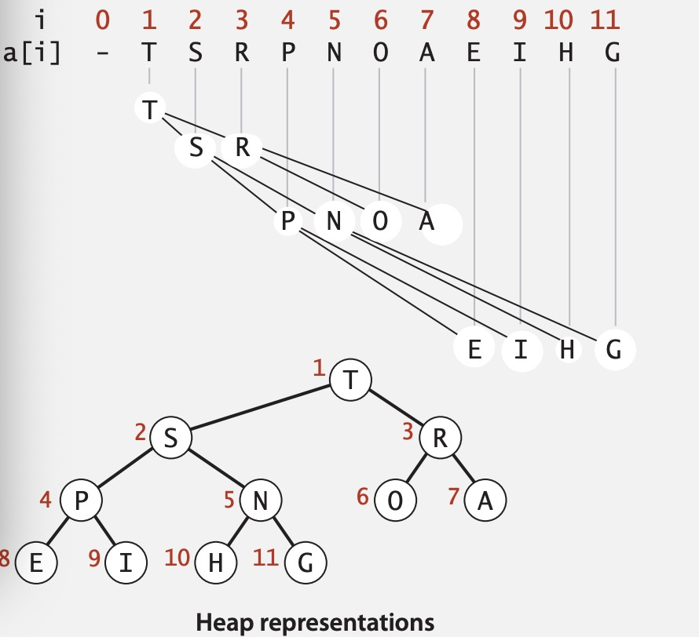
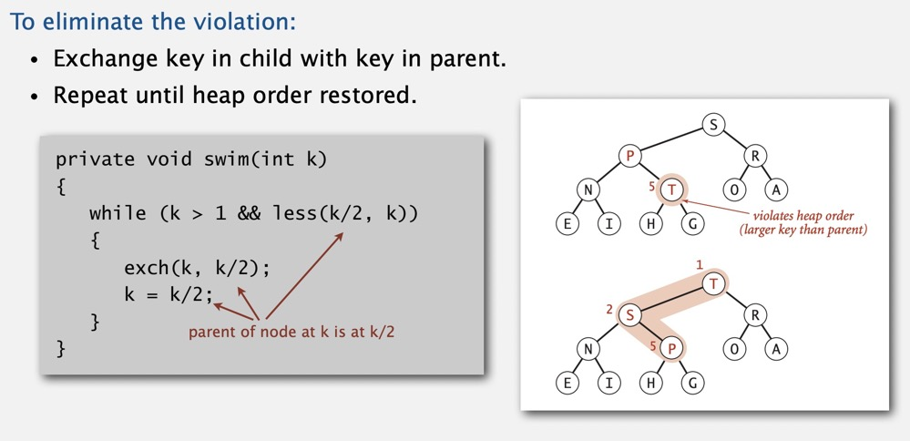
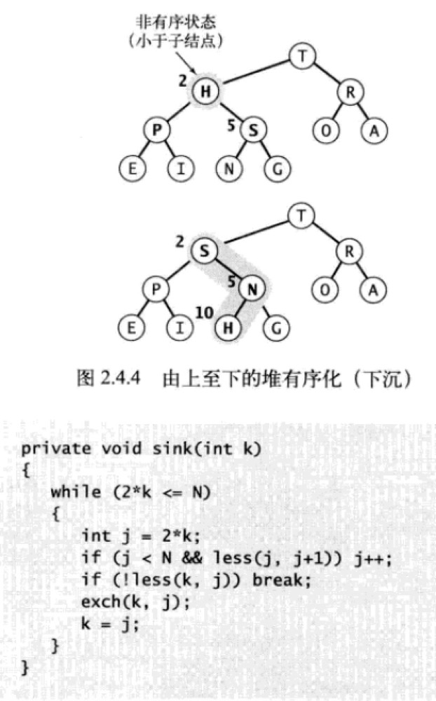
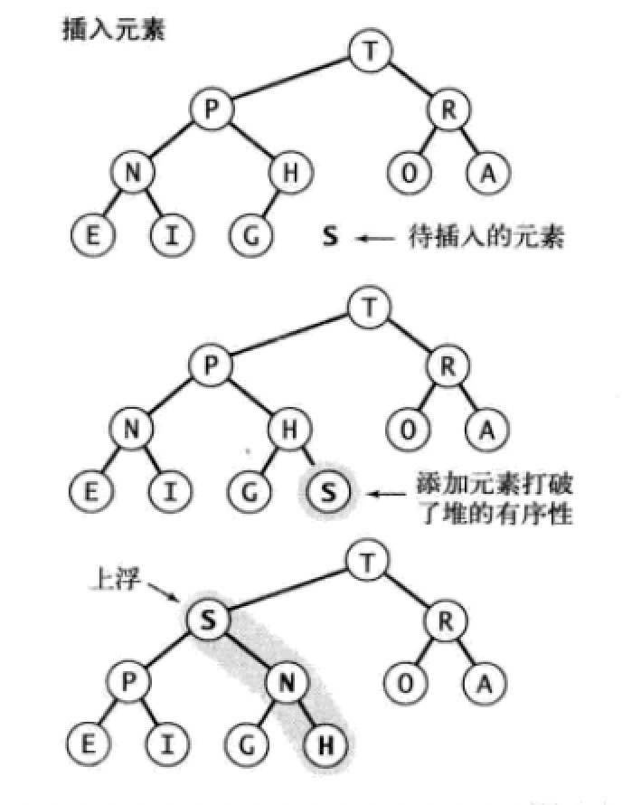
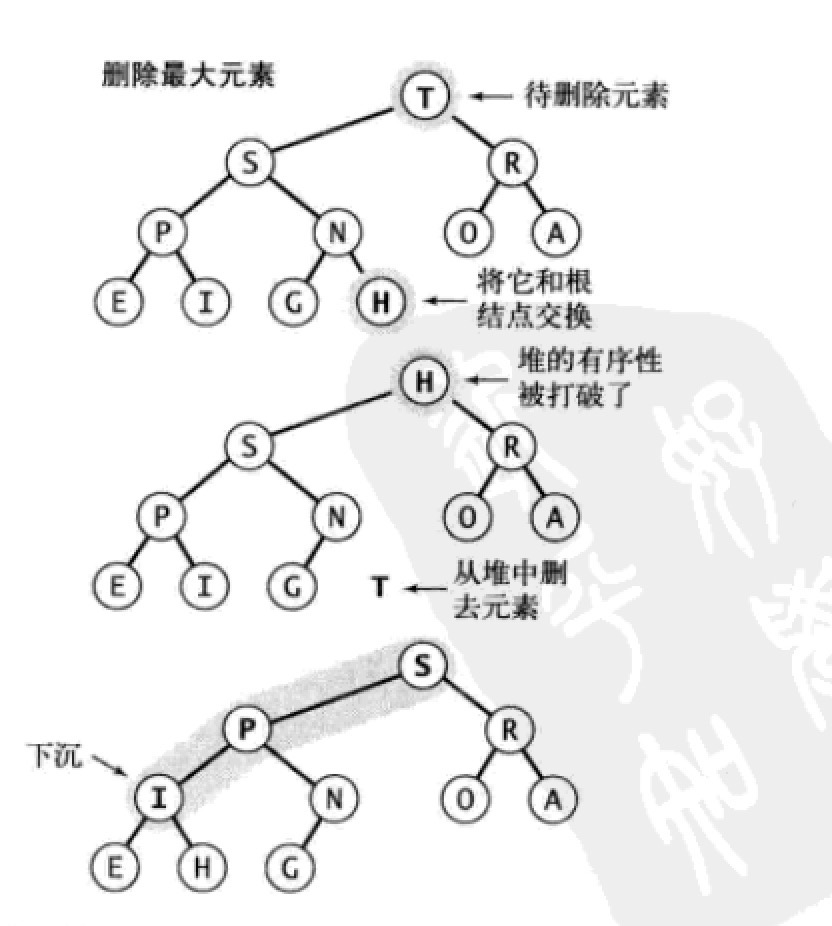

## 排序
https://blog.csdn.net/hk_john/article/details/79888992 这里面的算法复杂度图和动态演示不错

https://www.bilibili.com/video/av9005901?p=10
视频课程
.png)
### 选择排序
* 第一个元素为基准i,和i后面的元素做比较，找到比i最小的元素交换
* 以第二个元素为基准j，和j后面的元素做比较，找到比j最小的元素交换


```python
class Selection:
    @staticmethod
    def sort(arr):
        n = len(arr)
        for i in range(n):
            mid = i
            for j in range(i,n):
                if(arr[j]<arr[i]):
                    mid = j 
            arr[i],arr[mid] = arr[mid],arr[i]
        return arr 
```
* 复杂度O(n**2/2)

### 插入排序
* 它的工作原理是通过构建有序序列，对于未排序数据，在已排序序列中从后向前扫描，找到相应位置并插入。


```python
class Insertion:
    @statcimethod
    def sort(arr):
        n = len(ar)
        for i in range(n):
            for j in range(i,0,-1):
                if(arr[j] >= arr[j-1]):
                    #因为左侧都是已排序序列，只要大于j-1则说明大于[j-1,0]
                    break
                else:
                    arr[j],arr[j-1] = arr[j-1],arr[j]
```

### 希尔排序
* 插入排序的改进版
* 对于一个len = 13 的数组，增量序列原则3n+1
* 4 sort
* 1 sort
```python
class Sheel:
    @classmethod
    def sort(arr):
        n = len(arr)
        gap = 1 
        while(gap < n/3):
            gap = gap * 3 + 1
        
        while(gap>=1):
            for i in range(gap,n):
                for j in range(i,0,-gap):
                    if(arr[j] >= arr[j-gap]):
                        break
                    arr[j],arr[j-gap] = arr[j-gap],arr[j]
            gap = floor(gap/3)
```

### 归并排序
* 两个有序的数组归并为一个更大的有序数组
* 分治思想
* 1. divide array into two halves
* 2. recursively sort each half (这一步不是排序,是divide 操作)
* 3. merge two halves (这一步是排序操作)

```python
class Merge:
    @classmethod
    def Sort(cls,arr):
        li = 0
        hi = len(arr) -1 
        cls.MergeSort(arr,li,hi)


    @classmethod
    def MergeSort(cls,arr,li,hi):
        if(li >= hi):
            return 
        mid = (li + hi ) // 2
        cls.MergeSort(arr,li,mid)
        cls.MergeSort(arr,mid+1,hi)
        cls.Merge(arr,li,mid,hi)


    @classmethod
    def Merge(cls,arr,li,mid,hi):
        #辅助数组
        aux = list(arr)
        i = li 
        j = mid + 1 
        print('li {} mid {} hi {} '.format(li,mid,hi))
        for k in range(li,hi+1):
            if(i>mid):
                arr[k] = aux[j]
                j = j + 1 
            elif(j>hi):
                arr[k] = aux[i]
                i = i + 1
            elif(aux[i] > aux[j]):
                arr[k] = aux[j]
                j = j + 1 
            else:
                arr[k] = aux[i]
                i = i + 1
        print(arr)
```


### 快速排序
* 快速排序是一种分治的排序算法，将一个数组分成两个独立的数组，独立排序，快速排序和归并排序正好互补。归并排序将两个子数组分别排序，并将有序数组归并为整个数组排序。而快速排序的两个子数组有序时，整个数组自然就有序了。
* 归并排序递归调用发生在处理整个数组之前，快速排序递归调用发生在整个数组之后.归并排序中数组被等半切分, 在快速排序中切分partition的位置由取决于数组内容。

算法的关键在于切分
* 对于某个a[j]
* a[lo] 到 a[j-1] 中所有元素都不大于a[j]
* a[j] 到 a[hi] 中所有元素都大于a[j]
切分算法的策略一般随意选取 a[lo]作为切分元素v,左指针i先从左边往右扫，找到第一个大于等于v的元素，右指针j从右往左扫找到一个小于等于v的元素，交换他们的位置。如此继续就可以保证左指针i的左侧都不大于切分元素v，右指针j的右侧都不小于切分元素v。当两指针相遇时我们只需要把切分元素a[lo]和左侧最右端的元素交换即可。返回j

```python
class Quick:
    @classmethod
    def quick_sort(cls,arr):
        lo = 0 
        hi = len(arr) -1 
        cls.sort(arr,lo,hi) 

    @classmethod
    def sort(cls,arr,lo,hi):
        #终止条件
        if(lo >= hi ):
            return 
        #切分
        j = cls.partition(arr,lo,hi)
        #左半排序
        cls.sort(arr,lo,j-1)
        #右半排序
        cls.sort(arr,j+1,hi)
        
    @classmethod
    def partition(cls,arr,lo,hi):
        v = arr[lo]  #切分元素
        i = lo + 1 
        j = hi 
        while True:
            while( i <= hi and v > arr[i]):
                i = i + 1 
            while( j > lo and v < arr[j]):
                j = j - 1
            if(i >=j):
                break
            arr[i],arr[j] = arr[j],arr[i]
        
        arr[lo],arr[j] = arr[j],arr[lo]
        return j      
```
#### 改进
* 上述算法当潜在缺点，当切分不平衡当时候可能很低效，如第一次切分从最小都元素，第二次切分从第二小都元素(例子a b c d e f g 升序数组) 1/2N^2,所以排序前最好是 **打乱顺序**
* 另一个改进都方法是用中位数作为切分元素，但是这样需要计算每个子数组都**中位数**
* 对于有大量重复元素都数组，对于全部是重复元素都子数组，其实不需要切分，但是我们还是会继续切分到更小的子数组。改进的办法是采用**三向切分
### 三向切分
* 三个指针 lt , i , gt
* lt 使 [lo,lt-1] < v
* gt 使 [gt+1,hi] > v
* i  使 [lt ,i-1] = v


```python
class Quick:
    @classmethod
    def quick_sort(cls,arr):
        lo = 0 
        hi = len(arr) -1 
        cls.sort(arr,lo,hi) 

    @classmethod
    def sort(cls,arr,lo,hi):
        #终止条件
        if(lo >= hi ):
            return 
        #3-way partition
        lt,gt,i= lo,hi,lo
        v = arr[lo]
        while(i <= gt):
            if(arr[i] == v):
                i = i+1 
            elif(arr[i] < v):
                arr[i],arr[lt] = arr[lt],arr[i]
                i = i +1 
                lt = lt + 1
            else:
                arr[i],arr[gt] = arr[gt],arr[i]
                gt = gt -1 
        #左半排序
        cls.sort(arr,lo,lt-1)
        #右半排序
        cls.sort(arr,gt+1,hi)
    
```


```python
#很久之前稀里糊涂写的

class Solution:
    def GetLeastNumbers_Solution(self, tinput, k):
        # write code here
        def quick_sort(lst):
            if not lst:
                return []
            pivot = lst[0]
            #这里开辟了空间，而且遍历了两次，这个代码只是为了理解思想吧
            left = quick_sort([x for x in lst[1:] if x < pivot])
            right = quick_sort([x for x in lst[1:] if x>=pivot])
            return left + [pivot] + right 
    
        if(tinput==[] or k >len(tinput)):
            return []
        tinput = quick_sort(tinput)
        return tinput[:k]

# -*- coding:utf-8 -*-
class Solution:
    def GetLeastNumbers_Solution(self, tinput, k):
        def quick_sort(arr):
            less = [] 
            pivot = []
            more =[]

            #这个只遍历了一次但是还是开辟了空间
            if(len(arr)<=1):
                return arr
            else:
                p = arr[0]
                for i in arr:
                    if(i<p):
                        less.append(i)
                    elif(i>p):
                        more.append(i)
                    else:
                        pivot.append(i)
            less = quick_sort(less)
            more = quick_sort(more)
            return less + pivot + more
        
        if(len(tinput)<k):
            return []
        arr = quick_sort(tinput)
        return arr[:k]

# -*- coding:utf-8 -*-
class Solution:
    def GetLeastNumbers_Solution(self, tinput, k):
        # 未开辟空间，标准的快速排序
        if(len(tinput)<k):
            return []
        arr = self.quick_sort(tinput)
        return arr[:k]
    
    def quick_sort(self,arr):
        def swap(arr,i,k):
            arr[j] , arr[i] = arr[i] , arr[j]
            
        def partition(arr,left,right):
            storeIndex = left
            pivot = arr[right] #直接选取最右边的元素为基准元素
            for i in range(left,right):
                if(arr[i] < pivot):
                    swap(arr,storeIndex,i)
                    storeIndex +=1
                    
            swap(arr,right,storeIndex)  #交换基准元素和 storeIndex 位置的元素的位置,为什么这里有个swap，因为sotreindex右边的都比pivot大
            return storeIndex
            
        def sort(arr,left,right):
            if(left > right):
                return 
            storeIndex = partition(arr,left,right)
            sort(arr,left,storeIndex-1)
            sort(arr,storeIndex+1,right)
            
        sort(arr,0,len(arr)-1)
        return arr

```


### 冒泡排序

```python 
#复杂度N^2
def bubbleSort(arr):
    n = len(arr)
 
    # 遍历所有数组元素
    for i in range(n):
        swap = False
        # Last i elements are already in place
        for j in range(0, n-i-1):
 
            if arr[j] > arr[j+1] :
                arr[j], arr[j+1] = arr[j+1], arr[j]
                swap = True
        if(swap == True):
            return 
 
arr = [64, 34, 25, 12, 22, 11, 90]
 
bubbleSort(arr)
```

## 二叉堆
* 当二叉树每个结点都大于等于他都两个子结点，成为堆有序
* 二叉堆可以用完全二叉树表示，完全二叉树可以用数组表示而无需链表

* 根结点的位置在 1 
* 对于位置k的结点，他的父结点是k/2,他的两个子结点是2k,2k+1
* a[k]向上一层是a[k/2],a[k]乡下一层是2k或者2k+1
### 堆有序化
#### 从下往上堆有化 swim 上浮
如果堆的有序状态因为某个结点的改变而变得比他的父结点还大，那么我们需要通过交换他和他的父点，如果交换后还是比父结点大，那么我们需要继续一直到根结点


#### 从上往下堆有化 sink 下沉


#### 插入元素
将新元素加入末尾，并上浮到合适到位置

#### 删除最大元素
将数组末尾元素放在顶端，并下沉到合适位置



