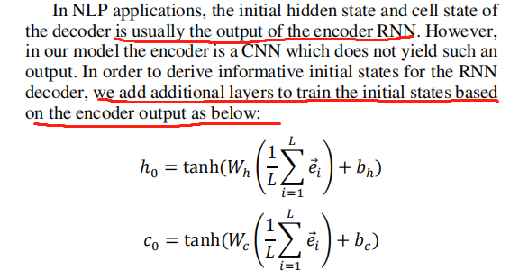

## 数学公式识别
### 数据集
http://lstm.seas.harvard.edu/latex/data/
### 前言
* 说一些自己的理解：结构上没有创新，唯一的一点是加入了2d 位置编码。在decoder阶段 使用了双层单向的lstm。

### encoder部分

* 简单的cnn,输出(bz, h * w, 512)

### decoder部分

* rnn 的 hidden_dim = 512 与 cnn 输出维度一致

* 一般初始的隐含状态是encoder的最终隐含状态，但是decoder是cnn最终初始的是cnn的featuremap。所以具体的操作是

* input_feeding 先不用? 

#### 流程
1. 

### attenton部分

embedding_dim = 32 

encoder : cnn_dim = 512 

attention : units = 256

decoder : hidden_dim = 512 

$
[ J _ { m n } , J _ { p q } ] = i ( \delta _ { q [ m } J _ { n ] p } - \delta _ { p [ m } J _ { n ] q } )
$

$
e ^ { \tilde { \mathcal K } / 2 }
$
$
e ^ { \tilde { K } / 2 }
$

$
[ J _ { m n } , J _ { p q } ] = i ( \delta _ { q [ m } J _ { n ] } - \delta _ { p [ m } J _ { n ] } )
$

